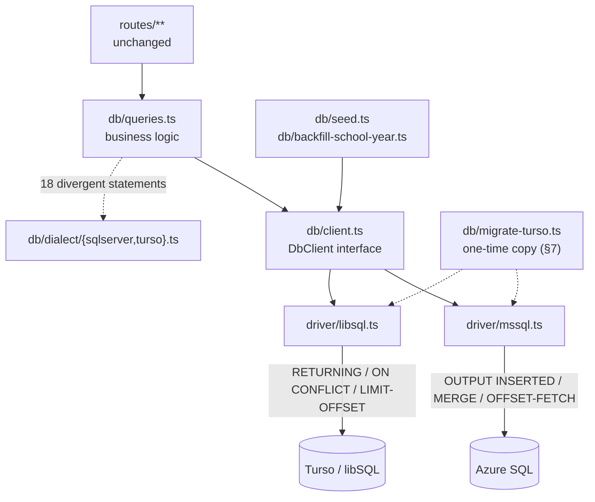

# Plan — `DB_MODE`: Switch Between SQL Server and Turso

**Status:** Draft for review — **Option B confirmed** (§7): Turso must carry the existing data
**Date:** 2026-09-14 (rev. 2 — Option B revision)
**Area:** Server → `server/src/db/**` (data layer only; no client changes)

---

## 1. Goal

Add a `DB_MODE` environment variable so the API can run against **either** the existing
Azure SQL Server database **or** a Turso (libSQL/SQLite) database, selected at boot, with
no change to the HTTP API surface, the client, or the Swagger contract.

```
DB_MODE=sqlserver   # current behaviour, unchanged — Azure SQL Serverless
DB_MODE=turso       # new — Turso/libSQL
```

The intent is that `server/src/db/**` is the **only** directory that changes, and that the
SQL Server path is provably untouched (it is the live production database).

---

## 2. Headline finding — read this before the detail

The good news is that this codebase is **unusually well-positioned** for a port, because
the data layer is already isolated behind a small number of helpers:

- **Every** DB call in the app funnels through `server/src/db/queries.ts`, `db/documents.ts`,
  `db/seed.ts`, and `db/backfill-school-year.ts`. **No route file touches a pool directly** —
  the only exception is a single `UPDATE` in `routes/forms.ts`.
- Only **4 base column types** are used across the whole schema: `INT`, `NVARCHAR(n|MAX)`,
  `BIT`, `DATETIME2`. There is no `DECIMAL`, `MONEY`, `UNIQUEIDENTIFIER`, `JSON`, XML,
  `GEOGRAPHY`, or `VARBINARY`.
- There are **zero** stored procedures, **zero** `DATEADD`/`DATEDIFF`, **zero** `ISNULL()`,
  **zero** `FORMAT()`, **zero** multiple-result-set (`recordsets`) reads, and **exactly one**
  transaction.
- The SQL already uses **`@param` named placeholders** (260 of them) — and libSQL supports
  `@`, `:`, and `$` named placeholders, so **the placeholder style needs no change at all.**
- The app **never inspects database error codes** (no `err.number` checks for duplicate-key or
  FK violations). Uniqueness conflicts are pre-checked in application code and returned as
  friendly `409`s. This removes an entire category of work — no error-code translation layer.

The bad news is that the divergence is **not** where you'd expect. There are only **19 DML
statements** that genuinely need a dialect variant, but they are all on the **write path**,
and the real cost is not the SQL syntax — it is a set of **silent behavioural differences**
(collation, NULL ordering, foreign-key enforcement, date format) that will not fail to
compile and will not fail loudly at runtime. They will just quietly return wrong data.

**Roughly 40% of the effort in this plan is the behavioural traps in §10, not SQL translation.**

---

## 3. Non-goals

- **No client changes.** `client/**` is not touched. The API request/response shapes are
  byte-identical in both modes.
- **No ORM.** This plan deliberately does not introduce Drizzle/Prisma, even though Turso
  supports them. The codebase is raw parameterized SQL by design; swapping in a second
  query layer would be a much larger and riskier change than the port itself.
- **No automatic schema sync between the two databases.** §12 defines a migration path, but
  the two schemas are maintained by hand after this work lands. That is an explicit,
  accepted ongoing cost (§14).
- **No continuous replication between the two databases.** Turso *will* carry the existing
  production data (Option B, §7 — confirmed), but that copy is **one-time**, run during the
  migration window. This plan does not build change-data-capture, log shipping, or any live
  two-way sync. After cut-over the two databases diverge unless the copy is re-run.

---

## 4. What is actually in the codebase today

Measured across `server/src/**` (excluding `swagger.ts`, which contains no SQL).

### 4.1 The SQL surface

| Metric | Count |
| --- | --- |
| Tables in the schema | **11** (`schools`, `organizations`, `users`, `forms`, `form_fields`, `submissions`, `submission_values`, `submission_adhoc_fields`, `app_settings`, `documents`, `report_views`) |
| `DDL_STATEMENTS` entries (`schema.ts`) | **39** |
| SQL literals beginning with a DML keyword | **81** (SELECT 37 / INSERT 13 / UPDATE 27 / DELETE 4) |
| `execute<…>()` call sites in `queries.ts` | **50** |
| `queries.ts` size | **1,737 lines** |
| `schema.ts` size | **719 lines** |

> Measured on the tree **after** the Staff Comments feature was removed (2026-09-14), which
> deleted the `comments` table and its two read/write helpers. The statements, indexes and
> foreign keys that belonged to it are gone from every count below.

### 4.2 The constructs that genuinely differ

| Construct | Count | Where |
| --- | --- | --- |
| `OUTPUT INSERTED…` | **15** | `queries.ts` 13, `documents.ts` 1, `seed.ts` 1 |
| `OUTPUT DELETED…` | **2** | `queries.ts` — `DELETE … OUTPUT DELETED.id`. Identical `RETURNING` translation, but invisible to a search for `INSERTED`; the first draft of this plan missed them. |
| `MERGE …` (upsert) | **2** | `queries.ts` (`setSetting`, `upsertSchoolFromSource`) |
| `OFFSET @offset ROWS FETCH NEXT …` | **1** | `queries.ts` (school search paging) |
| **Divergent DML subtotal** | **20** | 19 on the write path + 1 read-paging |

Two further divergences, **found only during implementation** — and together they returned HTTP 500
from 8 endpoints:

| Construct | Count | Where | Why the first draft missed it |
| --- | --- | --- | --- |
| `SELECT TOP 1 …` | **8** | `documents.ts` 6, `queries.ts` 2 | `TOP` is a *token in the select list*; `LIMIT` is a *trailing clause*. §8.5 originally claimed a token rewriter could handle this class. It cannot — see §5.1. |
| `CAST(x AS NVARCHAR(MAX))` | **1** | `queries.ts` | Read as the harmless `NVARCHAR(200)` row in §5.1, but the bare `MAX` length token is a **hard parse error** in libSQL, not a coercion difference. |
| `SYSUTCDATETIME()` | **33** | `schema.ts` 15, `queries.ts` 14, `documents.ts` 3, `routes/forms.ts` 1 |
| `dbo.` qualifier | **271** | `schema.ts` 141, `queries.ts` 90, `documents.ts` 23, `seed.ts` 16, `forms.ts` 1 |
| `@param` placeholders | **260** | portable as-is |
| Bracket-quoted identifiers | **4 unique** | `[key]`, `[value]`, `[i]` only |
| `IDENTITY(1,1)` | **10** | DDL only |
| Foreign keys | **17** | 8 `ON DELETE CASCADE`, 4 `ON DELETE SET NULL`, 5 `NO ACTION` |
| `INT` / `NVARCHAR` / `BIT` / `DATETIME2` | — | the only 4 column types used |

### 4.3 The constructs that need **no** work (verified zero occurrences)

`DATEADD`, `DATEDIFF`, `ISNULL(`, `FORMAT(`, `STRING_AGG`, `OPENJSON`, `FOR JSON`,
`NEWID()`, `@@ROWCOUNT`, `SCOPE_IDENTITY()`, `recordsets` (plural), stored procedures,
`BEGIN TRY/CATCH`, savepoints, cursor usage, and SQL date arithmetic of any kind.

Also worth noting: the SQL uses `COALESCE` (not `ISNULL`), and SQLite **does** support partial
indexes, so the two filtered unique indexes (`UX_schools_source_id`, `UX_forms_code`) port
directly.

---

## 5. Translation map

### 5.1 Statement level

| SQL Server | libSQL/SQLite | Notes |
| --- | --- | --- |
| `INSERT … OUTPUT INSERTED.col, … VALUES …` | `INSERT … VALUES … RETURNING col, …` | `RETURNING` is supported since SQLite 3.35 (2021); libSQL ships well past that. Covers all 15 sites. ⚠️ SQLite does **not** guarantee `RETURNING` row order — all 15 sites affect exactly one row, so this is safe here. |
| `UPDATE … OUTPUT INSERTED.col` | `UPDATE … RETURNING col` | The atomic submission-id counter. Safe: SQLite takes a write lock for the whole statement. |
| `MERGE … WHEN MATCHED / WHEN NOT MATCHED` | `INSERT … ON CONFLICT(col) DO UPDATE SET … RETURNING …` | For an upsert, `RETURNING` reports **both** inserted and updated rows — so both `MERGE`s translate cleanly, including `upsertSchoolFromSource` which returns the row. |
| `OFFSET @o ROWS FETCH NEXT @n ROWS ONLY` | `LIMIT @n OFFSET @o` | SQL Server requires `ORDER BY`; SQLite does not. |
| `SELECT TOP n … ORDER BY x` | `SELECT … ORDER BY x LIMIT n` | ⚠️ **Hand-build per dialect; do not rewrite.** `TOP n` is a token in the select list while `LIMIT n` is a *trailing clause* — a clause move, which no token substitution can express. Missed in the first draft; caused 8 endpoints to 500 under Turso. |
| `IDENTITY(1,1) PRIMARY KEY` | `INTEGER PRIMARY KEY AUTOINCREMENT` | |
| `dbo.` prefix | *(none)* | SQLite has no schemas. See §8.3 for how this is handled with one safe transform rather than 271 edits. |
| `[key]` / `[value]` | `"key"` / `"value"` | The only bracketed identifiers in the codebase. |
| `A + B` for string concat | `A \|\| B` | `+` is **numeric addition** in SQLite. Only matters in the `school_year` backfill (§5.3). |
| `YEAR(x)` / `MONTH(x)` | `CAST(strftime('%Y', x) AS INTEGER)` / `CAST(strftime('%m', x) AS INTEGER)` | Only in the `school_year` backfill. |
| `OBJECT_ID('dbo.x','U') IS NULL` | `CREATE TABLE IF NOT EXISTS` | |
| `COL_LENGTH('dbo.x','y') IS NULL` | *(no equivalent)* | SQLite has no `ALTER TABLE ADD COLUMN IF NOT EXISTS`. See §5.3. |
| `sys.check_constraints` / `sys.foreign_keys` / `sys.indexes` | *(no equivalent)* | SQLite cannot `DROP CONSTRAINT`. See §5.3. |
| `NVARCHAR(200)` | `TEXT` | SQLite does not enforce length. A *sized* length parses fine. |
| `NVARCHAR(MAX)` | `NVARCHAR` | ⚠️ **Not a coercion difference — a parse error.** libSQL raises `SQL_PARSE_ERROR near ID` on the bare `MAX` length token, so any statement containing it fails outright regardless of result. The driver's token rewriter handles it because it *is* a straight token substitution (§8.3). |
| `BIT` | `BOOLEAN` (stored as 0/1) | Declare as `BOOLEAN` so `ResultSet.columnTypes` reports it and the adapter can normalize (§8.4). |
| `DATETIME2` | `TEXT` in ISO-8601 UTC | **Format is load-bearing** — see §10.4. |
| `SYSUTCDATETIME()` | `strftime('%Y-%m-%dT%H:%M:%fZ','now')` | Not `CURRENT_TIMESTAMP`, which emits `'YYYY-MM-DD HH:MM:SS'` — see §10.4. In a DDL `DEFAULT` clause SQLite requires wrapping: `DEFAULT (strftime(…))`. |

### 5.2 Driver level

`@libsql/client` accepts `InValue = null | string | number | bigint | ArrayBuffer | boolean | Uint8Array | Date`
— so the existing call sites that bind **booleans** (`staff_only`, `required`, `active`) and
**`Date`** objects keep working without change. `intMode` defaults to `"number"`, which matches
what `mssql` returns for `INT`; **do not change it**, or every id in the app becomes a `bigint`.

⚠️ **Verify in the spike:** how `@libsql/client` serializes a *bound* `Date` (ISO string vs
epoch). If it is not the exact ISO form we store, dates written via a parameter would sort and
parse inconsistently with dates written via a column `DEFAULT`. The spike must assert the
round-trip.

### 5.3 The 39-statement DDL ladder — the one genuinely hard part

`DDL_STATEMENTS` is not "create the schema". It is a hand-rolled **cumulative migration
ladder** accumulated feature by feature:

```sql
-- schema.ts:324 — widen the role CHECK constraint to admit 'cdm_contact'.
-- Constraint names are auto-generated, so find any CHECK on `role` that does not
-- mention the new role, DROP it by generated name via dynamic SQL, and re-add it.
IF EXISTS (SELECT 1 FROM sys.check_constraints
             WHERE parent_object_id = OBJECT_ID('dbo.users') …)
BEGIN
  DECLARE @ck nvarchar(128) = (SELECT TOP 1 name FROM sys.check_constraints …);
  IF @ck IS NOT NULL EXEC(N'ALTER TABLE dbo.users DROP CONSTRAINT ' + @ck);
  ALTER TABLE dbo.users ADD CONSTRAINT CK_users_role CHECK (role IN (…));
END;
```

Alongside it: `COL_LENGTH`-guarded `ALTER TABLE ADD COLUMN` (20 sites), nullable → backfill →
`ALTER COLUMN … NOT NULL` promotions, `sys.foreign_keys`/`sys.indexes` existence checks, and
one-time `UPDATE` backfills.

**None of this is expressible in SQLite.** SQLite's `ALTER TABLE` supports only
`RENAME TABLE`, `RENAME COLUMN`, `ADD COLUMN`, and `DROP COLUMN`. Changing a `CHECK`
constraint, a column's `NOT NULL`, or a column's type requires the SQLite
**12-step table rebuild** (create new table, copy, drop, rename, recreate indexes).

**This is fine — and it is the single biggest simplification available** — *provided the
Turso schema is built fresh, before any data lands in it*:

> On a **fresh** Turso database, the entire 39-statement ladder collapses into ~15 plain
> `CREATE TABLE IF NOT EXISTS` / `CREATE INDEX IF NOT EXISTS` statements describing the
> **final** schema. There is nothing to migrate from, so there is nothing to guard.

**This holds under Option B too, and that is the single most important consequence of §7.**
Option B does **not** require translating this ladder. It requires creating the final schema
empty and *then* importing rows, in parent-before-child order — so the ladder is still deleted,
not ported. Option B adds a **data copy on top of a fresh schema**, not a migration problem.

What Option B *does* change is the margin for error. With no ladder, the `CREATE TABLE`
statements are the only chance to get the shape right, and there is no historical convergence
to fall back on. That is why §9 Phase 7 pairs the import with per-table counts and checksums
rather than trusting the copy.

---

## 6. Blast radius

```
server/src/
  config/env.ts             + dbMode, turso{url,authToken}          (small)
  db/pool.ts                becomes a thin façade over a driver      (medium)
  db/queries.ts             50 call sites; ~18 delegate to a dialect (large)
  db/documents.ts           1 OUTPUT, 3 SYSUTCDATETIME, 23 dbo.      (small)
  db/seed.ts                11 raw pool.request() sites → driver     (medium)
  db/backfill-school-year.ts 3 raw pool.request() sites → driver     (small)
  db/schema.ts              DDL moves out; pure helpers stay         (medium)
  db/driver/*               NEW                                      (large)
  db/dialect/*              NEW                                      (large)
  db/migrate-turso.ts       NEW — one-time SQL Server → Turso copy    (medium)
  routes/forms.ts           1 UPDATE with SYSUTCDATETIME()           (trivial)
  routes/health.ts          + dbMode in the payload                  (trivial)
  index.ts                  warm-up loop becomes driver-agnostic     (small)
client/**                   NOT TOUCHED                              (none)
```

The client is untouched, but **9 client call sites across 6 files do `new Date(...)` on
timestamp strings** and `client/src/types/index.ts` types every timestamp as `string`. Those are
the canary for §10.4 — if the Turso date format is wrong, all 9 silently shift by the server's
UTC offset.

The team has already hit this exact class of bug once. `StaffSubmissionDetail.tsx:651-653`
carries a deliberate workaround with the reason written out:

```ts
// Format date fields and date-like strings (e.g. "2026-08-28") as M/D/YYYY.
// Parse the YYYY-MM-DD string directly to avoid the timezone shift that
// `new Date("2026-08-28")` would introduce on negative-offset systems.
```

That guard covers **date-only** answers. It does **not** cover the full ISO timestamps
(`submitted_at`, `updated_at`, `created_at`, `last_used_at`), which is precisely where a wrong
Turso format would land.

---

## 7. The decision — **resolved: Option B**

**Does the Turso database need to contain the existing production data?**

> **Yes — resolved 2026-09-14. Turso must carry the existing data.** The alternative is kept
> below only so the trade-off stays visible; the estimate in §9 assumes Option B.

### Option B — confirmed: Turso carries the existing data

The data copy is now a **mandatory phase** (§9 Phase 7), not a conditional extra.

**What Option B does *not* change — read this before pricing the work.**

The DDL ladder is still **dropped, not translated**. Turso is created from the **final** schema
(~15 clean `CREATE TABLE IF NOT EXISTS` statements, §5.3) and rows are imported *afterwards*.
Option B adds a **data copy**, not a schema-translation problem. The `school_year` backfill, the
`organization_id`/`active` promotions, and the role-`CHECK` surgery all stay deleted — which is
what keeps this from being a much larger job than the estimate suggests.

**What Option B *does* change.**

1. Every table must land in its **final** shape on the first attempt — no ladder to converge it.
2. The copy must be *verifiably* lossless. "It looked right" is not a standard you can revert
   from, so Phase 7 spends two of its three days on verification, not on the copy.

### How to migrate — through the application layer, not a SQL dump

Read from SQL Server via the existing `execute()` and write to Turso via portable parameterized
`INSERT`s. Because every `INSERT` is plain SQL, **no dialect translation is needed for the data
itself** — only for the read and write plumbing. Three mechanics matter:

- **Preserve `IDENTITY` values explicitly by inserting the `id` column.** This keeps every
  foreign key valid without any remapping. Combined with importing **parents before children**
  (§9 Phase 7 fixes the order), the copy needs no FK relaxation at all.
- **Enforce foreign keys during the copy.** This reverses the recommendation in rev. 1 of this
  plan, which suggested wrapping the import in `client.migrate([...])`. `migrate()` runs with
  `PRAGMA foreign_keys=off` (§10.3) — correct for bulk *DDL*, but during a **data** copy it means
  a parent/child ordering mistake commits silently and leaves orphan rows behind. With FK
  enforcement **on** and a correct topological order, a broken copy fails loudly instead.
  Keep `migrate()`'s FK-off path only as a documented fallback.
- **Read without an `ORDER BY` on any nullable column**, so the copy's behaviour cannot depend on
  engine-specific NULL ordering (§10.2).

⚠️ `foreign_keys=off` is correct for DDL and **wrong for normal operation** — see §10.3.

**Sizing.** The copy script itself is small — a read/write loop, budgeted at ~1 day inside
Phase 7. Without row counts (§16 Q3) the real variable is batching: `@libsql/client` has no
bulk-`COPY`, so large tables need chunked multi-row `INSERT`s (SQL Server also caps a request at
2100 parameters, so chunk at ~1000 or fewer). The remaining ~2 days of Phase 7 are the
verification described there.

---

## 8. Recommended architecture

### 8.1 The seam that already exists

`queries.ts` already has exactly the right shape for this:

```ts
export async function execute<T = unknown>(
  query: string,
  params: Record<string, unknown> = {}
): Promise<T[]> {
  const pool = await getPool();
  const request = pool.request();
  for (const [name, value] of Object.entries(params)) {
    request.input(name, value as never);
  }
  const result = await request.query(query);
  return (result.recordset ?? []) as T[];
}
```

**The overwhelming majority of the SQL already flows through this one function** — 54
`execute<T>()` call sites (50 in `queries.ts`, 4 in `documents.ts`) against 81 DML-leading
statements overall. That is the seam. The work is (a) reimplementing it behind an interface,
and (b) carving out the 18 statements that need dialect variants.

### 8.2 File layout

```
server/src/db/
  driver/
    index.ts          NEW  createDbClient() — selects by env.dbMode
    mssql.ts          NEW  extracted verbatim from pool.ts (retry/backoff preserved)
    libsql.ts         NEW  @libsql/client wrapper + row normalization
  dialect/
    sqlserver.ts      NEW  DDL (moved from schema.ts) + 18 SQL Server statements
    turso.ts          NEW  fresh final-state DDL + 18 libSQL statements
  client.ts           NEW  DbClient interface + the shared query/transaction surface
  pool.ts             KEEP thin façade: initDb / isDbReady / resetDbPool / getClient
  schema.ts           KEEP pure TS only (types + formatSubmissionPublicId,
                           schoolYearForDate, fieldAccessRoles, canSeeField)
  queries.ts          KEEP all business logic
  documents.ts        KEEP
  seed.ts             KEEP
  backfill-school-year.ts  KEEP (guarded to sqlserver only, or dialect-aware)
  migrate-turso.ts    NEW  one-time SQL Server → Turso data copy (§7, §9 Phase 7)
```



### 8.3 The driver interface

```ts
export type DbKind = "sqlserver" | "turso";

export interface DbClient {
  readonly kind: DbKind;
  query<T>(sql: string, params?: Record<string, unknown>): Promise<T[]>;
  /** DDL / bulk import only — runs in one transaction. */
  run(statements: string[]): Promise<void>;
  transaction<T>(fn: (tx: DbClient) => Promise<T>): Promise<T>;
  close(): Promise<void>;
}

export interface Dialect {
  readonly kind: DbKind;
  readonly ddl: string[];
  now(): string;                       // SYSUTCDATETIME() | strftime('%Y-%m-%dT%H:%M:%fZ','now')
  allocateSubmissionSeq(): string;
  insertReturning(table: string, cols: string[], params: string[], returning: string): string;
  upsertSetting(): string;
  upsertSchoolFromSource(): string;
  schoolSearchPage(): string;
}
```

### 8.4 Two API details worth building on

**(a) `dbo.` handling — one transform instead of 271 edits.** The SQL Server driver/dialect
keeps `dbo.` exactly as it is today; the **libSQL driver strips it** with a single literal
`replaceAll("dbo.", "")` as the statement enters the driver layer. This is safe because `dbo.`
only ever appears as a schema qualifier in this codebase (verified: all 271 occurrences are
table qualifiers; the only bracketed identifiers are `[key]`/`[value]`/`[i]`). A unit test
should assert that no occurrence of `dbo.` sits inside a single-quoted SQL literal.

Why strip rather than have the SQL Server driver *add* `dbo.`: adding requires identifying
table names, which is a genuinely ambiguous transform; removing a fixed known token is not.
And critically — **this keeps the SQL Server path byte-identical to today**, which is the
property that lets us ship this without re-certifying production.

**(b) Row normalization via `columnTypes`.** libSQL's `ResultSet` exposes `columnTypes`, which
reports the **declared** type of each column. So if the Turso DDL declares `staff_only BOOLEAN`
rather than `staff_only INTEGER`, the adapter can convert `0/1 → true/false` automatically
without a hand-maintained column registry. This matters because `client/src/types/index.ts`
types these as `boolean` and `swagger.ts` documents them as `{ type: "boolean" }` — returning
`1` would make both silently wrong.

### 8.5 Why not the obvious alternatives

| Alternative | Why not |
| --- | --- |
| **A SQL-rewriting proxy** — one set of SQL strings, regex-translated at runtime (`OUTPUT INSERTED`→`RETURNING`, `MERGE`→upsert, `OFFSET/FETCH`→`LIMIT/OFFSET`) | These are not token substitutions, they are **statement restructurings**. `MERGE`→`ON CONFLICT` moves clauses; `OFFSET/FETCH` changes argument order. A rewriter that handles them is a SQL parser, and it will fail in ways that are hard to debug. Restrict rewriting to the two provably-safe literal tokens (`dbo.`, `SYSUTCDATETIME()`) and hand-write the 18. |
| **Two full copies of `queries.ts`** (`queries.sqlserver.ts` / `queries.libsql.ts`) | 1,737 lines duplicated. Every future feature is written twice and can silently drift. The 18-statement carve-out keeps the shared surface genuinely shared. |
| **An ORM (Drizzle/Prisma) to abstract the dialect** | Would touch every call site *and* require modelling 11 tables, and the codebase is deliberately raw SQL. Larger change than the port, and it doesn't solve §10's behavioural traps anyway — those are semantic, not syntactic. |
| **`sql.js` / a local SQLite file instead of Turso** | Doesn't give you the hosted/backed-up property that presumably motivates Turso. Note `@libsql/client` supports `file:` URLs, so this is a cheap first step — see §9 Phase 0. |

---

## 9. Work breakdown

Estimates assume one engineer familiar with this codebase.

**Total: 16–20 days.** Phase 7 — the Option B data migration — is now **mandatory**, not
conditional. Phases 1–2 are a pure refactor of the SQL Server path and are independently
shippable: if the project stops after Phase 2, the codebase is better off and nothing is at risk.

### Phase 0 — Spike (0.5 day) — *do this first, before writing the plan's code*

Prove the risky assumptions on a scratch Turso database with a throwaway script:

1. **Date round-trip** — `DEFAULT (strftime('%Y-%m-%dT%H:%M:%fZ','now'))` vs binding a JS `Date`
   parameter. Assert both produce the identical ISO shape, and that `new Date(stored)`
   round-trips to the same instant.
2. **`RETURNING` on `UPDATE`** — the `submission_seq` counter, under concurrency.
3. **`ON CONFLICT … DO UPDATE … RETURNING`** — for both `MERGE` replacements.
4. **`columnTypes`** — confirm `BOOLEAN` is reported for a `BOOLEAN`-declared column.
5. **Named `@param` placeholders** through the real client.
6. **`PRAGMA foreign_keys`** — confirm cascade actually fires, and confirm it is **off** by
   default.

If 1–3 hold (I expect they will), the rest of this plan is mechanical.

### Phase 1 — Driver abstraction, SQL Server only (2–3 days)

Extract the current `pool.ts` into `driver/mssql.ts` behind `DbClient`, keeping the Azure
Serverless retry-with-backoff and single-flight `poolPromise` logic **verbatim** — that code
exists for a specific cold-start failure mode and must not be "cleaned up" in passing.

Rewrite `seed.ts` and `backfill-school-year.ts` off raw `pool.request()` onto the interface.
`queries.ts` and `documents.ts` should need no changes in this phase.

**Exit criterion: the app runs identically on SQL Server with zero behaviour change.** This is
a refactor-only phase and should be committed and verified on its own before any Turso code
exists. It is also independently valuable — it makes the data layer interface-shaped.

### Phase 2 — Dialect split (2 days)

Move `DDL_STATEMENTS` out of `schema.ts` into `dialect/sqlserver.ts`. Introduce the 18
statement builders with SQL Server implementations that produce **byte-identical SQL to
today**, and add a **parity test** asserting the generated SQL matches the current literals.
Then wire `queries.ts` to call them.

**Exit criterion: still zero behaviour change on SQL Server, now with the dialect seam in place.**

### Phase 3 — Turso driver + DDL (2–3 days)

Implement `driver/libsql.ts` (or `@tursodatabase/serverless` — see §16 Q2) and
`dialect/turso.ts`. Author the fresh final-state DDL for all 11 tables and their indexes, with:

- `INTEGER PRIMARY KEY AUTOINCREMENT`
- `TEXT` for all `NVARCHAR`
- `BOOLEAN` for all `BIT`
- `TEXT NOT NULL DEFAULT (strftime('%Y-%m-%dT%H:%M:%fZ','now'))` for all `DATETIME2`
- **`COLLATE NOCASE` on the case-insensitive-identity columns** (§10.1) — `users.email`,
  `organizations.slug`, `organizations.name`, `schools.name`, `forms.code`,
  `submissions.public_id`
- `PRAGMA foreign_keys=ON` on every connection (§10.3)

Add a **schema parity test**: the Turso table/column set must match the SQL Server one read
from `information_schema`, so a future column added to one and not the other fails CI.

### Phase 4 — Statement builders + normalization (2 days)

The 18 libSQL variants, plus the `0/1 → boolean` normalization driven by `columnTypes`.

### Phase 5 — Behavioural audit (2–3 days)

This is the phase that stops you shipping wrong data. Work through §10 systematically:
collation-dependent lookups, every `ORDER BY` on a nullable column, every timestamp read path,
and the FK cascade paths. Add explicit regression tests.

### Phase 6 — Wiring, env, docs (1 day)

`env.dbMode`, `.env.example`, `docs/plans/deploy-azure.md`, health payload, npm dep, and the
`docs/features/swagger-ui.md` note.

### Phase 7 — Data migration (**mandatory — Option B is confirmed**) (3 days)

Read-from-SQL-Server / write-to-Turso script via the application layer, with explicit `id`
preservation and **FK enforcement on** (§7 — not `client.migrate()`).

**Step 1 — schema.** `client.migrate(DDL)` against an empty Turso database. FK-off is correct
here; this is DDL only.

**Step 2 — data, in topological order.** Parents must land before children, because FK
enforcement is on:

1. `organizations`, then `schools`
2. `users` (→ `schools`, `organizations`)
3. `forms` (→ `schools`, `users`, `organizations`)
4. `form_fields` (→ `forms`)
5. `submissions` (→ `forms`, `schools`, `organizations`)
6. `submission_values`, `submission_adhoc_fields`, `documents` (→ `submissions`, `users`,
   `form_fields`)
7. `app_settings`, `report_views` (no incoming parents — any order)

Explicit `id` values are inserted so no foreign key needs remapping. Reads carry **no**
`ORDER BY` on a nullable column (§10.2). Large tables are written as chunked multi-row
`INSERT`s — chunk at ≤1000 rows to stay clear of SQL Server's 2100-parameter cap on the read
side, and because `@libsql/client` has no bulk-`COPY`.

**Step 3 — verification (the bulk of this phase).**

- per-table row counts, SQL Server vs Turso, asserted equal
- per-table column checksums (sum/hash of each column) so a truncated or reordered column fails
- timestamps re-read from Turso and asserted to match the ISO-8601 `…Z` form (§10.4)
- boolean columns asserted to arrive as real booleans after the driver transform (§10.5)
- `PRAGMA foreign_key_check` on Turso returns **zero** rows — the direct proof that the
  FK-on copy was ordered correctly
- an API-level check: a known submission loaded through `GET /api/submissions/:publicId` in
  `DB_MODE=turso` returns byte-identical JSON to the same call in `DB_MODE=sqlserver`
- `COUNT(*)` and checksums favour no ordering assumption; **no** `ORDER BY`-dependent comparison

### Phase 8 — Dual-mode test suite (2–3 days)

`server/src/swagger.test.ts` is the only test today. This project needs:

- the same integration suite run against **both** modes in CI, including a Turso run against a
  local `file:` database (no cloud credentials needed in CI — this is a strong argument for
  `@libsql/client` over a remote-only driver)
- targeted tests for each §10 trap
- a **date-format test** asserting that a submission created via the API round-trips to the
  same instant in both modes
- an API-contract test: identical JSON for the same fixture in both modes

---

## 10. The traps — where the real risk lives

None of these produce a compile error. None produce a 500. They produce **wrong data**.

### 10.1 Collation — the highest-risk item

SQL Server's default collation is **case-insensitive, accent-insensitive, and
trailing-space-insensitive**. SQLite's `=` is **byte-exact**; only `LIKE` is case-insensitive
(and only for ASCII).

| Site | Today on SQL Server | On SQLite without a fix |
| --- | --- | --- |
| `getUserByEmail` — `WHERE email = @email` | `Foo@x.com` matches `foo@x.com` | **No match → user cannot log in** |
| `UX_users_email` unique index | rejects both cases as duplicates | **allows `Foo@x.com` and `foo@x.com` as two accounts** |
| `organizations.slug` / `name` unique indexes | case-insensitive uniqueness | allows `Academics` and `academics` |
| `forms.code` → `submissions.public_id` lookups | case-insensitive | a lowercase URL path would 404 |
| `schools.name` (`UX_schools_name`) | case-insensitive | duplicate schools differing by case |

The login path in particular is a **user-facing outage**, not a data-quality issue.

**Mitigation:** declare `COLLATE NOCASE` on those columns in the Turso DDL, and normalize
emails to lowercase on write. Note `NOCASE` is ASCII-only — acceptable for emails, slugs, and
codes. The accent-insensitivity difference remains and should be documented as accepted.

### 10.2 NULL ordering

**SQL Server sorts `NULL` first in `ASC`; SQLite sorts `NULL` last in `ASC`.** Different
default ordering, same query, no error.

Every `ORDER BY` on a nullable column needs review. The portable form that behaves identically
on both is:

```sql
ORDER BY col IS NULL DESC, col   -- NULLs first, on both engines
ORDER BY col IS NULL, col        -- NULLs last, on both engines
```

> **Erratum (rev. 3):** an earlier revision of this plan had those two comments **swapped**.
> `col IS NULL` evaluates to `1` for a NULL and `0` otherwise, so `DESC` places the NULLs first.

**Audit result (rev. 3) — the risk did not materialise.** Every `ORDER BY` in the data layer was
checked, and **none** orders by an unfiltered nullable column, so no `IS NULL` workaround was
needed anywhere:

| Site | Verdict |
| --- | --- |
| `organizations ORDER BY name`; `schools ORDER BY name`; `users ORDER BY display_name, email`; `forms ORDER BY f.updated_at DESC`; `form_fields ORDER BY sort_order`; `submissions ORDER BY s.submitted_at DESC`; `documents ORDER BY d.created_at DESC` | column is `NOT NULL` — no exposure |
| `getSchoolFacets` — `ORDER BY grade_level` / `ORDER BY calendar` | nullable columns, **but** the accompanying `WHERE grade_level IS NOT NULL AND grade_level <> ''` removes every NULL before the sort |
| `report_views` — `ORDER BY is_default DESC, COALESCE(last_used_at, updated_at) DESC, name ASC` | `COALESCE` — already safe |
| `selectSchoolsPage({ where, orderBy })` | `orderBy` is interpolated raw, but its **only** caller passes `"name"` |

So this is a **latent** trap rather than an active one. It returns the moment anyone orders by
`district`, `grade_level`, `calendar` or `submission_seq` without thinking about it — which is why
the two portable forms above are worth keeping in mind.

### 10.3 Foreign-key enforcement is **off by default** in SQLite

This app depends on referential actions at **17 foreign keys**: **8 `ON DELETE CASCADE`**
(`forms.school_id`, `form_fields.form_id`, `submissions.form_id`,
`submission_values.submission_id`, `submission_adhoc_fields.submission_id`,
`documents.submission_id`, `report_views.user_id`, `report_views.form_id`), **4 `ON DELETE
SET NULL`** (`users.school_id`, `forms.designer_id`, `submission_adhoc_fields.created_by`,
`documents.created_by`), and **5 `NO ACTION`** (`users.organization_id`,
`forms.organization_id`, `submissions.organization_id`, `submissions.school_id`,
`submission_values.field_id`).

libSQL/SQLite ignore foreign keys unless `PRAGMA foreign_keys = ON` is set **per connection**.
With it off, deletes silently orphan rows and `notify`/report counts drift — a slow-burn data
corruption bug that will not be noticed for weeks.

**Mitigation:** set the pragma on every connection at open time. Note the trap in the same
territory: `client.migrate()` deliberately runs with `foreign_keys=off` — correct for DDL and
bulk import, **wrong for anything else**. Never route application writes through `migrate()`.

**Outcome (rev. 3) — verified live, and the mitigation holds.** `driver/libsql.ts` sets
`PRAGMA foreign_keys = ON` at open time and then **reads the pragma back**; if it does not report
`1`, it warns that referential integrity has fallen back to the application layer. Against the
real Turso endpoint the pragma **took effect** (no warning at boot), so the 8 cascades and 4
set-nulls above are enforced by libSQL exactly as they are by SQL Server.

The check is written best-effort anyway, because a remote endpoint *may* ignore or reject the
pragma. If that ever happens the fallback is the application layer: `queries.ts` already performs
explicit child deletes rather than relying on `ON DELETE CASCADE` alone, and `migrate-turso.ts`
prepends `PRAGMA foreign_keys = ON` per batch instead of using `client.migrate()`. Run
`migrate-turso --verify` after any bulk import.

### 10.4 Date format on the wire

`client/src/types/index.ts` types timestamps as `string`, and 9 call sites across 6 files do
`new Date(value)`. Express serializes a JS `Date` to ISO-8601 with `Z`.

SQLite's `CURRENT_TIMESTAMP` produces `'2026-08-30 15:42:47'` — **no `Z`, space separator**.
`new Date('2026-08-30 15:42:47')` is accepted by V8 but interpreted as **local time**. The
result is that every displayed timestamp shifts by the server's UTC offset — with no error,
and `StaffSubmissionDetail.tsx:653` suggests this class of bug has already occurred here.

Three requirements:

1. **Always** store timestamps as `strftime('%Y-%m-%dT%H:%M:%fZ','now')`
   → `2026-08-30T15:42:47.123Z`. Never `CURRENT_TIMESTAMP` / `datetime('now')`.
2. Use the same expression in `DEFAULT` clauses, in `now()` for updates, **and** in the
   `SYSUTCDATETIME()` replacements in `queries.ts` / `documents.ts` / `routes/forms.ts`.
3. This format is fixed-width, so lexicographic `ORDER BY submitted_at DESC` still sorts
   correctly — which is what makes the approach viable at all. A test must lock this in.

Note the interaction with §5.2: if `@libsql/client` serializes a **bound** `Date` differently
from the `DEFAULT` expression, then two submissions created seconds apart could be stored in
two different formats and sort against each other incorrectly. Phase 0 settles it.

### 10.5 Boolean fidelity

`BIT` has no SQLite equivalent. Returned as `0`/`1`, they would flow to the client as numbers
while `client/src/types/index.ts` says `boolean` and `swagger.ts` documents
`{ type: "boolean" }`. Most consumers use truthiness and would appear to work — which is
precisely what makes this dangerous. Normalize at the driver (§8.4b).

### 10.6 Smaller items

| Item | Impact |
| --- | --- |
| **No `NVARCHAR` length enforcement** | `NVARCHAR(200)` limits are advisory in SQLite. Data SQL Server would reject can now land. `zod` covers the input edge; anything writing outside the request path is unguarded. |
| **Write concurrency** | libSQL has a **single writer**. Interactive `"write"` transactions use `BEGIN IMMEDIATE` and queue; the docs warn about a 5-second lock timeout and high-latency impact. The app's only transaction is the one-statement id allocation, so it is fine — but it must stay short, and no future feature should hold a write transaction across an `await` on the Google Docs API. |
| **`+` is not string concat** | `YEAR(x) + '-' + YEAR(y)` becomes numeric arithmetic. Only in the `school_year` backfill, which is **dropped, not translated** (§5.3). |
| **`lastInsertRowid` is a `bigint`** | Don't use it. `RETURNING` returns the real row. |

### 10.7 Return types — the blind spot no SQL audit can see

Everything in §10.1–§10.6 is a *statement* difference, and statement differences are findable by
reading the SQL. The defect that took longest to find was **not a statement at all**: the two
drivers map SQL types to JavaScript values differently.

| Column type | `mssql` returns | `@libsql/client` returns |
| --- | --- | --- |
| `DATETIME2` | a real `Date` | the **TEXT** that was stored — `"2026-09-15T03:10:58.366Z"` |
| `BIT` | `boolean` | `0` / `1` |
| `INT` | `number` | `number` — *only* because `intMode: "number"` is set; the default would be `bigint` |
| `NVARCHAR` / `TEXT` | `string` | `string` |

Consequence: `Intl.DateTimeFormat.format(value)`, and `new Date(value)` where the value is
already a `Date`, behave differently per driver. Under Turso, `formatSubmittedAt` threw
**`RangeError: Invalid time value`**, returning HTTP 500 from `/api/export/preview` and
`/api/reports/preview` — **while every SQL-level test passed**. This is the class of bug that a
statement-portability review cannot see, because the SQL is perfectly portable.

**Mitigation: normalize in the driver, not in the SQL.** `db/client.ts` exports
`TIMESTAMP_COLUMNS` and an anchored `ISO_UTC_INSTANT` pattern; `normalizeRow` converts any listed
column whose value is the fixed-width ISO-8601 form back into a `Date`, **before** the boolean
branch runs. It is invisible on the wire: `JSON.stringify(date)` is `date.toISOString()`, which is
byte-identical to the DDL's `strftime` text, so both backends emit identical HTTP bodies.

Three guards keep this durable:

1. `ISO_UTC_INSTANT` is anchored and demands milliseconds, so it can never fire on a
   second-precision string (`"2026-09-15T02:33:35Z"` is deliberately left alone).
2. `school_year` is a plain `"2026-2027"` string and is deliberately **absent** from
   `TIMESTAMP_COLUMNS`, so it is never coerced into a `Date`.
3. A test asserts that **every `*_at TEXT` column in the Turso DDL appears in
   `TIMESTAMP_COLUMNS`** — add a timestamp column without listing it and the suite fails.

**Lesson:** any driver port must audit *return types*, not only statements. Budget for it
explicitly — it will not show up in a SQL diff.

---

## 11. Configuration

Root `.env` (loaded by `server/src/config/env.ts`), parsed with the same allowlist-validation
pattern already used for `loginModeOverride`:

```bash
# -----------------------------------------------------------------------------
# Database mode — sqlserver (default) | turso
# -----------------------------------------------------------------------------
DB_MODE=sqlserver

# Used only when DB_MODE=turso
TURSO_DB_URL=libsql://<database>-<org>.turso.io
TURSO_DB_APIKEY=<token>
```

> **Erratum (rev. 3):** the implemented names are `TURSO_DB_URL` / `TURSO_DB_APIKEY`, to match
> the existing `.env` convention. The names used earlier in this plan
> (`TURSO_DATABASE_URL` / `TURSO_AUTH_TOKEN`) are **accepted as aliases**, so either spelling
> works and an existing deployment need not be renamed.

`DB_MODE` must default to `sqlserver` so that **an existing deployment with no new env vars
behaves exactly as it does today**, and so a missing/typo'd value fails loudly rather than
silently selecting an empty database.

Also needed: a health-payload field (`dbMode`) so the deployed mode is observable without
shell access — `routes/health.ts` already returns `dbReady`, and `swagger.ts` documents it.

**One exception to the either/or model.** The Option B migration script (§9 Phase 7) needs
**both** connections in one process — a SQL Server reader *and* a Turso writer — while `DB_MODE`
names only one. It should therefore take its source and target explicitly (SQL Server from the
existing env vars, Turso from `TURSO_DB_URL`/`TURSO_DB_APIKEY`, or their aliases) rather than
reading `DB_MODE` at all. Run it as a one-off script, never at boot, and gate it behind an explicit
confirmation flag so a production process cannot start writing to Turso by accident.

⚠️ `@libsql/client` will expose `TURSO_AUTH_TOKEN` to anything that logs the environment.
Existing practice keeps `.env` uncommitted and Azure App Settings as the source of truth —
follow that, and never log the token.

---

## 12. Testing strategy

| Layer | Approach |
| --- | --- |
| Unit — dialect | Parity test: SQL Server builders must emit **byte-identical** SQL to today's literals. Turso builders must be valid SQLite. |
| Unit — transforms | Assert `dbo.` never appears in a single-quoted literal; assert every produced statement is `dbo.`-free after the libsql transform. |
| Schema parity | Turso table/column set must equal the SQL Server set read from `information_schema`. Fails CI when a column is added to one dialect only. |
| Integration — dual mode | Run the full suite twice: once against SQL Server, once against a **local `file:` Turso database** (no cloud creds in CI). |
| Contract | Same fixture → byte-identical JSON from both modes, including timestamp strings and booleans. |
| Trap-specific | A test per §10 item: mixed-case login, duplicate-case email insert rejected, NULL-ordering equivalence, FK cascade actually deletes children, date round-trip preserves the instant. |
| Migration (Option B) | §9 Phase 7's checks become automated: row counts, column checksums, `PRAGMA foreign_key_check()` returning zero rows, plus the date-format and boolean-form assertions — all against a local `file:` database seeded from a fixture. |

The existing `server/src/swagger.test.ts` enforces that every mounted API route appears in
`inventory.ts` and `swagger.ts`. **This plan adds no routes**, so that invariant is unaffected —
worth confirming explicitly rather than by omission.

---

## 13. Risks

| Risk | Likelihood | Impact | Mitigation |
| --- | --- | --- | --- |
| Collation difference breaks login or allows duplicate accounts | **High** | **High** | `COLLATE NOCASE` + lowercase-normalize; explicit test (§10.1) |
| FK enforcement off → silent orphaned rows | **High** | **High** | `PRAGMA foreign_keys=ON` per connection; cascade test (§10.3) |
| Date format drift → all timestamps shift | **High** | Medium | Phase 0 spike; fixed format; round-trip test (§10.4) |
| NULL ordering changes report order | Medium | Medium | Audit every `ORDER BY`; portable `IS NULL` form (§10.2) |
| **Option B data copy loses or mangles rows** | Medium | **High** | Insert explicit `id`s, import in topological order with FK enforcement **on**, then prove it: row counts + column checksums + `PRAGMA foreign_key_check()` == 0 before cut-over (§9 Phase 7) |
| Writes to SQL Server after the snapshot are not captured | **High** (if the window is long) | Medium | Accept a re-run immediately before cut-over, or a short write freeze (§16 Q5); no CDC is built by design (§3) |
| Schema drift between dialects over time | **High** (long-run) | Medium | Schema parity test + the "one change, two places" rule (§14) |
| SQL Server path regresses during refactor | Medium | **High** | Phase 1 and 2 are refactor-only with byte-identical SQL; verify and commit before any Turso code |
| libSQL single-writer contention under load | Low | Medium | Keep write transactions to a single statement |
| No migration ladder for future Turso schema changes | Medium | Medium | The schema is created fresh in its final shape, so nothing needs converging yet; adopt an explicit numbered-migration approach for Turso when the first post-cut-over change lands |

---

## 14. What you'd give up — the honest accounting

These are real, permanent costs. They are not reasons not to do it, but they should be
accepted deliberately.

1. **Every future schema change must be written twice.** The SQL Server path needs its
   `COL_LENGTH`/`ALTER TABLE` ladder statement; the Turso path needs a table rebuild or a new
   `ALTER TABLE` — and SQLite only supports four `ALTER TABLE` forms. The schema parity test
   catches the omission, but the work is duplicated forever.
2. **You lose SQL Server's case-insensitive collation as a safety net.** Today, `foo@x.com` and
   `Foo@x.com` are the same account by database default. After the port they are the same only
   because we remembered to say so.
3. **You lose SQL Server's strict typing.** No length enforcement, no type enforcement beyond
   five SQLite affinities, no `DECIMAL` precision.
4. **Two code paths to test, deploy, and debug.** A bug report now starts with "which mode?".
5. **Statement builders are less readable than SQL literals.** The 19 hand-written variants are
   string-concatenated in TypeScript rather than readable inline SQL. This is the price of the
   carve-out approach; the alternative (duplicating `queries.ts`) is worse.
6. **The `dbo.`-strip transform is magic.** It is small, tested, and documented — but it is a
   hidden step between the SQL you write and the SQL that runs. That is a real debuggability
   cost, accepted in exchange for not editing 271 sites.
7. **The Option B data copy is one-way, and re-running it after cut-over is not free.** While
   both databases are live, rows written to SQL Server after the snapshot are *not* captured —
   continuous replication is explicitly out of scope (§3). Either the copy is re-run immediately
   before cut-over, or the cut-over is preceded by a short write freeze. Budget for one of those
   two; do not assume the first copy is the last.

---

## 15. Alternatives considered

> The labels here are **routes**, unrelated to §7's Option A/B (which is about whether the data
> travels). Option B is the destination on every route below.

| Route | Effort | Assessment |
| --- | --- | --- |
| **1. Dual mode, SQL Server retained** (this plan) | ~16–20 days | Highest cost, highest safety. The SQL Server path stays byte-identical to today, so production keeps running on the proven engine while Turso is proven against the same data. |
| **2. Migrate to Turso and drop SQL Server directly** | ~10–13 days | **Cheaper and simpler.** No dual dialect, no parity burden, no `Dialect` interface — `queries.ts` is edited once in place, and `mssql`, the retry/backoff logic and the whole migration ladder are deleted. The blockers are that it is a one-way door and that it takes every §10 trap with no fallback. |
| **3. Turso in dev/CI only, SQL Server in production** | ~6–8 days | Best value-per-risk, and it needs no data copy. You get free, fast, credential-free integration tests (§12 depends on this anyway) and nobody's production data is at risk. The cost is that dev and prod run different engines, so dialect bugs first surface in production — the opposite of what you want. |
| **4. Do nothing, keep Azure SQL Serverless** | 0 | Still worth stating: if the motivation is cost, price the Azure SQL Serverless tier against Turso before committing to any of this. |

**Recommendation — build route 1, ending at route 2.** The destination is Turso carrying the
production data (Option B, §7 — confirmed). Reaching it in a single step (route 2) is ~6 days
cheaper, but it gives up the ability to compare answers side by side, and that comparison is
the only cheap way to catch the §10 traps — every one of them is silent, and none throws.
Route 1 buys that comparison for the price of the dialect split, and it delivers something
independently useful along the way: **credential-free integration tests against a local `file:`
Turso database**, which route 3 shows is worth ~6 days on its own.

The sequence, using §9's phases:

1. **Phases 1–2** — land the driver seam. Refactor-only, byte-identical SQL Server SQL. Commit
   and verify before any Turso code exists.
2. **Phases 3–6** — ship Turso behind `DB_MODE=turso`.
3. **Phase 7** — run the data copy and its verification.
4. Run both modes against production data for a period and reconcile the answers.
5. Retire `dialect/sqlserver.ts`, `driver/mssql.ts`, and the `mssql` dependency. That deletes
   roughly half of this plan's own work and is the point of the exercise.

Route 2 is only advisable if the dataset is small enough to rehearse a cut-over on a full copy
and re-run it on the night, and if there is no appetite for running two engines at once.

---

## 16. Open questions — decisions needed from you

1. ~~**Option A or Option B** (§7)~~ — **ANSWERED: Option B.** Turso must carry the existing
   data; the copy is in scope as §9 Phase 7.
2. **Data volume and shape** — now the top open item, because it is the only real variable left
   in Phase 7. Roughly how many rows today in `submissions`, `submission_values`, `documents`,
   and `schools`? Anything approaching ~1M rows in a single table turns the copy from a simple
   loop into a chunked/batched job (`@libsql/client` has no bulk-`COPY`, and SQL Server caps a
   request at 2100 parameters).
3. **Driver:** `@libsql/client` or `@tursodatabase/serverless`? Both expose the same API
   surface. I lean **`@libsql/client`** — it is the battle-tested driver, its `execute`/`batch`/
   `transaction`/`migrate` semantics are the documented reference, it supports `file:` URLs
   (which lets CI run without cloud credentials), and `@tursodatabase/serverless` is the newer
   package explicitly described as pointing at the rewritten Turso Database engine rather than
   libSQL. If zero native dependencies matter on your App Service plan, that flips.
4. **Cut-over shape** — run both modes side by side for a period and reconcile (recommended,
   route 1 in §15), or migrate and switch in a single window (route 2)?
5. **Snapshot freshness and the write-freeze window.** The copy is a snapshot: rows written to
   SQL Server after it starts are not captured (§3 rules out CDC). Is a short read-only freeze
   acceptable, or does a re-run immediately before cut-over suffice?
6. **Historical data retention** — are submissions from previous school years in scope, or is a
   clean cut-over on the current year sufficient? This directly sizes question 2.
7. **Turso's role:** primarily **cost** reduction, a **latency/geography** play, **local-dev
   ergonomics**, or **simplification**? If it is mainly dev ergonomics, route 3 in §15 is by far
   the best value and the data copy stops being necessary.
8. **Timeline** — is there a date driving this (an Azure renewal, a cost review, a demo)?
9. **Is dual mode a destination or a transition?** My recommendation (§15) is a transition: keep
   both engines until Turso is trusted, then delete SQL Server. If dual mode is meant to be
   permanent, the ongoing §14 costs should be accepted explicitly rather than discovered later.

---

## 17. Change log

| Date | Change |
| --- | --- |
| 2026-09-14 | Initial draft for review. |
| 2026-09-14 | **rev. 2 — Option B confirmed.** Turso must carry the existing production data. §3 (data copy in scope; only *continuous replication* stays out), §7 rewritten as a resolved decision, §9 Phase 7 promoted from conditional to mandatory, §9 total restated at 16–20 days, §11 gained the two-connection note for the migration script, §12 gained a migration-parity test row, §13 gained data-loss and snapshot-freshness risks, §14 gained the one-way-copy cost, §15 relabelled as *routes* (the letters collided with §7's Option A/B) with a single recommended path, §16 re-ordered so data volume is the top open item, §17 (this table). |
| 2026-09-14 | **re-measured after the Staff Comments feature was removed.** §4.1: 11 tables, 39 `DDL_STATEMENTS`, 81 DML-leading literals, 50 `execute<>` in `queries.ts`, 1,737/719 lines. §4.2: 15 `OUTPUT INSERTED`, 18 divergent DML, 33 `SYSUTCDATETIME()`, 271 `dbo.`, 10 `IDENTITY`, 17 FKs. §10.3: 8 cascade / 4 set-null / 5 no-action. §10.4: 9 client date sites. Also corrected several out-of-date figures in §5.1, §5.3, §6, §8.2, §8.4, §8.5 and §9 (the earlier draft carried a 37-statement ladder and 286 `dbo.` sites). |
| 2026-09-15 | **rev. 3 — corrections from implementation.** Added the two divergences the first draft missed: `SELECT TOP 1` (**8** sites — a select-list token, not a rewritable one) and `CAST(x AS NVARCHAR(MAX))` (**1**); together they returned HTTP 500 from 8 endpoints under Turso. §4.2: `OUTPUT DELETED` (**2**) was also missing, so the divergent-DML subtotal is **20**, not 18. §5.1: added both missed constructs as explicit rows. §10.2: the two `IS NULL` forms were labelled **backwards** — corrected, plus the audit result that no site is currently exposed. §10.3: recorded that `PRAGMA foreign_keys = ON` *did* take effect against the live Turso endpoint. **§10.7 (new): return-type parity** — `DATETIME2`→`Date` vs TEXT→`string`, `BIT`→`boolean` vs `0`/`1` — invisible to any SQL-level audit, and the cause of a `RangeError` → 500 on `/api/export/preview` and `/api/reports/preview`. §11: the implemented env names are `TURSO_DB_URL`/`TURSO_DB_APIKEY` (the plan's names remain valid aliases). Also recording: `@libsql/client` is hoisted to the workspace root, not `server/`; libSQL named args are `$`-prefixed, so parameterless statements need `args: {}`; `'a' + 'b'` is arithmetic (`0`) in SQLite, not concatenation; and a cross-backend HTTP parity harness found all three blocking bugs that 19 green unit tests missed. |
