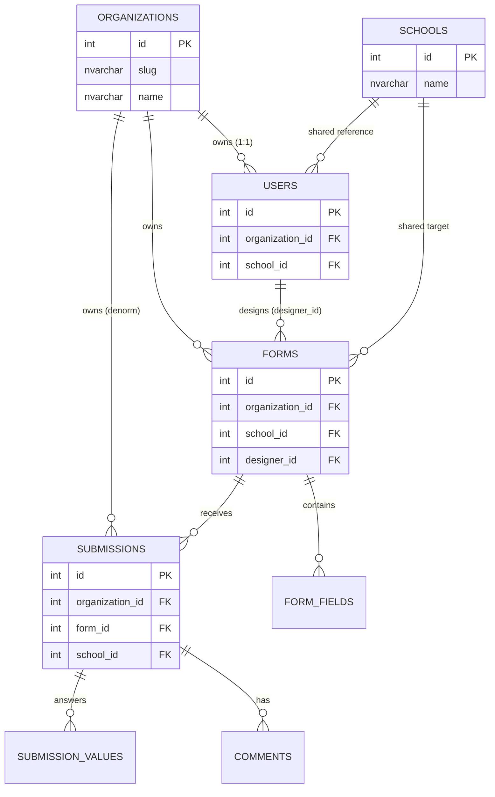

# School Forms — Organizations (Multi-Tenancy) Plan

> **Status:** Draft for review
> **Date:** 2026-08-27 (presented to product)
> **Scope:** Introduce an `Organization` tenant boundary. Every user belongs to **exactly one** organization; users cannot see another organization's Forms or data. Admins are **org-scoped**. Schools remain a **global/shared** reference list available to all organizations. Public forms are **org-scoped by URL**.

---

## 1. Requirements (verbatim)

> Every user will belong to only one organization, the default will be "Academics". A second will be "Technology Services". Users in one organization will not be able to see Forms or data from another organization. Schools will be available to all organizations.

**Breaking that down (with the confirmed decisions):**

| # | Constraint | Decision |
|---|-----------|----------|
| 1 | Every user belongs to an org | **Exactly one org per user** — `users.organization_id` (`1:1`), NOT NULL. No "unassigned" users. |
| 2 | Default = `Academics`; second = `Technology Services` | Seed these two; registration/backfill defaults to `Academics`. |
| 3 | Cross-org isolation of **Forms and data** | A user only reads/modifies forms + submissions belonging to **their org**. |
| 4 | **Admins are org-scoped** | No more global admin — an admin sees only their org's users/forms/data. |
| 5 | Schools **shared across all orgs** | `schools` is **not** scoped by org; it's a global dictionary any org's form may reference. |
| 6 | Public forms **org-scoped by URL** | A public form link encodes the org (slug) so a published form is reachable only under its org's URL. |

---

## 2. Current model & the gap

Today the app is scoped **only** by `school`:

- `users.school_id` → `schools(id)` (nullable; admins may be global). Staff carry `school_id` in their JWT.
- `forms.school_id` → `schools(id)` (nullable), `forms.designer_id` → `users(id)`.
- `submissions.school_id` → `schools(id)` (denormalized for fast staff scoping).
- Admins are effectively **global** today — `listForms()`/`listSubmissions()` without an org filter see everything.

There is **no** tenant above school. We add a top-level boundary (`organization`) that sits **above** school, while keeping school as a **shared** dimension.

**Key design shift (confirmed):** today an admin is *global*; after this change **an admin is scoped to their org** like everyone else. Schools are shared, so an org's forms can still point to any school in the list.

---

## 3. Design decision — one org per user (1:1)

The user confirmed **exactly one org per user**. We model this with a **single nullable-then-NOT-NULL `users.organization_id` FK** — no join table.

- A user's org = `users.organization_id` (a single value).
- A user sees forms/submissions whose `organization_id = users.organization_id`.
- Scoping becomes a simple equality (`organization_id = @orgId`), not an `IN (...)` predicate.

The JWT carries a single `organization_id` (not an array).

---

## 4. Data model changes

### 4.1 New `organizations` table

| Column | Type | Notes |
|--------|------|-------|
| `id` | `INT IDENTITY` PK | |
| `slug` | `NVARCHAR(60)` | Unique, url-safe identifier — `UX_organizations_slug`. Used in public form URLs (`/org/:slug/...`). |
| `name` | `NVARCHAR(120)` | Unique — `UX_organizations_name`. |
| `created_at` | `DATETIME2` | Default `SYSUTCDATETIME()`. |

**Seeded rows (idempotent):**

| name | slug |
|------|------|
| `Academics` | `academics` |
| `Technology Services` | `technology-services` |

### 4.2 Alter `users` — add `organization_id` (1:1)

| Column | Type | Notes |
|--------|------|-------|
| `organization_id` | `INT` NOT NULL FK → `organizations(id)` | The single org the user belongs to. Backfilled to `Academics` for existing rows. |
| Index | `IX_users_organization` on `organization_id` | For "who's in this org" listings. |

`school_id` stays as-is (nullable, FK → schools). A user's org is independent of their school.

### 4.3 Alter `forms` — add `organization_id`

| Column | Type | Notes |
|--------|------|-------|
| `organization_id` | `INT` NOT NULL FK → `organizations(id)` | The tenant that owns the form. Backfilled to `Academics` for existing rows. |
| Index | `IX_forms_organization` on `organization_id` | |

`school_id` and `designer_id` stay as-is. A form's org is independent of its school.

### 4.4 Alter `submissions` — add `organization_id` (denormalized)

| Column | Type | Notes |
|--------|------|-------|
| `organization_id` | `INT` NOT NULL FK → `organizations(id)` | Denormalized from `form_id → forms.organization_id` for fast org scoping (mirrors the existing `school_id` denormalization). |
| Index | `IX_submissions_org_school_form` on `(organization_id, school_id, form_id)` | Replace/widen the existing `IX_submissions_school_form`. |

`submission_values`, `comments`, `submission_adhoc_fields` need **no** org column — they hang off `submissions`, which carries the org.

---

### 4.5 Relationship map



`schools` appears **only** as a reference from users/forms/submissions — it is never owned or scoped by an org.

---

## 5. Scoping rules

Once org context is on the token and on `users`/`forms`/`submissions`, every authenticated read/write is filtered by a **single** `organization_id = @orgId`.

| Data | Public / Anonymous | Admin | Staff | Scope source |
|------|--------------------|-------|-------|--------------|
| `schools` | ✓ (all) | ✓ (all) | ✓ (their school) | **Unchanged** — global/shared. |
| `forms` list/preview | via org-scoped public URL | **org only** | **org only** | `forms.organization_id = user.organization_id` |
| single `form` (get/edit/publish) | via org-scoped public URL | **org only** | **org only** | `forms.organization_id = user.organization_id` |
| `submissions` list | via org-scoped public URL | **org only** | **org + their school** | `submissions.organization_id = user.organization_id` |
| single `submission` detail | via public id + org | **org only** | **org + school owner** | `submissions.organization_id = user.organization_id` |
| `export` preview/csv | n/a | **org only** | **org + school** | `submissions.organization_id = user.organization_id` |
| `users` (admin panel) | n/a | **org only** | n/a | `users.organization_id = admin.organization_id` |
| `organizations` | n/a | **read-only list** | n/a | org itself |

### Public form org-scoping by URL

Because public parents have no account, the org boundary is enforced through the **URL** rather than a token. A published form's public URL includes the org slug:

```
/org/:slug/forms/:id            # parent opens a published form
/org/:slug/submissions/:publicId  # parent confirmation readback
```

Rules:
- The public **list** endpoint (`/api/forms/public`) is **removed** or restricted to returning the published forms for a **single org** addressed by `?org=<slug>` — never all orgs at once.
- `getForm(id)` for a public link must also check the form's `organization_id.slug` matches the slug in the URL. A form in `academics` is *not* reachable under `/org/technology-services/forms/:id`.
- The parent-facing routes that previously accepted a bare `form_id` / `public_id` now require the org slug to be present and matching.

---

## 6. Migration (idempotent, matches existing `DDL_STATEMENTS` pattern)

All statements go into the `DDL_STATEMENTS` array in `server/src/db/schema.ts`. Each is a separate idempotent batch, so `initDb` can re-run safely.

```sql
-- (1) organizations table
IF OBJECT_ID('dbo.organizations', 'U') IS NULL
   CREATE TABLE dbo.organizations (
     id         INT IDENTITY(1,1) PRIMARY KEY,
     slug       NVARCHAR(60)  NOT NULL,
     name       NVARCHAR(120) NOT NULL,
     created_at DATETIME2 NOT NULL CONSTRAINT DF_organizations_created_at DEFAULT SYSUTCDATETIME()
   );
IF NOT EXISTS (SELECT 1 FROM sys.indexes WHERE name='UX_organizations_slug')
   CREATE UNIQUE INDEX UX_organizations_slug ON dbo.organizations(slug);
IF NOT EXISTS (SELECT 1 FROM sys.indexes WHERE name='UX_organizations_name')
   CREATE UNIQUE INDEX UX_organizations_name ON dbo.organizations(name);

-- (2) seed the two defaults (idempotent)
IF NOT EXISTS (SELECT 1 FROM dbo.organizations WHERE slug = N'academics')
   INSERT INTO dbo.organizations (slug, name) VALUES (N'academics', N'Academics');
IF NOT EXISTS (SELECT 1 FROM dbo.organizations WHERE slug = N'technology-services')
   INSERT INTO dbo.organizations (slug, name) VALUES (N'technology-services', N'Technology Services');

-- (3) users.organization_id (1:1)
IF COL_LENGTH('dbo.users', 'organization_id') IS NULL
   ALTER TABLE dbo.users ADD organization_id INT NULL;
IF EXISTS (SELECT 1 FROM dbo.users WHERE organization_id IS NULL)
   UPDATE u SET u.organization_id = o.id
   FROM dbo.users u CROSS JOIN dbo.organizations o
   WHERE o.slug = N'academics' AND u.organization_id IS NULL;
IF NOT EXISTS (SELECT 1 FROM dbo.users WHERE organization_id IS NULL)
   ALTER TABLE dbo.users ALTER COLUMN organization_id INT NOT NULL;
IF NOT EXISTS (SELECT 1 FROM sys.foreign_keys WHERE name='FK_users_organization')
   ALTER TABLE dbo.users ADD CONSTRAINT FK_users_organization
     FOREIGN KEY (organization_id) REFERENCES dbo.organizations(id) ON DELETE NO ACTION;
IF NOT EXISTS (SELECT 1 FROM sys.indexes WHERE name='IX_users_organization')
   CREATE INDEX IX_users_organization ON dbo.users(organization_id);

-- (4) forms.organization_id
IF COL_LENGTH('dbo.forms', 'organization_id') IS NULL
   ALTER TABLE dbo.forms ADD organization_id INT NULL;
IF EXISTS (SELECT 1 FROM dbo.forms WHERE organization_id IS NULL)
   UPDATE f SET organization_id = o.id
   FROM dbo.forms f CROSS JOIN dbo.organizations o
   WHERE o.slug = N'academics' AND f.organization_id IS NULL;
IF NOT EXISTS (SELECT 1 FROM dbo.forms WHERE organization_id IS NULL)
   ALTER TABLE dbo.forms ALTER COLUMN organization_id INT NOT NULL;
IF NOT EXISTS (SELECT 1 FROM sys.foreign_keys WHERE name='FK_forms_organization')
   ALTER TABLE dbo.forms ADD CONSTRAINT FK_forms_organization
     FOREIGN KEY (organization_id) REFERENCES dbo.organizations(id) ON DELETE NO ACTION;
IF NOT EXISTS (SELECT 1 FROM sys.indexes WHERE name='IX_forms_organization')
   CREATE INDEX IX_forms_organization ON dbo.forms(organization_id);

-- (5) submissions.organization_id (denormalized from its form)
IF COL_LENGTH('dbo.submissions', 'organization_id') IS NULL
   ALTER TABLE dbo.submissions ADD organization_id INT NULL;
IF EXISTS (SELECT 1 FROM dbo.submissions WHERE organization_id IS NULL)
   UPDATE s SET organization_id = f.organization_id
   FROM dbo.submissions s JOIN dbo.forms f ON f.id = s.form_id
   WHERE s.organization_id IS NULL;
IF NOT EXISTS (SELECT 1 FROM dbo.submissions WHERE organization_id IS NULL AND form_id IS NOT NULL)
   ALTER TABLE dbo.submissions ALTER COLUMN organization_id INT NOT NULL;
IF NOT EXISTS (SELECT 1 FROM sys.foreign_keys WHERE name='FK_submissions_organization')
   ALTER TABLE dbo.submissions ADD CONSTRAINT FK_submissions_organization
     FOREIGN KEY (organization_id) REFERENCES dbo.organizations(id) ON DELETE NO ACTION;
-- widen the school+form index to include org (drop old, create new)
IF EXISTS (SELECT 1 FROM sys.indexes WHERE name='IX_submissions_school_form')
   DROP INDEX IX_submissions_school_form ON dbo.submissions;
IF NOT EXISTS (SELECT 1 FROM sys.indexes WHERE name='IX_submissions_org_school_form')
   CREATE INDEX IX_submissions_org_school_form ON dbo.submissions(organization_id, school_id, form_id);
```

> ⚠️ **SQL Server cascade note:** `users.organization_id`, `forms.organization_id`, and `submissions.organization_id` use `ON DELETE NO ACTION` (consistent with the existing school FKs). `ON DELETE CASCADE` from org would collide with the existing `forms.school_id`/`submissions`/`users` cascade paths (error 1785). Org deletion is an administrative operation done after reassigning children.

**Safe re-run guarantee:** every block is guarded by `IF OBJECT_ID` / `IF COL_LENGTH` / `IF NOT EXISTS` / `IF EXISTS (... NULL)`. No data loss on a second run.

---

## 7. Backend implementation

### 7.1 `auth.ts` — put the single org on the token

```ts
export interface AccessPayload {
  sub: number;
  email: string;
  role: Role;
  school_id: number | null;
  organization_id: number | null;  // NEW — the user's single org
  type: "access";
}

interface JwtUser {
  id: number;
  email: string;
  role: Role;
  school_id: number | null;
  organization_id: number | null;  // NEW
}
```

- `signAccessToken(...)` accepts and embeds `organization_id`.
- `requireAuth` / `optionalAuth` populate `req.user.organization_id` from the payload.

### 7.2 `queries.ts` — org-scope the access functions

Add a scalar `orgClause` where needed. Since it's a **single** org, the predicate is `organization_id = @orgId`. Example:

```ts
export async function listForms(opts: { schoolId?: number | null; orgId: number }): Promise<Form[]> {
  const params: Record<string, unknown> = { orgId: opts.orgId };
  let where = "f.organization_id = @orgId";
  if (opts.schoolId != null) { where += " AND f.school_id = @schoolId"; params.schoolId = opts.schoolId; }
  return execute<Form>(`SELECT ... FROM dbo.forms f WHERE ${where} ORDER BY f.updated_at DESC`, params);
}
```

Scoped functions to update (add `orgId` param, filter on `organization_id`):
- `listForms`, `listSchoolsPage` (unchanged for schools)
- `getForm` / `getFormWithFields` (add `getFormInOrg(id, orgId)` / check the org slug)
- `createForm` (write `organization_id` from the caller's org)
- `updateForm` / status patch (guard ownership by org)
- `listSubmissions` / `getSubmissionDetail` / `listSubmissionValues` (filter by org; staff also filter by their school)
- `createSubmission` (inherit org from the form's `organization_id`)
- `createComment`, adhoc-field writes (guard by parent submission's org)
- `listUsers` (filter by `users.organization_id = admin.organization_id`)

**Shared-school note:** `listSchools`, `listSchoolsPage`, and the school-MERGE/import helpers are **unchanged** — schools are global. `listSchools(schoolId?)` keeps working for the staff school picker and admin schools panel.

### 7.3 Routes

| File | Change |
|------|--------|
| `routes/forms.ts` | Read `req.user.organization_id` and pass to `listForms`/`getForm*`/`updateForm`/status. `createForm` writes `organization_id` from `req.user.organization_id`. |
| `routes/submissions.ts` | Pass `organization_id` to list/detail/value queries. Keep the existing **school** ownership check for staff (org AND school). Inherit org on create. |
| `routes/export.ts` | Pass `organization_id` to `listSubmissions` so exports never leak across orgs. |
| `routes/users.ts` | `listUsers()` filters to users **in the admin's org**. Add org assignment on create/edit (a single `organization_id`, required). Block an admin from changing/removing their own org (mirrors existing self-deactivate guard). |
| `routes/auth.ts` | `register`: accept/select an org (default `Academics`) and set `users.organization_id`. `login`/`me`: attach `organization_id` (and org details) to token + response. |

### 7.4 Public (anonymous) routes — org scope by URL

| File | Change |
|------|--------|
| `routes/forms.ts` | Remove or org-restrict `/api/forms/public`. New `/org/:slug/forms/:id/public` resolves the form **and** verifies `form.organization_id.slug === :slug`. |
| `routes/submissions.ts` | `/org/:slug/submissions/:publicId/public` verifies the submission's org slug before returning the confirmation. |
| `routes/webhook.ts` | Inherit org from the form; org-scoped by the form it targets. |

Add a `requireOrgSlug` resolver that loads an org by slug and attaches it, plus a guard that compares the target's org.

### 7.5 `schemas.ts`

- `registerSchema`: add required `organization_id` (defaults to Academics if omitted).
- `createFormSchema` / `updateFormSchema`: `organization_id` validated against the caller's org.
- User create/update schemas: add `organization_id: number` (single, required).
- Add `organization_id` to relevant response DTOs.

### 7.6 `swagger.ts`

Add `organization_id` (and `slug`) to Form/Submission/User/Organization schemas; document the org-scoped behavior and the URL-encoded public routes.

### 7.7 `seed.ts`

- Seed the two orgs (or rely on migration step §6(2)).
- Ensure seeded users get `organization_id` = the `Academics` org id.

---

## 8. Frontend implementation

| File | Change |
|------|--------|
| `client/src/lib/api.ts` | Update public form/submission URLs to the org-slug form. |
| `client/src/context/AuthContext.tsx` | Read `organization_id` from the login/me payload; expose `user.organization_id` + org `slug`. |
| `client/src/types/index.ts` | Add `organization_id` / `slug` to Form/Submission/User/Org types. |
| `client/src/pages/RegisterPage.tsx` | Add an org selector (default `Academics`); show the org name on the dashboard header. |
| `client/src/pages/admin/AdminForms.tsx` + `AdminFormDesigner.tsx` | Scope form listing to the user's org; show an org badge. |
| `client/src/pages/staff/StaffQueue.tsx` + `StaffSubmissionDetail.tsx` | Already scoped to staff school; ensure detail/queue only surfaces org-matching submissions. |
| `client/src/pages/admin/AdminSettings.tsx` | Add an **Organizations** panel (list orgs, members) + a single-org assignment in add/edit user. |
| `client/src/pages/admin/AdminDashboard.tsx` | Show the user's org scope/badge. |
| Public parent page(s) | Route through `/org/:slug/forms/:id`; extract/validate the slug. |

**Shared Schools UI:** the existing school picker and admin Schools panel need **no** org filtering — schools stay global. Only a small label ("shared across all organizations") is optional polish.

---

## 9. Open questions / decisions

1. ~~Single vs. many orgs per user~~ — **Resolved:** a user belongs to exactly **one** org (`users.organization_id`, NOT NULL).
2. ~~Admin scope change~~ — **Resolved:** admins **are org-scoped** (no global admin). This is the biggest behavioral change and will surprise any admin who used to see everything — call it out in release notes.
3. ~~Public forms listing~~ — **Resolved:** public forms are **org-scoped by URL** (`/org/:slug/...`). Questions remaining: should `/api/forms/public` (the old unscoped list) be **removed** entirely or kept behind a `?org=<slug>` filter? Recommend removing the unscoped variant.
4. **Org slug source** — fixed slugs (`academics`, `technology-services`) vs. auto-generated. Recommend fixed for the two known orgs, auto-generated for any future ones.
5. **Org admin roles** — do we need per-org admins (an "org admin" who manages only their org's users) separate from the global role? Recommend yes long-term, optional now.
6. **Deleting an org** — org FKs are `NO ACTION`, so deletion requires manual reassignment. Do we need soft-delete/disable for orgs (an `active` flag) instead of hard delete?

---

## 10. Rollout phases

| Phase | Deliverable | Verify |
|-------|-------------|--------|
| **1** | Migration DDL (orgs, `users.organization_id`, `forms.organization_id`, `submissions.organization_id`) + seed | `initDb` re-runs cleanly; existing users/forms/submissions backfilled to Academics. |
| **2** | `queries.ts` org helpers + auth token `organization_id` | Login returns `organization_id`; `/me` returns it. |
| **3** | Route scoping (forms, submissions, export, users) + public org-slug routes | Cross-org access returns 403/empty; public form reachable only under its org slug. |
| **4** | `schemas.ts` + register/user-management org field | New users get Academics by default; admins set a single org. |
| **5** | Frontend org awareness + Settings Organizations panel | UI reflects org scope; school picker unchanged. |
| **6** | E2E + Swagger update | Verify a Technology Services user cannot see Academics forms/submissions; admin panel lists only their org's users. |

---

## 11. File-by-file change list

**Server**
- `server/src/db/schema.ts` — `organizations`, `users.organization_id`, `forms.organization_id`, `submissions.organization_id` DDL + type updates.
- `server/src/db/queries.ts` — org clauses on forms/submissions/users queries; org-aware create/update.
- `server/src/db/seed.ts` — seed orgs + user org assignment.
- `server/src/auth.ts` — `organization_id` in payloads + `requireAuth`/`optionalAuth`.
- `server/src/routes/forms.ts`, `submissions.ts`, `export.ts`, `users.ts`, `auth.ts`, `webhook.ts` — org scoping/filtering + public org-slug routes.
- `server/src/schemas.ts` — org fields on auth/form/user schemas.
- `server/src/swagger.ts` — org fields documented.

**Client**
- `client/src/types/index.ts` — org types.
- `client/src/context/AuthContext.tsx` — expose `organization_id`/org slug.
- `client/src/pages/RegisterPage.tsx`, `admin/AdminSettings.tsx` — org assignment UI; Organizations panel.
- `client/src/pages/admin/AdminForms.tsx`, `AdminFormDesigner.tsx`, `AdminDashboard.tsx` — org scoping/badges.
- `client/src/pages/staff/StaffQueue.tsx`, `StaffSubmissionDetail.tsx` — confirm org+school filtering.
- Public parent form/submission pages — route through `/org/:slug/...`.

---

## 12. Verification checklist (after implementation, run locally / on GitHub)

- `GET /api/health` → `{ok:true, dbReady:true}`.
- Login as an **Academics** admin → token has `organization_id:<Academics id>`.
- Login as a **Technology Services** admin → `GET /api/forms` returns **only** Technology Services forms (seed one per org to prove isolation).
- A Technology Services user calling `GET /api/submissions` for an Academics form returns empty/403.
- Export preview/CSV only includes the caller's org submissions.
- Admin user panel lists only the admin's org users; a new user defaults to Academics.
- Staff still sees **only their school** (org + school both enforced).
- A public Academics form is reachable at `/org/academics/forms/:id` and **not** at `/org/technology-services/forms/:id`.
- An anonymous parent can submit and read back their confirmation via the org-scoped public URL.
- Public `/forms/:id/public` link still works for anonymous parents.
