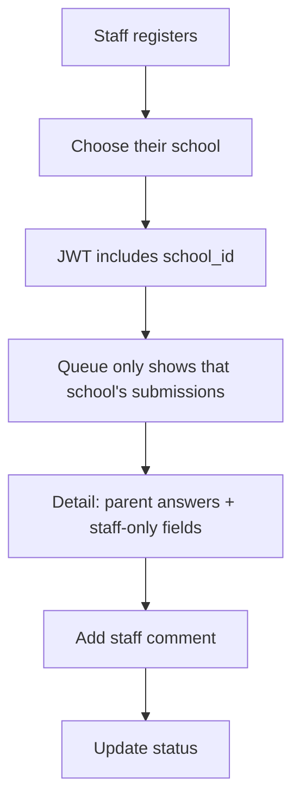
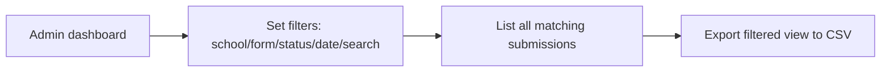

# School Forms — Implementation Plan

> **Status:** Draft for review
> **Date:** 2026-08-26
> **Audience:** Product & Engineering review

---

## 1. Overview

School Forms is a role-based form management platform for K-12 districts. It lets **Admins** design form templates, **Parents** submit those forms, and **School Staff** review submissions and annotate them with comments.

The single most important design principle: **every role sees only what they're allowed to see** — an entire access-control story built around school scoping.

### The core loop

```
  Admin designs a Form          Parent submits             Staff reviews & comments
  (template + fields)   ───►   (answers on the form)  ───► (adds staff-only notes)
        │                                                          │
        └──────────── Admin sees ALL submissions, ─────────────────┘
                         filters and exports them
```

---

## 2. Roles & Personas

| Role  | Who | What they can do |
|-------|-----|------------------|
| **Admin** | District form managers / IT | Design form templates, see **all** submissions across all schools in a spreadsheet-style list, filter, and **export** data. Manage schools & staff. |
| **Staff** | School staff (teachers, counselors, office staff) | Register, **choose their school**, see only submissions **for their school**, and add **staff-only comments/fields**. |
| **Parent** | Parents / guardians | Submit forms **completely anonymously**. No account, no login, no session. After submit they get a confirmation + a **Submission ID**. |

### Access rule summary
- **Admin** — global scope (all schools). Designs forms, exports everything.
- **Staff** — school scope. Their registration *must* include choosing a school; they never see other schools' data.
- **Parent** — anonymous. They are **not** users in the system; they only fill and submit a form. Any contact info they enter (name/email/phone) is just *form field data*, not an identity.

---

## 3. Tech Stack

Chosen for consistency with existing district tooling (matches TeamSupportPro conventions and prior Azure SQL / TypeScript work).

| Layer | Choice | Notes |
|-------|--------|-------|
| **Frontend** | React + Vite + TypeScript | Fast dev, modern SPA. React Router for routing, TanStack Query for data fetching/caching. |
| **Backend** | Node.js + Express + TypeScript | REST API; clean separation from frontend. |
| **ORM / DB** | Drizzle ORM over `mssql` | Azure SQL (serverless-friendly). Drizzle gives typed schemas + migrations. |
| **Database** | Azure SQL | Serverless free tier supported — see the DB-warmup notes below. |
| **API Docs** | Swagger / OpenAPI 3 (served via `swagger-ui-react` or `swagger-ui-express`) | **Robust** — this is a first-class requirement. |
| **Auth** | JWT (access + refresh) with role claim (`admin` / `staff`) | **No parent auth** — parents submit anonymously. The staff token carries the `school_id` claim. |
| **Validation** | Zod | Shared request/response validation; drives Swagger schemas. |

> **DB warmup reminder (from prior work):** Azure SQL Serverless auto-suspends when idle. On first start, TDS logins `ECONNRESET`. Use retry-with-backoff around `sql.connect`, start `app.listen()` *before* DB init in a background retry loop (don't `process.exit(1)`), and expose a module-level `dbReady` flag so the frontend can poll `/api/health` and show a "warming up" banner.

---

## 4. Data Model

> Drizzle schema. All tables scoped to a school where relevant.

### `schools`
| Column | Type | Notes |
|--------|------|-------|
| `id` | uuid/pk | |
| `name` | text | |
| `district` | text | Optional grouping. |
| `created_at` | timestamp | |

### `users`
| Column | Type | Notes |
|--------|------|-------|
| `id` | uuid/pk | |
| `email` | text (unique) | |
| `password_hash` | text | Staff & Admin only (no parent accounts). |
| `role` | enum(`admin`,`staff`) | **No `parent` role** — parents are anonymous submitters, not users. |
| `school_id` | uuid/fk → `schools` | **Required for staff.** Null for admins (global). |
| `display_name` | text | |
| `created_at` | timestamp | |

### `forms` (templates designed by Admins)
| Column | Type | Notes |
|--------|------|-------|
| `id` | uuid/pk | |
| `title` | text | |
| `description` | text | |
| `school_id` | uuid/fk → `schools` | Which school the form is for. |
| `designer_id` | uuid/fk → `users` | The admin who built it. |
| `status` | enum(`draft`,`published`,`archived`) | |
| `created_at` | timestamp | |
| `updated_at` | timestamp | |

### `form_fields` (template fields, ordered)
| Column | Type | Notes |
|--------|------|-------|
| `id` | uuid/pk | |
| `form_id` | uuid/fk → `forms` | |
| `label` | text | |
| `type` | enum(`text`,`textarea`,`number`,`date`,`select`,`checkbox`,`radio`,`email`) | **No `file` type** (no uploads). |
| `options` | json | For select/radio/checkbox. |
| `required` | boolean | Parent-facing. Optional fields are simply `required = false`. |
| `staff_only` | boolean | **Staff-only field** — hidden from Parent, visible to Staff when reviewing. |
| `sort_order` | int | |
| `placeholder` | text | Optional. |

### `submissions` (one per anonymous Parent form completion)
| Column | Type | Notes |
|--------|------|-------|
| `id` | uuid/pk | Serves as the public **Submission ID** given to the parent. |
| `form_id` | uuid/fk → `forms` | |
| `school_id` | uuid/fk → `schools` | Denormalized for fast staff scoping. |
| `status` | enum(`submitted`,`in_review`,`flagged`,`resolved`) | State machine for staff. |
| `submitted_at` | timestamp | |
| `updated_at` | timestamp | |

> **Anonymous by design:** there is **no** `parent_name` / `parent_email` column and no FK to `users`. The parent's name, email, phone, etc. are captured only as `submission_values` against that form's fields — they are data, not an account.

### `submission_values` (Parent answers for each field)
| Column | Type | Notes |
|--------|------|-------|
| `id` | uuid/pk | |
| `submission_id` | uuid/fk → `submissions` | |
| `field_id` | uuid/fk → `form_fields` | |
| `value` | json | Typed per field type. |

### `comments` (Staff-only annotations)
| Column | Type | Notes |
|--------|------|-------|
| `id` | uuid/pk | |
| `submission_id` | uuid/fk → `submissions` | |
| `staff_id` | uuid/fk → `users` | |
| `body` | text | |
| `visibility` | enum(`internal`) | **Staff-only** by design. |
| `created_at` | timestamp | |

### Indexes / constraints
- Unique `users.email`.
- Composite index on `submissions(school_id, form_id)` for staff scoping + admin filtering.
- Index on `submissions(submitted_at)` for admin date-range filters/exports.
- FK cascade deletes where appropriate.

---

## 5. API Surface (Swagger)

A **robust Swagger UI** is an explicit requirement. Every endpoint below should have a full OpenAPI schema, examples, and be grouped by tag.

### Auth & Users
| Method | Path | Role | Purpose |
|--------|------|------|---------|
| `POST` | `/api/auth/register/staff` | Public | Staff registers, **must** pick a school. |
| `POST` | `/api/auth/login` | Public | Returns JWT (refresh kept in httpOnly cookie). |
| `POST` | `/api/auth/refresh` | Public | Rotate access token. |
| `POST` | `/api/auth/logout` | Auth | Invalidate refresh. |
| `GET` | `/api/auth/me` | Auth | Current user + role + school. |
| `GET` | `/api/schools` | Public | List schools for the staff registration dropdown. |

### Forms (Admin design)
| Method | Path | Role | Purpose |
|--------|------|------|---------|
| `GET` | `/api/forms` | Admin | List templates (with filter: school/status). |
| `POST` | `/api/forms` | Admin | Create a template. |
| `GET` | `/api/forms/:id` | Admin | Fetch a template + **all** its fields (including staff-only). |
| `PUT` | `/api/forms/:id` | Admin | Update template/fields. |
| `PATCH` | `/api/forms/:id/status` | Admin | Publish / unpublish (goes live for parents). |
| `GET` | `/api/forms/public` | Public | List **published** forms (staff-only fields stripped). |
| `GET` | `/api/forms/:id/public` | Public | Fetch a **published** form + its fields (staff-only fields stripped). |

### Submissions
| Method | Path | Role | Purpose |
|--------|------|------|---------|
| `POST` | `/api/submissions` | Public (anon) | **Anonymous** submission — no auth. Returns the submission + its **Submission ID**. |
| `GET` | `/api/submissions/:publicId/public` | Public | Thin confirmation readback (timestamp/status/form name only — **no answers**, preserving anonymity). |
| `GET` | `/api/submissions` | Admin, Staff | List. **Admin:** all + filter. **Staff:** scoped to their school. |
| `GET` | `/api/submissions/:publicId` | Admin, Staff | Detail (including staff-only fields + comments). |
| `PATCH` | `/api/submissions/:publicId/status` | Admin, Staff | Update workflow state (submitted → in_review → flagged → resolved). |
| `POST` | `/api/submissions/:publicId/comments` | Admin, Staff | Add a staff-only comment.
| `PATCH` | `/api/submissions/:id/status` | Staff, Admin | Update status (in_review / flagged / resolved). |
| `POST` | `/api/submissions/:id/comments` | Staff, Admin | Add a staff-only comment. |
| `GET` | `/api/submissions/:id/comments` | Staff, Admin | List staff-only comments. |

### Admin spreadsheet / export
| Method | Path | Role | Purpose |
|--------|------|------|---------|
| `GET` | `/api/admin/submissions/export` | Admin | **Export filtered rows** as CSV. |
| `GET` | `/api/admin/submissions/filters` | Admin | List available filter facets (schools, forms, status, date range). |

### Swagger UI
| Method | Path | Purpose |
|--------|------|---------|
| `GET` | `/api/docs` | Swagger UI (interactive). |
| `GET` | `/api/docs.json` | Raw OpenAPI spec. |

> **Filtering contract (Admin):** `?school_id=&form_id=&status=&date_from=&date_to=&q=&page=&page_size=` — all optional, combined with AND, mirrored 1:1 between the spreadsheet UI and the export endpoint so "what you see is what you export."

---

## 6. Screens & UX

### Auth / Access
- **Login** — shared email/password.
- **Staff registration** — form with a **School selector** (required). This is how staff get scoped.
- Role-aware redirect after login (Admin → Dashboard, Staff → School queue, Parent → their submissions).

### Admin
- **Form Designer** — drag/reorder field builder. Set `staff_only` on fields. Publish/unpublish.
- **Data Dashboard (spreadsheet)** — the centerpiece. A data-grid/table listing **all** submissions across schools with:
  - Sortable columns.
  - **Filters** (school, form, status, date range, free-text search) persisted in the UI.
  - **Export** button → **CSV** of the current filtered view.
- **Submission detail** — full read view, status controls, staff comments.

### Staff
- **School queue** — list of submissions for *their school only*.
- **Submission detail** — reads the Parent's answers including **staff-only fields**, and a comment thread (staff-only).
- **Comment + status** actions (`in_review`, `flagged`, `resolved`).

### Parent
- **Public form page(s)** — publishes a form; fill & submit **anonymously**. No sign-in, no account.
- **Confirmation page** — shows a success message + the **Submission ID** to reference later (the parent can't log back in, so the ID is their only receipt).

### Layout
Reuse the TeamSupportPro shell: dark navy `#0d2f4f` top banner, sidebar nav with active-highlight, light `#f4f7fb` canvas, white cards with `2px` radius, the signature uppercase buttons.

---

## 7. Design System (CSS tokens)

Derived directly from the reference site (`teamsupportpro-development.azurewebsites.net`). Adopt these as the new site's CSS custom properties.

```css
:root {
  --font: "Work Sans", sans-serif;

  /* Brand / color */
  --accent: #0078d4;          /* primary action */
  --button-bg: #0078d4;
  --button-text: #ffffff;
  --header-bg: #0d2f4f;       /* dark navy top bar */
  --menu-bg: #123555;         /* dropdown menus */
  --text: #10243b;            /* primary text */
  --text-muted: #5f7389;
  --app-bg: #f4f7fb;          /* page background */
  --card-bg: #ffffff;
  --panel-bg: #fbfdff;
  --border: #e5e7eb;
  --input-bg: #ffffff;

  /* Shape */
  --radius: 2px;              /* sharp, minimal */
  --shadow-card: rgba(13, 47, 79, 0.08) 0 30px 80px;
}
```

### Key component rules (from the reference)
- **Buttons:** uppercase, `letter-spacing: 0.08em`, `font-weight: 700`, `font-size: 13px`, padding `10px 14px`, radius `2px`, `transition` on hover.
  - Primary: `var(--button-bg)` bg / `var(--button-text)` text; hover `filter: brightness(0.98)`.
  - Secondary: `1px solid var(--border)`, `var(--app-bg)` bg; hover fills `var(--accent)`.
  - Icon buttons: `36×36`, transparent, hover fills accent.
- **Cards:** `.surface { border:1px solid var(--border); background: var(--card-bg); border-radius:2px; }`.
- **Inputs:** `.input-control { border:1px solid var(--border); background: var(--input-bg); padding:10px 12px; border-radius:2px; }` focus → `border-color: var(--accent)`.
- **Badges (status/priority):**
  - Blue: text `rgb(49,93,198)` / bg `rgb(234,243,255)` / border `rgb(169,201,255)`.
  - Green: text `rgb(30,140,82)` / bg `rgb(230,255,240)` / border `rgb(150,224,176)`.
  - Amber: text `rgb(165,108,0)` / bg `rgb(255,245,214)` / border `rgb(248,211,109)`.
  - Red: text `rgb(186,48,64)` / bg `rgb(255,232,234)` / border `rgb(255,177,184)`.
  - Slate: text `rgb(84,98,116)` / bg `rgb(245,247,250)` / border `rgb(213,220,228)`.
- **Tabs:** bottom-border active state (`border-bottom-color: var(--accent); color: var(--accent)`).
- **Sidebar links:** white text, active row gets `var(--accent)` background.

### Spreadsheet / admin grid
The admin data view should be a clean, dense table: sticky header, zebra rows, sortable column headers, a filter toolbar above, and the Export button in the toolbar. Use the same `--accent`/`--border`/card tokens as everything else.

---

## 8. Key Flows (Mermaid)

### Staff school scoping


### Admin filter & export


---

## 9. Milestones / Phases

### Phase 1 — Foundation
- Repo scaffold (React+Vite frontend, Express+TS backend, Drizzle + Azure SQL).
- School & user model, auth (JWT + role), staff registration with school picker.
- `/api/health` + `dbReady` banner.

### Phase 2 — Admin designs & publishes
- Form designer (field builder with `staff_only` flag), publish flow.
- Swagger UI wired for all endpoints added so far.

### Phase 3 — Parent submissions
- Public **anonymous** form submission flow, validation, confirmation page with **Submission ID**.

### Phase 4 — Staff review
- School-scoped queue, detail view (incl. staff-only fields), comments, status transitions.

### Phase 5 — Admin spreadsheet & export
- Filterable data grid, **CSV** export wired to the same filters.

### Phase 6 — Polish & hardening
- Rate limiting, RBAC enforcement tests, seeding (idempotent delete-then-insert), end-to-end review, production type-check.

---

## 10. Resolved Decisions

All prior open questions are now decided:

1. **Parent accounts → No.** Parents submit **anonymously** — no account, no login, no session. They get a confirmation page + **Submission ID** as their receipt. (No user record is created for parents.)
2. **File uploads → No.** The `file` field type is removed from the model. No Azure Blob / storage needed.
3. **Export format → CSV only.** Drop the extra XLSX dependency; produce a single CSV export of the filtered view. (Can revisit XLSX later.)
4. **School hierarchy → No nesting.** Flat `schools` list (name + optional district), no district → school → building tree.
5. **Notification of staff → No.** No email/in-app notification on new submissions. Staff simply see new rows in their school queue.
6. **Form versioning → No.** Live forms are edited in place; there's no version-history or snapshot. Submissions store values against the current fields at submit time.

---

## 11. Reference Form: "CDM"

The first form to build is **CDM** — a course/credit selection form. It demonstrates the full anonymous-submit flow and is the seed data for the Admin spreadsheet view.

### Form definition (`form_fields`)
| `label` | `type` | `required` | `staff_only` | `options` |
|---------|--------|-----------|--------------|----------|
| Student Name | text | ✓ | — | — |
| Birthdate | date | ✓ | — | — |
| School | select | ✓ | — | `Broughton High School`, … (list of schools) |
| Grade Level | select | ✓ | — | `9`, `10`, `11`, `12` |
| Student ID | text | ✓ | — | — |
| Course choice #1 | select | ✓ | — | list of course offerings |
| Course choice #2 (optional) | select | ✗ | — | list of course offerings |
| Course choice #3 (optional) | select | ✗ | — | list of course offerings |
| Parent/Guardian Name | text | ✓ | — | — |
| Email | email | ✓ | — | — |
| Phone | text | ✓ | — | — |

> **Note:** By default `staff_only` is `false` for all CDM fields — the parent's submitted contact info is *data*, not identity. A `staff_only` field (e.g. an internal adjudication note) can be added later without affecting the parent-facing shape.

### Example submission (seed data)
This is the reference record to seed for the Admin spreadsheet and the Staff review queue.

| Field | Value |
|-------|-------|
| Student Name | `Johnny Smith` |
| Birthdate | `2010-08-26` |
| School | `Broughton High School` |
| Grade Level | `9` |
| Student ID | `123456` |
| Course choice #1 | `English I` |
| Course choice #2 (optional) | `Biology` |
| Course choice #3 (optional) | `English II` |
| Parent/Guardian Name | `Tim Smith` |
| Email | `tsmith@gmail.com` |
| Phone | `919-333-4444` |
| Submission Time | `2026-08-26T20:03:49.442Z` |
| Submission ID | `7bea2443-a5bb-4e40-a5c2-95034718fdd3` |
| Form ID | `1` |
| Form Name | `CDM` |

### Notes
- **Submission ID** (`7bea2443-…`) is the value returned to the parent on the confirmation page and is the row's primary key in the spreadsheet.
- **Submission Time** is `submitted_at` (ISO 8601 UTC).
- **Form ID** `1` and **Form Name** `CDM` drive the Admin filter dropdown for the form column.

---

## 11. Reference Design Source

CSS tokens and component styles were extracted from:
**https://teamsupportpro-development.azurewebsites.net/**

Primary palette: `#0078d4` accent, `#0d2f4f` navy header, `#f4f7fb` canvas, `#10243b` text, `2px` radius, `Work Sans` typeface, uppercase buttons with `0.08em` letter-spacing.
