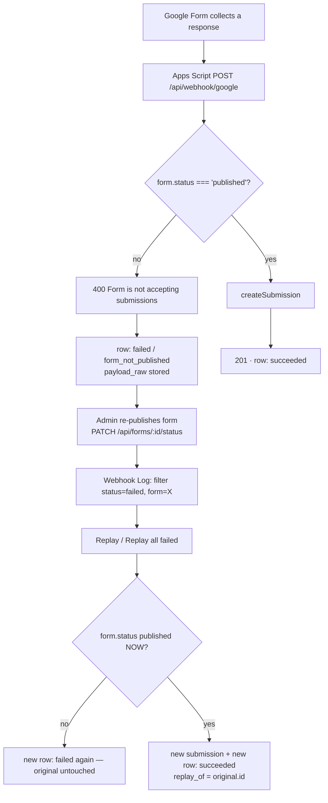

# Webhook Log & Replay

**Status:** ✅ **Approved and implemented** — 2026-09-15. All nine decisions in §12 were
answered by the product owner and are recorded inline there; the built result matches them.
Verified live against both SQL Server and Turso (§10).
**Date:** 2026-09-15
**Area:** Admin → Webhook Log (inbound Google Forms intake observability + replay)
**Related:** [`docs/plans/webhook.md`](./webhook.md) (the original intake feature), [`docs/features/webhook.md`](../features/webhook.md), [`docs/plans/dual-db.md`](./dual-db.md) §5.3, [`docs/plans/delete-form.md`](./delete-form.md) (formatting precedent)

---

## 1. What was asked

> "I need more visibility into which webhooks succeed and fail, maybe this calls for a 'Webhook Log' as they come into the app. Also, could I resubmit a failed webhook if the log has all of the information? Let's say a form was accidentally 'Unpublished' by an administrator, can I publish it again and re-send the information to the app."

Three asks, and they are one feature:

1. **Visibility** — a log of every inbound webhook with a success/failure outcome.
2. **Replay** — re-run a failed webhook from the data captured in the log.
3. **The republish scenario** — a form was accidentally unpublished, so Google Forms kept
   collecting responses that the app rejected. Republish the form, then push the lost
   responses in.

---

## 2. Current state (why this is needed at all)

`server/src/routes/webhook.ts` is 62 lines. Every failure path returns **before any write**:

| Line | Condition | Response | Persisted? |
| ---- | --------- | -------- | ---------- |
| 26 | secret missing/wrong | `401 {error:"Invalid or missing webhook secret"}` | **nothing** |
| 32 | Zod `safeParse` fails | `400 {error:"Validation failed", details}` | **nothing** |
| 38 | `!getForm(form_id)` | `404 {error:"Form not found"}` | **nothing** |
| 42 | `form.status !== "published"` | `400 {error:"Form is not accepting submissions"}` | **nothing** |
| 47 | `createSubmission` throws | bubbles to `next(err)` → 500 | **nothing** |
| 56 | success | `201 {public_id, message}` | the submission |

So today, when a form is unpublished and a parent submits the Google Form:

- Apps Script gets a `400`, which `docs/plans/google-script.md` treats as an error to log.
- The app has **no record that a response ever arrived**, let alone what was in it.
- The response exists only in the Google Sheet (which is not the system of record) and in
  Apps Script execution logs (which expire).

There is nothing to review, nothing to replay, and no way to know a loss happened at all.
That is the gap.

---

## 3. The two constraints that drive the whole design

### 3.1 The log must be written **before** the checks, not after them.

The failures we most want to see are exactly the ones that currently return early. If we
write the log row at the end of the handler (the `documents` pattern — a row updated as it
progresses), then the form-not-published case still writes nothing. So:

> **The webhook handler must record the raw payload and then decide the outcome, never the
> other way around.**

Consequences:

- The table must accept a payload for a `form_id` that does not exist, and for a form that
  is not published. Therefore **`webhook_events.form_id` must not be a foreign key** (§4.2).
- Recording must be **non-throwing**. If the log write itself fails, the webhook must still
  return its real status — losing a submission because the audit table is unavailable would
  be strictly worse than the status quo.

### 3.2 Replay is not "re-send the request". It re-runs the *current* checks.

`createSubmission` (`server/src/db/queries.ts` ~1307) allocates a fresh `submission_seq` via
`forms.submission_seq = submission_seq + 1` and formats a brand-new `public_id`
(`formatSubmissionPublicId(form.code, seq)`). Every call creates a **new, distinct
submission**. Two things follow:

- A replay of an already-**succeeded** attempt would silently create a **duplicate
  submission**. The Resubmit action must therefore be available only for **failed** rows,
  and must refuse if that row already has a succeeding child (§4.5).
- Replay must go through the *same* form-status check that the live path uses — that is
  precisely what makes "republish, then resend" work, and it is also what prevents resending
  into a form that is still unpublished.

---

## 4. Design

### 4.1 The table — `webhook_events`

One row per **attempt** (inbound or replay). Failures are immutable history; the replay of a
failure is a *new* row pointing back at the original.

```
id                INT IDENTITY PRIMARY KEY
source            NVARCHAR(30)  NOT NULL              -- 'google'
received_at       DATETIME2     NOT NULL DEFAULT SYSUTCDATETIME()   -- TEXT on Turso
remote_ip         NVARCHAR(64)  NULL
user_agent        NVARCHAR(200) NULL
auth_result       NVARCHAR(20)  NOT NULL              -- 'ok' | 'invalid' | 'missing'
status            NVARCHAR(20)  NOT NULL              -- 'succeeded' | 'failed'
http_status       INT           NOT NULL              -- 201 | 400 | 401 | 404 | 500
error_code        NVARCHAR(40)  NULL                  -- see §4.3
error             NVARCHAR(MAX) NULL                  -- human-readable / Zod details
form_id           INT           NULL                  -- extracted best-effort. NO FK.
submission_id     INT           NULL                  -- NO FK.
public_id         NVARCHAR(64)  NULL                  -- set on success
payload_raw       NVARCHAR(MAX) NULL                  -- the request body, verbatim
payload_bytes     INT           NULL                  -- size of the ORIGINAL body
payload_hash      NVARCHAR(64)  NULL                  -- sha256 hex, duplicate hint
replay_of         INT           NULL                  -- webhook_events.id being replayed
replayed_by       INT           NULL                  -- users.id, NO FK
```

Indexes: `IX_webhook_events_received (received_at DESC)`,
`IX_webhook_events_status (status, received_at DESC)`,
`IX_webhook_events_form (form_id, received_at DESC)`,
`IX_webhook_events_replay_of (replay_of)`.

`auth_result` is a **string**, not a `BIT`, deliberately: it avoids a second boolean column
to register in `BOOLEAN_COLUMNS` (both `db/client.ts` and the copy inside
`db/migrate-turso.ts`) and it reads better in the UI ("missing" vs "invalid" is a real
distinction when someone misconfigures Apps Script).

### 4.2 No foreign keys on `webhook_events` — on purpose

| FK | If we added it | Verdict |
| -- | -------------- | ------- |
| `form_id → dbo.forms(id)` | `CASCADE` would **delete the evidence** the moment someone deletes the form. `NO ACTION` would make `DELETE /api/forms/:id` start failing with an FK error, breaking an existing feature. | **No FK.** Plain `INT`, UI renders `(deleted)` when the join misses. |
| `submission_id → dbo.submissions(id)` | Same problem, plus `submissions` already has two cascade paths trimmed for SQL Server error 1785 (see `docs/plans/delete-form.md`). | **No FK.** |
| `replayed_by → dbo.users(id)` | Deleting a user would either null out or block. | **No FK.** |

This is also why the table is safe to add to the SQL Server DDL ladder: with no FK
constraints there is no new cascade path, so **error 1785 cannot occur**.

### 4.3 Status & error vocabulary

`status` is deliberately binary so the UI and any alerting stay trivial; the nuance lives in
`error_code`.

| `error_code` | HTTP | `status` | Replayable? |
| ------------ | ---- | -------- | ----------- |
| — | 201 | `succeeded` | n/a |
| `unauthorized` | 401 | `failed` | **No** — no payload stored (§4.4) |
| `invalid_body` | 400 | `failed` | Yes — replay re-validates the stored raw body |
| `form_not_found` | 404 | `failed` | Yes |
| `form_not_published` | 400 | `failed` | **Yes — this is the headline case** |
| `internal_error` | 500 | `failed` | Yes |

`form_not_published` and `form_not_found` are separate codes specifically so the log can say
*"7 responses arrived while this form was unpublished"* rather than the current opaque
`"Form is not accepting submissions"`.

### 4.4 Capture point in the handler

Refactor the handler so the outcome is assembled in one place and written in a `finally`.
Extract the intake logic into a new module so the live route and the replay route cannot
drift apart:

```
server/src/webhook/intake.ts     (new)  ← the checks + createSubmission, returns {httpStatus, body}
server/src/routes/webhook.ts            ← thin: read meta, call intake, record, respond
```

Sketch of the new public handler:

```ts
webhookRouter.post("/google", async (req, res, next) => {
  const meta = requestMeta(req);         // ip, user-agent
  const rawBody = safeStringify(req.rawBody ?? req.body);
  let outcome: IntakeOutcome = {
    status: "failed", httpStatus: 500, errorCode: "internal_error",
    formId: bodyFormId(req.body),
  };
  try {
    const secretOk = secretMatches(env.googleWebhookSecret, req.header("x-webhook-secret") ?? "");
    if (!secretOk) {
      outcome = { ...outcome, httpStatus: 401, errorCode: "unauthorized",
                  authResult: req.header("x-webhook-secret") ? "invalid" : "missing" };
    } else {
      outcome = { ...outcome, authResult: "ok", ...(await handleGoogleWebhookPayload(req.body)) };
    }
    res.status(outcome.httpStatus).json(outcome.body);
  } catch (err) {
    next(err);                            // 500 via the error middleware, still logged below
  } finally {
    // Never throws. Never awaited on the response path in a way that can fail it.
    await recordWebhookEvent({ ...outcome, meta, rawBody, payloadHash });
  }
});
```

Three details that are easy to get wrong:

1. **`recordWebhookEvent` must swallow its own errors** (`try/catch` inside, log to the
   console, return `null`). It runs in a `finally`, so a throw there would replace the real
   response with an unhandled rejection.
2. **Do not store the payload for a failed secret check.** That body is attacker-supplied;
   storing it turns the log into a free storage primitive. The row is still written
   (`auth_result`, `remote_ip`, `status='failed'`, `error_code='unauthorized'`,
   `payload_raw = NULL`) so you can see *that* someone probed and *how many times*.
3. **Malformed JSON never reaches the route.** If Apps Script ever sends a body that
   `express.json()` cannot parse, body-parser throws before the handler runs and nothing is
   logged. The cheap fix, which I recommend bundling into Phase 1 because this exact failure
   mode has already bitten this project (see user memory: PowerShell `curl -d` stripping
   quotes produced a phantom 500):

   ```ts
   // server/src/index.ts — keep the raw bytes, but only for the webhook path, and cap it.
   app.use(express.json({
     limit: "2mb",
     verify: (req, _res, buf) => {
       if (req.originalUrl.startsWith("/api/webhook/google") && buf.length <= 64 * 1024) {
         (req as RawBodyRequest).rawBody = buf.toString("utf8");
       }
     },
   }));
   ```

   Without `verify`, `payload_raw` has to be reconstructed with `JSON.stringify(req.body)`,
   which loses key order, whitespace and any unknown-but-informative junk. With it, we store
   exactly what arrived.

### 4.5 Replay semantics

`POST /api/webhook/events/{id}/replay` (admin):

1. Load the row. **404** if absent.
2. **409** if `payload_raw IS NULL` (nothing to replay — unauthorized rows).
3. **409** if `status = 'succeeded'` (nothing to replay).
4. **409** if a child row exists with `replay_of = {id} AND status = 'succeeded'`
   (already replayed successfully — this is the double-click guard).
5. Parse `payload_raw` back to JSON and call the **same** `handleGoogleWebhookPayload`.
   This re-runs the current form-status check, which is the whole point.
6. Record a **new** `webhook_events` row with `replay_of = {id}`,
   `replayed_by = <admin user id>`, `auth_result = 'ok'`, the new outcome, and the response's
   `public_id` when it succeeds.
7. Return the new row to the client so the grid refreshes in place.

Bulk: `POST /api/webhook/events/replay` (admin) with `{ event_ids: number[] }` (cap 200) or
`{ form_id, status: "failed" }` as a convenience. Returns
`{ attempted, succeeded, failed, results: [{ id, status, public_id, error_code }] }`.
It walks the list sequentially and applies the same four guards per row, so a bulk replay is
just N safe single replays. This is what makes the republish scenario tractable when 30
responses were lost, rather than 30 clicks.

### 4.6 The republish scenario, end to end



Note the shape: **the original failed row is never mutated.** Its `received_at` remains the
true record of when the parent submitted, and the reverting after a push keeps its history —
which is exactly what you want when someone asks "how many responses did we lose, and when?"

### 4.7 The `school_year` trap on replay

`createSubmission` (queries.ts ~1337) computes `schoolYearForDate(new Date())` at insert
time, and `submissions.submitted_at` is not in the insert column list at all — it takes the
DDL default `SYSUTCDATETIME()`. So a response captured in **July** and replayed in
**September** would land in the *new* school year, with the replay date as its timestamp.

Options, in increasing cost:

- **A — accept it.** The replayed submission is dated at replay time. The log row's
  `received_at` is the honest record. Zero risk, but `school_year` can be wrong.
- **C — override `school_year` only (recommended).** `school_year` is a plain
  `NVARCHAR` string column that is **already in the insert column list**, so this is a
  one-line change with no date-binding concerns on either dialect:
  ```ts
  export async function createSubmission(
    form: Form,
    answers: Answer[],
    opts?: { schoolYear?: string }          // ← replay passes the ORIGINAL year
  ): Promise<SubmissionDetail> {
    ...
    const schoolYear = opts?.schoolYear ?? schoolYearForDate(new Date());
  ```
  The replay handler computes `schoolYearForDate(new Date(row.received_at))` from the
  log row. The submission then reports the correct school year even though its timestamp
  is the replay time.
- **B — also preserve `submitted_at`.** Requires adding `submitted_at` to the insert column
  list *and* solving the date binding: `normalizeParamValue` in `db/client.ts` rewrites every
  JS `Date` to an ISO-8601 `…Z` string before binding, which is correct for libSQL's TEXT
  column but needs verifying against SQL Server's `DATETIME2` (the 'Z' suffix is the one
  literal form SQL Server converts unambiguously regardless of session `DATEFORMAT`, but I
  would not assume it without the probe in §10). Do not attempt this before Option C is in
  and verified.

I recommend **C now, B later if it turns out to matter**. Whichever is chosen, the UI should
show the log row's `received_at` next to the replay row so an operator can see both times.

---

## 5. Backend changes

### 5.1 `server/src/db/schema.ts`

- Add the `WebhookEvent` interface and
  `WEBHOOK_EVENT_STATUS = ["succeeded","failed"] as const` +
  `WEBHOOK_ERROR_CODES = [...] as const` next to the other tuples.
- Append to `SQLSERVER_DDL_STATEMENTS` — idempotent, `IF OBJECT_ID('dbo.webhook_events','U') IS NULL`,
  in **its own batch** (SQL Server compiles each batch; error 207 otherwise), followed by
  `IF NOT EXISTS (SELECT 1 FROM sys.indexes WHERE name='…') CREATE INDEX …` statements.

### 5.2 `server/src/db/dialect/turso.ts`

- Append `CREATE TABLE IF NOT EXISTS webhook_events (…)` to `TURSO_DDL` — the **final**
  schema, `CREATE TABLE IF NOT EXISTS` only, **zero `ALTER TABLE`** — with
  `received_at TEXT NOT NULL DEFAULT ${NOW_DEFAULT}` and matching
  `CREATE INDEX IF NOT EXISTS` statements.
- Because this is a brand-new table, **no `addColumns` entry is needed** (that mechanism
  exists only for columns added to pre-existing tables).

### 5.3 `server/src/db/client.ts`

- Add `received_at` to `TIMESTAMP_COLUMNS`. This is not optional: the libSQL honesty guard
  test asserts that every `*_at TEXT` column in the Turso DDL appears in that set, and
  without it a `received_at` comes back as a `Date` on SQL Server and a `string` on Turso.
- No `BOOLEAN_COLUMNS` change (see §4.1 — `auth_result` is a string precisely to avoid this).

### 5.4 `server/src/db/webhook-events.ts` (new)

Query layer, mirroring the file-per-area convention already used by `db/documents.ts`:

```ts
export type WebhookEventFilter = {
  status?: "succeeded" | "failed";
  form_id?: number;
  from?: string;
  to?: string;
  limit?: number;   // default 100, max 500
  offset?: number;
};

export async function recordWebhookEvent(input: WebhookEventInsert): Promise<number | null>;
export async function listWebhookEvents(filter: WebhookEventFilter): Promise<WebhookEventRow[]>;
export async function getWebhookEvent(id: number): Promise<WebhookEventRow | null>;
export async function hasSuccessfulReplay(id: number): Promise<boolean>;
```

`recordWebhookEvent` wraps its work in `try/catch` and returns `null` on failure (§4.4).
Parameterised queries only; no string interpolation. `INSERT` via
`dialect().insertReturning({ table: "webhook_events", … })` so both dialects emit their own
`RETURNING` / `OUTPUT INSERTED` form. Batch-safe: no `TOP n`, no `MERGE`, no `IF EXISTS (`.

### 5.5 `server/src/webhook/intake.ts` (new)

`handleGoogleWebhookPayload(body: unknown): Promise<IntakeOutcome>` where

```ts
type IntakeOutcome = {
  status: "succeeded" | "failed";
  httpStatus: number;
  errorCode: string | null;
  error?: string;
  formId: number | null;
  submissionId?: number;
  publicId?: string;
  schoolYear?: string;   // the ORIGINAL year, when replaying
  slidingSchoolYear?: string;
};
```

It contains, moved verbatim from the route: Zod `safeParse` → `getForm` → status check →
`createSubmission`. Behaviour must be **byte-identical** to today for the live path,
including the exact response bodies (`{error:"Validation failed", details}`,
`{error:"Form not found"}`, `{error:"Form is not accepting submissions"}`,
`{public_id, message:"Submission received via webhook."}`) — Apps Script may be matching on
them. The Slack alert stays inside intake on the success path only.

One judgement call: on the **failure** paths, `intake` may optionally
`void sendSlackAlert(...).catch(() => {})`. See §12 Q6.

### 5.6 `server/src/routes/webhookEvents.ts` (new, mounted at `/api/webhook/events`)

| Method | Path | Auth | Notes |
| ------ | ---- | ---- | ----- |
| `GET` | `/api/webhook/events` | `admin` | Query: `status`, `form_id`, `from`, `to`, `limit`, `offset`. Returns a bare array (consistent with the other list endpoints). Excludes `payload_raw` from the list rows. |
| `GET` | `/api/webhook/events/{id}` | `admin` | Full row **including `payload_raw`**, so the detail drawer can show the payload. |
| `POST` | `/api/webhook/events/{id}/replay` | `admin` | §4.5. Returns the new event row. |
| `POST` | `/api/webhook/events/replay` | `admin` | §4.5 bulk. |

**Route-order trap:** `/api/webhook/events/replay` and `/api/webhook/events/{id}` are
distinct by segment count, so they cannot collide — but if you later add
`/api/webhook/events/summary`, it **must** be declared *before* `/events/:id`, or Express
matches `:id = "summary"` and the handler answers `400 Invalid event id` (because
`Number("summary")` is `NaN`). Validate the id with
`Number.isInteger(Number(req.params.id))` and return a plain `400` rather than letting `NaN`
reach the driver, which throws a dialect-specific error.

Routes are mounted in `server/src/index.ts` as
`app.use("/api/webhook/events", webhookEventsRouter)` **before**
`app.use("/api/webhook", webhookRouter)` — the prefixes do not overlap, but ordering it this
way keeps the more specific mount first and reads correctly.

### 5.7 `server/src/routes/inventory.ts` + `server/src/swagger.ts`

Both must be updated or `server/src/swagger.test.ts` fails (it is the source of truth for
"no drift, no orphans" and for "protected endpoints declare `security`"). Admin routes use
`auth: "admin"`, which **must** set `security`; only `none` / `secret` / `cookie` omit it.

### 5.8 `server/src/db/migrate-turso.ts`

Add `webhook_events` to the copy list. Because there are no FKs on this table (and
`replay_of` self-references only by value), it can go **last** in the order — no dependency
reshuffle needed. No boolean normalisation to add.

---

## 6. Frontend changes

### 6.1 `client/src/types/index.ts`

```ts
export type WebhookEvent = {
  id: number;
  source: string;
  received_at: string;
  remote_ip: string | null;
  user_agent: string | null;
  auth_result: "ok" | "invalid" | "missing";
  status: "succeeded" | "failed";
  http_status: number;
  error_code: string | null;
  error: string | null;
  form_id: number | null;
  form_title?: string | null;
  submission_id: number | null;
  public_id: string | null;
  payload_bytes: number | null;
  payload_hash: string | null;
  replay_of: number | null;
  replayed_by: number | null;
  replayed_by_name?: string | null;
};

export type WebhookEventDetail = WebhookEvent & { payload_raw: string | null };
```

Use `type`, not `interface` — the client tsconfig is strict with `noUnusedLocals` /
`noUnusedParameters`, and the existing types file is `type`-only.

### 6.2 `client/src/lib/api.ts`

Four methods alongside the documents block, all `auth: true`:

```ts
listWebhookEvents(filter = {}): Promise<WebhookEvent[]>
getWebhookEvent(id: number): Promise<WebhookEventDetail>
replayWebhookEvent(id: number): Promise<WebhookEvent>
replayWebhookEvents(payload: { event_ids?: number[]; form_id?: number }): Promise<ReplaySummary>
```

`request<T>` already adds the Bearer header and transparently refreshes once on a 401 — no
new plumbing needed.

### 6.3 `client/src/pages/admin/WebhookLog.tsx` (new)

Admin-only, built from existing `global.css` classes — no new CSS unless the payload viewer
needs a monospace block:

- **Filter bar** — `.filter-bar` / `.filter-group` with a Status select
  (`All / Failed / Succeeded`), a Form select, and From/To date inputs. Default the Status
  filter to **Failed**, since that is the reason to open the page.
- **Stats strip** — "12 succeeded · 3 failed" for the current filter, reusing `.card`.
- **Grid** — `.grid-wrap` > `table.grid`, columns:
  `Received · Status · HTTP · Form · Public ID · Error · Replay of · ⚙`
  Status/HTTP rendered with the existing `.badge*` classes (`badge-warn` for failed,
  `badge-success` for succeeded). Never right-align inside `table.grid` — the grid scrolls
  horizontally at ~2.7× its viewport.
- **Row actions** — `View` opens the payload drawer; `Replay` is rendered **disabled** for
  `succeeded` rows and for `unauthorized` rows (with a tooltip explaining why), so the
  duplicate-submission hazard is visible in the UI rather than only enforced server-side.
- **Bulk action** — a `Replay all failed` `.primary-button.filter-chip` shown when the filter
  narrows to one form and ≥1 failed row, calling the bulk endpoint.
- **Payload drawer** — `.drawer-overlay` + `.drawer` (the `ColumnsDrawer` pattern), showing
  request meta, the outcome, and the prettified JSON payload.
- **Buttons** — all action controls at `--control-h` (36px), `.primary-button` /
  `.secondary-button`.

### 6.4 `client/src/App.tsx` + `client/src/components/layout.tsx`

- Route: `<Route path="/admin/webhooks" element={<ProtectedRoute roles={["admin"]}><AppShell><WebhookLog /></AppShell></ProtectedRoute>} />`
- ~~Sidebar: a `NavLink to="/admin/webhooks"` with a `lucide-react` icon in the **admin branch
  only** (lucide is the only icon library in this project — no inline `<svg>`).~~
  **Changed after review:** it was shipped as a sidebar item, then the user asked for it to
  move into the Settings list. It is now a **Webhook Log** collapsible section on
  `/admin/settings` holding the 7-day counters and an **Open Webhook Log** button. The route
  stays, because the dashboard strip, the post-publish banner, and the form designer all
  deep-link into it with query params — so the log is off the menu without losing those
  links. The section renders even when the counters fail to load.

⚠ **Do not add a `menu_items` key for this.** `server/src/routes/settings.ts` has
`MENU_ITEM_KEYS = ["forms","reports"]` and Documents was deliberately *removed* from that
list so `documents_link` remains its single authoritative gate. This project has twice grown
two overlapping visibility gates for one feature. The Webhook Log should have exactly one
gate: **`role === "admin"`**, enforced by both the route guard and the Settings entry. No
new `app_settings` key.

---

## 7. Retention & PII

`payload_raw` holds parent-submitted answers — the same data as `submission_values`, so it is
not a new category of exposure, but it is a second copy and it is reachable from a
different screen.

- Store the payload **only for authenticated calls** (§4.4), and cap it at 64 KB.
- `payload_bytes` records the original size, so the UI can flag
  `payload_bytes > length(payload_raw)` as "truncated" without needing a boolean column.
  A truncated row is **not replayable**.
- **Decision (Q8): keep indefinitely, and warn above 100,000 rows.** No pruning is
  implemented. The log page shows a warning banner once `COUNT(webhook_events)` passes the
  threshold, which is a constant (`RETENTION_WARNING_THRESHOLD`) returned in the retention
  block of the list and summary responses, so the number lives in one place. No automatic
  deletion exists, and none should be added without a separate decision — a wrong delete here
  destroys the only record of a lost submission.
  If pruning is ever needed, the portable spelling is a bound cutoff compared to
  a column, avoiding `DATEADD` (T-SQL) and `datetime('now',…)` (libSQL) entirely:
  ```sql
  DELETE FROM dbo.webhook_events WHERE received_at < @cutoff
  ```
  with `@cutoff` an ISO-8601 UTC instant — the one literal form both dialects convert
  unambiguously. **Verify on live SQL Server before shipping it** (§10).
- Access is admin-only. Note that "admin" in this app already includes anyone who can read
  raw submissions, so this is not a privilege escalation — but the log should not be extended
  to `staff` without a deliberate decision (§12 Q2).

---

## 8. Registration checklist (the parts that silently break)

This project has three "you must also edit…" invariants that a partial change defeats. All
four items below are mandatory; two of them have automated tests that will catch a miss.

- [ ] **Route registered in three places** — Express router, `routes/inventory.ts` `ROUTES`,
      `swagger.ts` `paths`. `swagger.test.ts` enforces both directions (no missing paths, no
      orphans) and the `security` rule for `auth: "admin"`.
- [ ] **Table declared in two dialects** — `schema.ts` `SQLSERVER_DDL_STATEMENTS` (idempotent
      `IF OBJECT_ID` ladder, own batch) **and** `dialect/turso.ts` `TURSO_DDL` (final schema,
      `CREATE TABLE IF NOT EXISTS`, zero `ALTER TABLE`).
- [ ] **`TIMESTAMP_COLUMNS`** in `db/client.ts` gains `received_at`.
- [ ] **No `TSQL_ONLY` spellings** — banned in any statement the libSQL path can execute:
      `TOP n`, `OUTPUT INSERTED/DELETED`, `MERGE`, `OFFSET…FETCH`, `IF EXISTS (`
      (`IF NOT EXISTS` is fine).

---

## 9. Out of scope

- Changing the Apps Script. It keeps POSTing the same payload; the only thing that changes is
  what the server records. (A future improvement — have Apps Script retry on 5xx — is
  unnecessary once the server stores the payload, because the server can now replay it.)
- A general audit log for other routes. This is webhook intake only.
- Retry/backoff **for the Slack alert** and for document generation — unchanged.

---

## 10. Verification

**Static / unit:**

```
cd server; npm run typecheck        # every relative import needs the .js suffix
cd server; npm test                 # 36 existing tests must stay green — incl. the
                                    # swagger drift test and the libsql honesty guard
cd client; npm run typecheck
cd client; npm run build
```

**Live probes** — post them from throwaway files under `server/tmp-*.ts`, never
`npx tsx -e "…"` (the shell eats backticks in template-literal SQL), and write JSON to a file
and use `curl.exe --data-binary "@body.json"` rather than `-d $json` (PowerShell strips the
quotes and manufactures a body-parser 500 that looks like an app bug). **Include a control
that is guaranteed to fail** — every probe script here should assert that a deliberate syntax
error and an unknown table both report failure, so a PASS cannot be confused with a harness
that runs nothing.

| # | Probe | Expected |
| - | ----- | -------- |
| 1 | POST `/api/webhook/google` with a wrong secret | `401`; **one** new row: `auth_result='invalid'`, `status='failed'`, `error_code='unauthorized'`, `payload_raw IS NULL` |
| 2 | POST with a **valid** secret but a non-existent `form_id` | `404`; row with `error_code='form_not_found'` and the payload stored |
| 3 | Unpublish the form, POST a valid payload | `400 "Form is not accepting submissions"`; row with `error_code='form_not_published'` and the payload stored |
| 4 | Republish, then replay that row | `201`; **original row unchanged**; **new** row `succeeded` / `replay_of = 4`, with a real `submission_id` + `public_id` |
| 5 | Replay row 4's original **again** | `409` (a succeeding child already exists) — and assert the submission count for that form is unchanged |
| 6 | Replay a `succeeded` row | `409`, no new submission |
| 7 | Replay an `unauthorized` row | `409` (no payload) |
| 8 | `GET /api/webhook/events?status=failed` | bare array, `payload_raw` absent from list rows; `GET /{id}` includes it |
| 9 | `GET` the list as a non-admin | `403` |
| 10 | Assert `school_year` on the replayed submission | equals `schoolYearForDate(original received_at)`, not today's year (Option C) |
| 11 | Payload-truncation boundary | a >64 KB body stores 64 KB, `payload_bytes` reports the original, and Replay is refused with a clear message |

**Dialect parity.** `DB_MODE` currently resolves to `turso` while the *live* deployment is
SQL Server, so a green run in one mode proves nothing about the other. Restart the server
after flipping `DB_MODE` (a long-running `tsx watch` does **not** pick up a `.env` change —
it watches the import graph). Re-run probes 1–5 and 8–10 in **both** modes, and specifically
confirm that `received_at` serialises identically (`JSON.stringify` of a `Date` is the same
fixed-width ISO string the Turso DDL writes, which is what makes this safe — but the guard
test only proves the *set membership*, not the round trip).

---

## 11. Implementation order

1. DDL in both dialects (`schema.ts`, `dialect/turso.ts`) + `TIMESTAMP_COLUMNS` + the
   `migrate-turso.ts` list. Verify the server boots and the table exists in both modes.
2. `db/webhook-events.ts` — insert/list/get, with the non-throwing `recordWebhookEvent`.
3. `webhook/intake.ts` extraction, with the live route refactored onto it. **No behaviour
   change yet** — re-run probes 1–3 and confirm the responses are byte-identical to today.
4. Route refactor to the `finally` capture + the `verify` raw-body hook. Now failures are
   recorded (probes 1–3).
5. `GET` list + detail, `inventory.ts`, `swagger.ts`. `npm test` must be green.
6. Replay (single + bulk) + `createSubmission` `schoolYear` option. Probes 4–7, 10.
7. Client: types, api methods, `WebhookLog.tsx`, route, sidebar link.
8. Docs: §12 decisions recorded in this file, a **Webhook Log** section added to
   `docs/guides/user-guide.md` (§2.18), and a pointer from `docs/plans/webhook.md`.
   `docs/features/webhook.md` describes the still-unbuilt **outbound** webhook feature and
   is not the home for this log; it only gained a cross-reference.

Each numbered step is independently shippable except 3–4, which should land together.

---

## 12. Open decisions

**Q1 — Log every attempt, or failures only?**
Recommend **every attempt**. A log that only records failures cannot answer "did the webhook
fire at all?" — which is the first question when a form looks empty. The success rows are
also what makes the duplicate guard in §4.5 possible, and the volume is one row per
submission.

**Q2 — Who can see it? `admin` only, or also `staff`?**
Recommend **`admin` only**. Payloads contain parent-submitted data, and staff are
school-scoped — a school-scoped view of a district-wide intake log would either leak across
schools or need a second scoping rule. If staff visibility is wanted later, scope it by
joining `form_id → forms.organization_id` exactly as `documentScope()` does, and treat it as
its own decision.

**Q3 — Is the `unauthorized` (401) row acceptable?**
Recommend **yes, without the payload**. It answers "is someone POSTing with a stale secret?"
— a realistic failure after a secret rotation — and it is the case where the current silence
is most misleading, because the Apps Script genuinely believes it sent something.

**Q4 — Should republishing a form automatically replay its failed events?**
Recommend **no auto-replay, but a prompt.** Auto-replay is a destructive action hidden inside
an unrelated one: an admin republishing to fix a typo would silently file 30 submissions.
Instead, after a successful publish where
`SELECT COUNT(*) FROM webhook_events WHERE form_id=? AND status='failed'` is non-zero, show a
banner on the form screen: *"7 responses arrived while this form was unpublished. Review and
replay them?"* — linking to `/admin/webhooks?form_id=X&status=failed`. The action stays
explicit and the information still surfaces.

**Q5 — One-shot replay, or replay as many times as you like?**
Recommend **one-shot per source row** (the succeeding-child guard, §4.5 step 4). Replaying
twice is always a duplicate submission, and "undo a replay" would mean deleting an audit
record. If a replay fails for a *transient* reason (500), a new failed row exists and *it*
can be replayed — so retries are still possible, just always forward.

**Q6 — Slack alert on webhook failure?**
Tempting, since `sendSlackAlert` already exists and the success path already pages admins.
Recommend **yes, but throttled and Phase 2**: alert on the *first* failure per form and then
at most once per 15 minutes, otherwise an unpublished form during a heavy submission window
produces a Slack flood and everyone mutes the channel. Needs a small counter or a lookup of
"most recent failed alert for this form" — cheap, but it is extra behaviour on a path that
must never fail the webhook, so keep it out of the critical first change.

**Q7 — `school_year` on replay.**
Recommend **Option C** (§4.7): override `school_year` from the original `received_at`, leave
`submitted_at` as the replay time. Confirm whether `submitted_at` also needs to be the
original — if yes, that is Option B and needs the date-binding probe first.

**Q8 — Payload retention.**
Recommend **keep indefinitely** for now, revisit past ~100k rows (§7). Confirm you are
comfortable with a second copy of parent-submitted data living in `webhook_events`; if not,
the alternative is storing only `{form_id, answers}` (a normalised subset) instead of the
verbatim body, at the cost of not being able to log malformed payloads.

**Q9 — A failure count on the admin dashboard?**
Recommend **yes, small**: a `Webhooks: 12 ok · 3 failed (7d)` line on `AdminDashboard`, linking
to the filtered log. It is the difference between a log you check and a log that tells you.
Low effort, but it needs one aggregate query and one more `dashboard` route entry in the
three registration places.

---

### Decisions (answered 2026-09-15 — authoritative)

The product owner answered all nine. Those answers are what the implementation follows; the
recommendations above are kept for the reasoning, not as the spec.

| # | Decision | Note |
| - | -------- | ---- |
| **Q1** | **Every attempt** — successes and failures both logged | Confirmed the recommendation. Success rows are what make the one-shot replay guard possible and answer "did the webhook fire at all?". |
| **Q2** | **Admin only** | Single gate: `role === 'admin'`. Deliberately **not** a `menu_items` entry and **not** an `app_settings` flag, so the log cannot be switched off — it is a diagnostic surface, not a feature to hide. |
| **Q3** | **Yes** — log the 401 row **without the payload** | `auth_result` records `invalid` vs `missing`; `payload_raw` stays `NULL`. |
| **Q4** | **No auto-replay on republish** — show a prompt instead | The prompt appears on the Forms list and on the form designer (both after publishing **and** on arrival at a form that is still unpublished), linking to the filtered log. |
| **Q5** | **One-shot** per source row | A second replay of the same row is refused with `409`. A *failed replay* is a new row and can itself be replayed, so retries are always possible, just forward. |
| **Q6** | **No Slack alert** on webhook failure | The dashboard counters and the republish prompt are the notification surface. |
| **Q7** | **Option C** — override `school_year` from the original `received_at`; leave `submitted_at` at replay time | Option B (`submitted_at` preservation) was explicitly declined. |
| **Q8** | Keep **indefinitely**, with a warning above **100,000** rows | No pruning implemented. See §7. |
| **Q9** | **Yes** — dashboard shows webhook ok/failed counts (7 days) linking to the filtered log | The counters deliberately ignore the submission grid's own form/school filters. |

### One consequence worth stating plainly

A row rejected for a **bad or missing secret cannot appear in any admin's list.** The secret was
never verified, so the `form_id` in that body is attacker-supplied and cannot be trusted to
scope the row to an organization — the row is stored with `organization_id = NULL`. It is
visible only as the global **`unattributed` count** on the log page. This is why that count is
rendered even when the list underneath it is empty: it is the only evidence that someone is
POSTing with a stale secret after a rotation.
