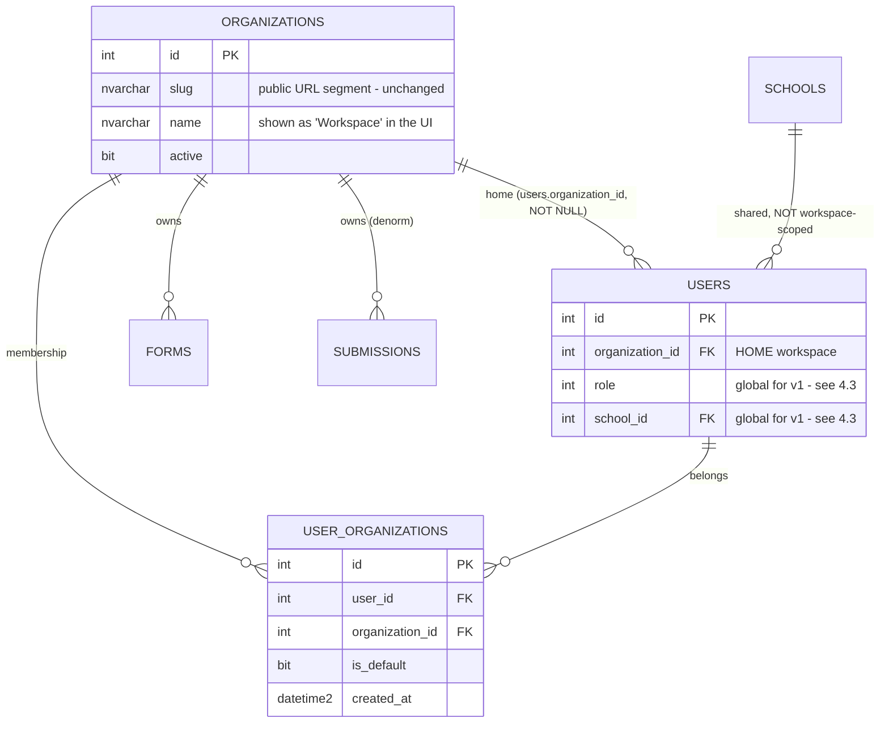

# Plan — Organization → "Workspace" Rebrand, Multi-Workspace Membership & Theme Toggle

> **Status:** Draft for review — **no code written yet.**
> **Date:** 2026-09-16
> **Revised 2026-09-16:** §4.5 — the workspace control is now **hidden entirely** for a user with
> a single workspace (previously it was always visible with a conditional list). Rippled through
> §1.1, §2.5, §2.7, §4.10, §4.12, §6.1, §7.1, §7.2, §9, §10, §11.2, §11.3, §12, §13.13–13.14 and
> §14.6/§14.9; the §7.2 proposal to delete the redundant page-header slug is **withdrawn** as a
> consequence.
> **Supersedes:** [`organizations.md`](./organizations.md) §3 ("Design decision — one org per user (1:1)").
> That decision was correct for the single-tenant launch and is now being deliberately reversed.
> Everything else in `organizations.md` (the tenant boundary itself, the shared school list, the
> org-scoped public URLs) still holds and is *extended* here, not replaced.
> **Related:** [`organizations.md`](./organizations.md), [`organization-drive-folder.md`](./organization-drive-folder.md),
> [`access-groups.md`](./access-groups.md), [`login-mode.md`](./login-mode.md), [`dual-db.md`](./dual-db.md),
> [`password-recovery.md`](./password-recovery.md), [`feature-backlog.md`](./feature-backlog.md).

---

## 1. The request (verbatim)

> I need a plan to rebrand "Organization" to "Workspace". A user can belong to more than one
> Workspace; currently they can only belong to one Organization. Everyone sees a "World" icon
> with the current Workspace name beside it. When they click it shows the Workspaces underneath.
> If someone belongs to two Workspaces they can switch. Once they change they will see the
> submissions for that Workspace ONLY. The top-right menu order should be [world icon]
> [workspace name] [light/dark mode toggle] [user profile]. Please provide a plan at
> /docs/plans for me to review.

### 1.1 This is four workstreams, not one

They are separable, differently sized, and should be approved separately — but two of them
touch the same JWT claim, so they have to be *planned* together.

| # | Workstream | Size | Risk |
| --- | --- | --- | --- |
| **W1** | **Membership becomes many-to-many** (one user → many workspaces) | Large — new table, backfill, token redesign | **High** — silent data-scoping bugs if the token/column confusion isn't settled first |
| **W2** | **Workspace switcher in the banner** (world icon + name + dropdown) — **hidden entirely unless the user has 2+ usable workspaces** (revised 2026-09-16, §4.5) | Medium — new control, new endpoint, new DTO fields | Medium — the switch must re-scope *everything*, not just the page; and for today's users the control is invisible, so it ships unexercised |
| **W3** | **"Organization" → "Workspace" label rebrand** | Medium (mechanical but wide: **1,119 occurrences, 63 files**) | Low — cosmetic, but the rename boundary is a decision (see §4.2) |
| **W4** | **Light/dark mode toggle** | Medium-large — **greenfield, zero theme code exists today** | Medium — 48 hardcoded colours + 273 inline style objects must be tokenised first |

**★ W4 is not "add a toggle".** Verified by grep: `theme`, `Theme`, `dark`, `darkMode`,
`colorScheme`, `prefers-color-scheme`, `Sun`, `Moon` produce **zero matches anywhere in
`client/src`**. There is no dark palette, no `data-theme` attribute, no theme context, no
persisted preference. The banner slot the user is asking for does not exist yet and there is
nothing to reuse. §8 is written accordingly.

**★ The single most important finding in this plan:** the active workspace and the user's
*home* workspace are currently the **same value read from two different places** — the JWT claim
and the `users.organization_id` column. That works today because they can never differ. With
multi-workspace they *will* differ, and three code paths read the column when they mean the
active workspace. §3 is the whole reason this plan exists in the order it does.

---

## 2. What exists today (all verified against the current tree)

### 2.1 The tenant is one FK, mirrored into the token

| Fact | Evidence |
| --- | --- |
| A user belongs to **exactly one** org via a NOT NULL FK | `users.organization_id INT NOT NULL` → `organizations(id)`, `FK_users_organization` (NO ACTION), `IX_users_organization` — ladder at `server/src/db/schema.ts:486-511` (three separate batches) |
| The tenant is denormalised onto the two big tables | `forms.organization_id` (`schema.ts:534-552`), `submissions.organization_id` (`schema.ts:685-705`, backfilled *from its form*) |
| `organizations` is a small table | `id, slug, name, description, doc_folder_id, active, created_at` (`schema.ts:395-414`), unique `slug` + unique `name`, seeded idempotently with `academics` / `technology-services` (`schema.ts:418-421`) |
| The token carries it | `AccessPayload = { sub, email, role, school_id, organization_id, type: "access" }`, `JwtUser`, `signAccessToken(...)` — `server/src/auth.ts` |
| Middleware reads it **from the token** | `requireAuth` rebuilds `req.user` from the JWT; nothing re-queries the user row per request |
| Consumers read `req.user!.organization_id` | **34 sites in 5 files** — `forms.ts` (11), `submissions.ts` (11), `users.ts` (5), `export.ts` (4), `reports.ts` (3) |

**This is the good news.** Because scoping is `organizationId?: number \| null` threaded through
`queries.ts` (an `undefined` filter means "no filter") and because the value comes from the
token, **a workspace switch needs zero changes to those 34 sites** — provided the switch
rewrites the token. §4.1 is built on that.

### 2.2 The three silent traps

These are the reason W1 must land before (or with) W2. Each one is *silent*: no error is
thrown, the user just sees the wrong workspace's data.

**Trap 1 — `/refresh` would snap the user back to their home workspace.**

```
server/src/routes/auth.ts:340   authRouter.post("/refresh", ...)
                         :349-350  const payload = verifyRefreshToken(token);
                                   const user = await getUserById(payload.sub);
                         :359   const accessToken = signAccessToken(user);   <-- from the ROW
                         :360   setRefreshCookie(res, signRefreshToken(user.id));  <-- sub only
```

The refresh token payload is `{ sub, type: "refresh" }` — it carries **no** workspace. So
`signAccessToken(user)` rebuilds the claim from `users.organization_id`, i.e. the *home*
workspace. The client auto-refreshes on any 401 (`client/src/lib/api.ts:104-108`,
`refreshAccessToken()`), and the access token lives **15 minutes**. A user who switches to
workspace B would be silently dragged back to workspace A within 15 minutes — mid-session,
with no warning.

**Trap 2 — `/me` reports the home workspace, not the active one.**

```
server/src/routes/auth.ts:51-63   async function toUserDto(user) {
                                    const org = await getOrganizationById(user.organization_id);
                                    ... organization_id: user.organization_id,
                                        organization_slug: org?.slug ?? null
                                  }
```

It is driven by the **row**, not by `req.user`. `AuthContext.restore()` calls `api.me()` on
mount, so after a reload the banner would name workspace A while the token grants workspace B —
the exact opposite of the user's "Everyone sees the *current* Workspace name".

**Trap 3 — the login page's Organization dropdown does not pin anything.**

`client/src/pages/LoginPage.tsx:8-12` holds a **hardcoded** `ORG_OPTIONS` array, and line 139
calls `loginSelect(Number(userId))` — **the chosen org is not passed**. The dropdown only filters
the user list and the stats. Harmless today (a user has one org, so the server's
`user.organization_id` is always right); load-bearing the moment membership is plural, because
this dropdown becomes the user's *initial workspace* choice.

**The fix for all three is one rule, stated once in §4.1.**

### 2.3 Rebrand surface (measured, not estimated)

| Surface | Count | Note |
| --- | --- | --- |
| `organization` occurrences, case-insensitive, whole repo | **1,119** | across **63** files |
| … in `docs/plans/*.md` | ~450 | `organizations.md` alone is 167 |
| … in `server/src/db/queries.ts` | 166 | |
| … in `server/src/db/schema.ts` | 88 | |
| … in `client/src/pages/admin/AdminSettings.tsx` | 49 | the Organizations panel + the user form's org `<select>` |
| … in `server/src/swagger.ts` | 47 | developer-facing prose |
| `[Oo]rganization` occurrences in `client/src` | **91 in 13 files** | this is the **user-visible** label set |
| Stale `server/tmp-*.ts` probe leftovers | 4 files (43 mentions) | not part of the rebrand — see §13 |

### 2.4 Theme surface (measured)

| Surface | Count | Note |
| --- | --- | --- |
| Theme/dark/light/colorScheme symbols in `client/src` | **0** | greenfield |
| CSS files under `client/src` | **1** (`styles/global.css`, 1,164 lines, 365 blocks) | one file is good news |
| Custom properties defined in `:root` | **36** | palette *is* centralised (`global.css:5`) |
| `var(--…)` usages | **302** | most rules already go through tokens |
| **Hardcoded hex colours in `global.css`** | **48** (26 distinct) | `#fff`×11, `#ffffff`×5, `#165788`×4, `#d13438`×2 … — **these must be tokenised first** |
| `rgb()`/`rgba()` literals in `global.css` | 13 | mostly the two shadow tokens |
| Inline `style={{ … }}` objects in `.tsx` | **273 across 19 files** | worst: `AdminSettings.tsx` 57, `AdminFormDesigner.tsx` 39, `WebhookLog.tsx` 31 |
| Inline hardcoded hex in `.tsx` | **19 across 10 files** | mostly layout otherwise; the hex ones are the problem |

**Conclusion:** the palette is disciplined enough that a dark theme is *tractable* (302 of ~350
colour references already use tokens), but it is **not** a drop-in second `:root` block. It needs
a tokenisation pass first: 48 + 19 = **67 literal colours** converted, then a second palette.

### 2.5 The banner today

`client/src/components/layout.tsx` — `<header className="banner">` contains, in order:

| Slot | Element | Notes |
| --- | --- | --- |
| left | `button.icon-button.banner-toggle` (Menu/X) | off-canvas sidebar |
| left | `.logo` (`.logo-badge` "SF" + `.logo-text` "School Forms") | |
| **right** | `.actions` (`margin-left: auto`) | |
| right | `div.user-menu-wrap` → `button.user-chip` = `.avatar` + `.u-meta`(`.u-name`, `.u-school`) + `ChevronDown.u-caret` | dropdown `.user-menu[role=menu]`, z-index **210** |
| right | `button.icon-button` "Log out" (`LogOut`) | |

So the **current** top-right is `[user chip][log out]`. The requested
`[world][workspace name][theme][user profile]` inserts **two new controls** into `.actions`
*before* `.user-menu-wrap`, and **means "Log out" is no longer a top-level icon** — it must move
into the profile dropdown (it is already the natural place: the dropdown currently holds only
"Change password"). That relocation is a real, unstated requirement and is called out in §7.1.

**★ The new pair is conditional.** Per the 2026-09-16 revision (§4.5), `[world] [workspace name]`
is rendered **only for a user with two or more usable memberships**. For everyone else — which is
**all 7 live users** (§2.7) — the top-right becomes `[theme][profile]`. Two consequences follow
immediately and both are easy to miss:

- The banner layout has **two** valid shapes, and the hidden one is the one every real user sees on
day one. See §4.10 and §11.3.
- The page-header slug is **no longer redundant** and must not be deleted (§7.2) — for a
  single-workspace user it is the only workspace indicator in the entire app.

**Where the current workspace is shown today** — the *page header*, not the top-right:
`AdminDashboard.tsx:172-174`, `AdminForms.tsx:145-147`, `AdminFormDesigner.tsx:318` all render
`user.organization_slug`. Today an org is identified by **slug** (`academics`), not name. The
banner needs the *name*, which `User` does not carry — only `AdminUser` does
(`client/src/types/index.ts:57-59`). **Required change.**

**Constraints to respect:** `--banner-h` (64px, 52px ≤768px) is the single source of the banner's
height and is consumed by `.banner`, `.sidebar` top and `.sidebar-overlay` inset. z-index ladder:
overlay 199 / sidebar 200 / banner 201 / user menu 210. At ≤768px the chip's text is hidden.

### 2.6 Public URLs are part of the brand

The parent-facing routes are `/org/:slug/...`:

```
client/src/App.tsx:31-33   /org/:slug/submit
                           /org/:slug/forms/:formId
                           /org/:slug/submission/:publicId
```

Server side resolves `?org=<slug>` in `forms.ts:31,37,62`, `submissions.ts:44,89`, `health.ts:51`,
`auth.ts:271` (`getOrganizationBySlug`). `AdminFormDesigner.tsx:628-636` prints
`/org/${user.organization_slug}/forms/${form.id}` as the copyable published link.

**These URLs are in the wild** (printed, emailed, possibly QR-coded). A "complete" rebrand would
move them to `/workspace/:slug/...` — which **breaks every existing link**. See §4.11.

### 2.7 Live data (measured earlier, unchanged)

2 orgs — `{ id:1, slug:"academics" }`, `{ id:2, slug:"technology-services" }`. **7 users, all 7
in org 1.** 235 schools (shared across orgs, deliberately). 3 forms, 23 submissions. Org 2
(`technology-services`) has **zero members** — which is why its Test-User dropdown is empty
(`feature-backlog.md` §9.13). The backfill in §5.3 therefore creates **7 membership rows, all
pointing at org 1.**

**★ The consequence for W2:** because every user has exactly **one** membership, the banner control
specified in §4.5 renders `null` for **all 7 of them**. W2 therefore ships with **zero visible
change** — it is exercised only via the §11.4 fixture. Likewise `GET /api/workspaces` can only ever
return a one-element array against the current data (§11.2 #3), so the two-workspace shape needs a
fixture too.

---

## 3. The one rule that makes this safe

> **The JWT claim `organization_id` means *the active workspace*.
> The column `users.organization_id` means *the user's home workspace*.
> They are different things, and they may differ. Never read the column when you mean the active
> workspace.**

Today the two are interchangeable, which is exactly why the confusion is invisible and why it
must be stated before any code is written. Every existing read of `users.organization_id` gets
classified as **HOME** or **ACTIVE**:

| Site | Today | After | Why |
| --- | --- | --- | --- |
| `requireAuth` (`auth.ts`) | token | **ACTIVE** (unchanged) | already the token |
| the 34 `req.user!.organization_id` sites | token | **ACTIVE** (unchanged) | **zero edits** |
| `signAccessToken(user)` at login (`auth.ts:131,176`) | column | **ACTIVE** = HOME at first sign-in | no memberships chosen yet |
| `signAccessToken(user)` at `/select` (`auth.ts:323`) | column | **ACTIVE** = chosen org **if a member** | fixes Trap 3 |
| `signAccessToken(user)` at `/refresh` (`auth.ts:359`) | column | **ACTIVE** = *from the refresh token* | fixes Trap 1 |
| `toUserDto(user)` (`auth.ts:51-63`) | column | **ACTIVE** = passed-in claim | fixes Trap 2 |
| `orgIsActive(user)` (`auth.ts:76-78`) | column | **ACTIVE** = the workspace being signed into | |
| registration default (`getDefaultOrganization`) | column | **HOME** (unchanged) | a new user has exactly one membership |
| `users.organization_id` NOT NULL FK / unique guarantees | column | **HOME** (unchanged) | guarantees ≥1 membership |

**The rule in practice:** `toUserDto` and `orgIsActive` change signature from `(user)` to
`(user, activeOrganizationId)`. `signAccessToken` already takes a user-shaped object, so callers
pass `{ ...user, organization_id: activeId }`. That is the entire server-side blast radius of
W1 — 6 call sites in one file.

---

## 4. Design decisions

Each row is a decision *with a recommendation*. Nothing here is implemented.

### 4.1 Where does the active workspace live?

| Option | Verdict |
| --- | --- |
| **(a) A claim inside both the access and the refresh token** | ★ **Recommended.** Zero edits to the 34 scoping sites. No new column, no write per switch. Survives the 15-minute refresh *and* a page reload (the refresh cookie is 7 days and already httpOnly). The switch endpoint mints both tokens itself — it has `req.user.id`. |
| (b) An `X-Workspace-Id` request header validated per request | Rejected for v1. `requireAuth` would have to look up the caller's memberships on **every** request (a query per request today has none), the 34 sites still read `req.user.organization_id` so middleware would have to overwrite it anyway, and the value still has to be persisted client-side. Strictly more moving parts than (a) for a weaker guarantee. |
| (c) A `users.active_organization_id` column | Rejected for v1. Stateful, needs a write per switch, and — the killer — it is a **shared** value: two browser tabs on two workspaces would fight, and the last write wins. It also does not remove the need for a token change, so it is (a) plus a column. Worth revisiting if "remember my last workspace **across devices**" becomes a requirement. |

**Recommended:** (a). Concretely:

1. `AccessPayload` and `RefreshPayload` both gain `organization_id: number`.
2. `signRefreshToken(userId)` → `signRefreshToken(userId, organizationId)`.
3. `/refresh` passes `payload.organization_id` through instead of re-deriving it from the row —
   **but validates it against current membership first** (§6.3).
4. `/switch-workspace` mints a new pair and calls `setRefreshCookie`.

> **Security note (why step 3 validates):** a refresh token is a 7-day bearer credential. If it
> carries the workspace, revoking someone's membership must not be defeated by a token minted
> before the revocation. Membership is therefore re-checked on refresh *and* on switch. This
> costs one indexed query per 15 minutes per user — acceptable. `feature-backlog.md` §9.4 records
> that there is **no `token_version` column**, so this membership check is the only revocation
> point that exists; it should not be skipped.

### 4.2 Do we rename the *database* or only the *labels*?

| Option | Verdict |
| --- | --- |
| **(a) Labels only** — UI copy says "Workspace"; tables, columns, routes, TS types and Swagger keep `organization` | ★ **Recommended.** |
| (b) Full rename including the DB | Rejected for v1. |

**Why (a):** three concrete reasons, not taste.

1. **`TURSO_DDL` cannot express a rename.** The invariant in this repo is that the Turso dialect
   is `CREATE TABLE IF NOT EXISTS`-only, with late columns going through the `addColumns` array
   (`server/src/db/dialect/turso.ts` + `applyAddColumns` in `pool.ts`). Renaming
   `organizations` → `workspaces` needs *new table + copy + drop*, which is a one-off migration
   script (precedent exists: `db/migrate-turso.ts`, `db/backfill-school-year.ts`) against the
   **live** database. That is real risk for zero user-visible gain.
2. **1,119 occurrences across 63 files** — including `swagger.ts` (47), `queries.ts` (166),
   `schema.ts` (88) and every plan doc. The blast radius is mostly documentation drift, which is
   the kind of change that quietly breaks `swagger.test.ts` and the dialect-parity test.
3. **The user asked for a *rebrand*, which is a naming change, not a schema change.** A product
   rename does not require the storage layer to be renamed; it requires the *user* to never see
   the old word.

**What this means in practice:** the rule becomes
**`organizations` = the internal name for the thing users call a "Workspace"`.** A one-line
comment goes on the `organizations` table in `schema.ts` saying so, and the *new* join table is
named with the internal vocabulary (§4.3) so there is no `workspace_members.organization_id`
mismatch. The UI sweep in §7.3 is exhaustive for **user-visible copy only** (91 matches in 13
client files) — API field names, route paths and `/api/docs` stay `organization`, because
renaming *those* is a breaking API change with no user-facing benefit.

### 4.3 The membership table

**Recommended: a new join table `dbo.user_organizations`.**

| Column | Type | Notes |
| --- | --- | --- |
| `id` | `INT IDENTITY(1,1)` PK | |
| `user_id` | `INT NOT NULL` FK → `users(id)` ON DELETE **CASCADE** | deleting a user removes their memberships — no other cascade path exists from `users`, so this is safe (see §5.1) |
| `organization_id` | `INT NOT NULL` FK → `organizations(id)` ON DELETE **NO ACTION** | matches `FK_users_organization`; **CASCADE here would create a second cascade path** from `organizations` (users → org already exists) and SQL Server would reject it with error 1785 |
| `is_default` | `BIT NOT NULL DEFAULT 0` | the workspace a user lands in when they have not chosen one |
| `created_at` | `DATETIME2 NOT NULL DEFAULT SYSUTCDATETIME()` | **`_at` column** → must be added to `TIMESTAMP_COLUMNS` for the `libsql.test.ts` dialect-parity test (see §5.2) |

Constraints/indexes: `UX_user_organizations_user_org UNIQUE (user_id, organization_id)` and
`IX_user_organizations_org ON (organization_id)`. SQL Server permits **at most one** `NULL`-free
unique constraint per row — fine here. (Bonus: the unique pair is also what makes the backfill
idempotent.)

> **Why not store the role here?** Because that is a bigger change than this request. Today
> `users.role` is global, so a member of two workspaces is admin in both. Per-membership roles
> (`user_organizations.role`) is the natural v2 and is roughly what `access-groups.md` §7.4
> wants. For v1, global role is simpler, matches the current model exactly, and avoids a second
> migration. **Flagged as §14.3 — the user should confirm.**

> **Why not store `school_id` here?** Same reasoning, but with a sharper consequence: a staff
> member who is at School A in workspace 1 and School B in workspace 2 has **one** global
> `users.school_id` today, so their school scoping cannot differ per workspace. **This is a real
> limitation of v1** and is recorded in §13. The forward-compatible place for it is
> `user_organizations.school_id INT NULL`, added later via `addColumns`. **Flagged as §14.4.**

### 4.4 Does `users.organization_id` survive?

**Recommended: yes, keep it, and reinterpret it as the *home* workspace.**

- It is the NOT NULL FK that *guarantees* every user has at least one workspace — a guarantee the
  join table alone cannot express. Dropping it would mean every scoping path has to cope with
  "user belongs to nothing", which is a new failure mode for no benefit.
- It makes the backfill a pure `INSERT … SELECT` from the existing column (§5.3), so it is
  trivially idempotent.
- Registration, `getDefaultOrganization()` and the NOT NULL ladder keep working untouched.
- It is also the tie-breaker for the login default (§4.6).

What changes is the **read sites**: the six in §3, and nothing else. **Do not add a second
overlapping notion of "the user's org".** One column = home. One claim = active.

### 4.5 Single-workspace users — **hide the control entirely**

> **★ REVISED 2026-09-16 at the user's request.** The original wording in §1 (*"Everyone sees a
> World icon with the current Workspace name beside it…"*) implied an always-visible control with
> only the *list* conditional. The user has since decided the opposite: **if a user belongs to one
> workspace, do not show `[world icon] [workspace name]`.** This section is the authority; §1's
> quotation is superseded on this point.

**Rule:** render `WorkspaceMenu` — both the globe and the name — **only when the user has more
than one usable membership.** With exactly one, `.actions` contains `[theme] [profile]` and
nothing else: no globe, no name, no disabled placeholder, no explanatory note.

- **"Usable" = active, and the server already computes it.** `GET /api/workspaces` filters
  `o.active = 1` in SQL (§6.1), so its array *is* the usable set and the client predicate is
  simply **`workspaces.length > 1`** — no second filter, no extra field. This matters: a user with
  one active workspace plus one deactivated one must see **no** switcher, because the only other
  row in the popover would 403 (§4.7 step 5).
- **The threshold is membership count, not role.** Staff and admins are treated identically — an
  admin with a single workspace also sees nothing.
- **Nothing replaces it.** No "You belong to one workspace" note, no disabled globe. Hiding the
  control is the whole feature; a note explaining the absence would re-introduce exactly the
  clutter being removed.
- **Visibility is fetched with the session, not live.** The count comes from `GET /api/workspaces`,
  which `AuthContext` fetches during its **mount-only** `restore()` (§4.8). So granting or revoking
  a membership while the user is signed in changes the banner at their next **reload** — the same
  mechanism, and the same limitation, as the switch itself. Recorded as §13.14.
- **Discoverability becomes a real gap** — a single-workspace user has no in-app indication that
  other workspaces exist and no way to ask for one. Recorded as §13.13, with the suggested cheap
  fix (a line in the *profile dropdown*, not a banner control).

**★ Rollout consequence — W2 ships invisible.** All **7 live users are in org 1** (§2.7), so after
P4 ships, every real user sees precisely what they see today. The `[globe] [name]` pair can
**only** be exercised against a user with two memberships, which is why the §11.4 fixture is not
optional — without it, P4 is unreachable by hand.

### 4.6 The default workspace at login

| Sign-in path | Active workspace |
| --- | --- |
| `POST /api/auth/login` (password mode) | `users.organization_id` (home) |
| `POST /api/auth/select` (test mode) with `organizationId` | that org if the user is a **member**, else **403** |
| `POST /api/auth/select` without `organizationId` | home |
| `POST /api/auth/register` | the `DEFAULT_ORG_REGISTRATION` org (unchanged) |
| page reload | whatever the refresh cookie says (§4.1) |

The `is_default` flag on `user_organizations` is then only a UI hint for ordering the popover
(default first, then by name). Home stays the authority for *first* sign-in; the flag exists so
an admin can later change the landing workspace without moving the user's FK. Ordering:
`ORDER BY is_default DESC, o.name ASC` — plain columns, no dialect-specific syntax.

### 4.7 Guard order for the switch endpoint

Matching the contract established for password reset in `password-recovery.md` §3 (*id → self →
exists → tenant*), the switch endpoint's order is:

1. `requireAuth` → **401** if no/expired token (`"none"`-style routes must **not** set `security` in Swagger)
2. Zod validation of the body → **400**
3. `organization_id === req.user!.organization_id` → **409** `"That is already your active workspace."`
   (409, not 400: the request is well-formed, it conflicts with current state — and it makes an
   accidental double-click a no-op instead of a token churn)
4. membership check → **403** `"You do not belong to that workspace."`
5. `organizations.active = 0` → **403** `"Workspace is deactivated. Contact an administrator."`
   (reuse `orgIsActive`)
6. mint access + refresh, `setRefreshCookie`, return `{ access_token, token_type: "bearer", user }`

### 4.8 What re-scopes when you switch

The user's requirement — *"they will see the submissions for that Workspace ONLY"* — is satisfied
**server-side, by the existing filters**, not by the client hiding rows. Switching changes the
token, therefore it changes what every one of these returns:

| Re-scopes | Endpoint / surface |
| --- | --- |
| Submissions list + detail + status edits + comments | `GET/PATCH /api/submissions*` (`submissions.ts`, 11 sites) |
| Forms list, designer, publish/archive/restore/delete, columns | `GET/POST/PATCH/DELETE /api/forms*` (`forms.ts`, 11 sites) |
| Export preview + CSV + XLSX | `/api/export/*` (`export.ts`, 4 sites) |
| Reports + saved views | `/api/reports/*` (`reports.ts`, 3 sites) |
| Admin user list, user detail, edit, reset-password | `/api/users*` (`users.ts`, 5 sites) |
| Dashboard stats | `GET /api/health/stats` (`?org=<slug>`) |
| Login-page Test-User list | `GET /api/auth/users?org=<slug>` |
| Webhook log attribution | `webhook_events.organization_id` filter |
| Published public form link printed in the designer | derived from the active workspace's slug |

**Not re-scoped, on purpose:** the **schools** list (a shared district dictionary — do not
"fix" this), and the parent-facing public routes (they are org-scoped by URL, not by session).

**★ The refetch problem.** `AuthContext.restore()` runs **only in a mount `useEffect(…, [])`**
(`client/src/context/AuthContext.tsx:31-47`), and most pages fetch in their own mount effects.
So flipping a context value will **not** refetch the data on the current page. This is the same
mechanism that `password-recovery.md` documented (an already-open SPA survives a reset until a
reload). **Recommended:** on a successful switch, store the new token and then **hard-reload**
(`window.location.assign("/")`). It is one line, it is provably correct, it cannot leave a stale
page showing another workspace's submissions, and the extra reload cost is once per switch.
A context-driven refetch is the nicer v2 and is deferred (§13) — but shipping a client-side
switch without it would produce exactly the "I still see the other workspace's data" bug this
plan exists to prevent.

### 4.9 Theme toggle — mechanism

| Decision | Recommendation |
| --- | --- |
| Where the theme lives | A **`data-theme` attribute on `<html>`**, so it applies to the shell *and* the public parent pages (which are outside `AppShell`) |
| Values | `light` \| `dark` \| `system` (three-state), default **`system`** |
| `system` | `@media (prefers-color-scheme: dark)` sets the same custom properties on `:root:not([data-theme])` |
| Persistence | `localStorage["school_forms_theme"]`, **client-only, per device**. No DB column, no server write per toggle — this is a display preference, not a user record |
| Applied before first paint | A 4-line inline `<script>` in `client/index.html` reading `localStorage` and setting `data-theme` — otherwise a dark user gets a white flash on every load |
| Icon | Lucide `Sun` / `Moon` (`lucide-react` is the **only** icon library in this repo — no inline `<svg>`) |
| Public pages | Follow the theme automatically (they read `:root` tokens); no toggle is rendered for anonymous parents |

### 4.10 Banner layout

Order, left→right inside `.actions`: **`[world] [workspace name] [theme] [profile]`** — with the
first **two slots omitted entirely** for a single-workspace user (§4.5), leaving
**`[theme] [profile]`**. Both shapes must be laid out and both verified; the second is the one
that ships to all 7 current users.

- Two new popovers (workspace, theme is a plain toggle) reuse the **existing** `user-menu-wrap`
  pattern: `position: relative` wrapper, `[role=menu]` panel, close on route change / outside
  `mousedown` / `Esc`. The close behaviour is already implemented for the user menu and should be
  extracted rather than copy-pasted three times (§7.2).
- z-index **210** for both new panels — same layer as the existing user menu, above the banner's
  201. Opening one should close the other two (single "open menu" state).
- `--banner-h` remains the single source of truth; **do not hardcode** any height on the new
  controls. Reuse `--control-h` (36px) for the buttons.
- **≤768px, two-workspace user:** three controls + avatar will not fit. Recommended: keep all
  three icons, hide the workspace *name* (icon-only, with the name in the popover header and a
  `title` attribute). Verify against the existing `.banner .user-chip .u-meta` hiding rule, which
  already does this for the user chip — the mobile block must hide the workspace name by the same
  mechanism, **not** by a second ad-hoc rule.
- **≤768px, single-workspace user:** only `[theme] [profile]` are present, so there is more room
  than today, not less. Confirm the gap/`margin-left:auto` behaviour still looks right with the
  globe absent — a `.actions` that assumed a leading item can leave a stray gap.
- **`Log out` moves into the profile dropdown.** It is currently a separate top-level icon
  button; the requested order lists only four controls and *profile* is one of them. The dropdown
  already exists and already holds "Change password" — add "Log out" as a second item (and
  "Workspace" is *not* added to it, since it is now its own control).

### 4.11 Public URL path — keep `/org/:slug`

**Recommended: keep `/org/:slug/...` unchanged in v1.** The slug is the *identifier*; the word in
the path is a URL namespace, not a label shown to anyone. Changing it to `/workspace/:slug/`
would break every printed/emailed/QR-coded link with no user-visible benefit, and would require
redirect routes forever. If the user wants the rebrand to reach the URL, the safe form is
**additive**: register `/workspace/:slug/*` as an *additional* set of routes rendering the same
components, and keep `/org/:slug/*` alive indefinitely.

### 4.12 What the popover shows per row

*(Reachable only by a multi-workspace user — the popover does not exist for anyone else, §4.5.)*

One row per membership: workspace **name** (primary), **slug** (secondary, mono — matches how the
page headers identify it today), and a check/marker on the current one. No member counts (that
would be N queries; `AdminSettings` already gets `member_count` server-side and is the right place
for it). Because the control only renders at 2+ rows, the popover is **never** a single-row list —
the "one membership" branch is unreachable and no empty/singleton styling is needed.

---

## 5. Data model & migration

### 5.1 SQL Server (`server/src/db/schema.ts` → `SQLSERVER_DDL_STATEMENTS`)

Follow the existing idempotent ladder, **one statement per batch** (error 207 otherwise). Insert
immediately after the existing `users.organization_id` block (~`schema.ts:511`) so the FK target
and the new table are adjacent.

```
-- batch 1: create the join table
IF OBJECT_ID('dbo.user_organizations', 'U') IS NULL
CREATE TABLE dbo.user_organizations (
  id              INT IDENTITY(1,1) PRIMARY KEY,
  user_id         INT NOT NULL,
  organization_id INT NOT NULL,
  is_default      BIT NOT NULL CONSTRAINT DF_user_organizations_is_default DEFAULT 0,
  created_at      DATETIME2 NOT NULL CONSTRAINT DF_user_organizations_created_at DEFAULT SYSUTCDATETIME(),
  CONSTRAINT FK_user_organizations_user
    FOREIGN KEY (user_id) REFERENCES dbo.users(id) ON DELETE CASCADE,
  CONSTRAINT FK_user_organizations_organization
    FOREIGN KEY (organization_id) REFERENCES dbo.organizations(id) ON DELETE NO ACTION
);

-- batch 2: unique pair + org index (also what makes the backfill idempotent)
IF NOT EXISTS (SELECT 1 FROM sys.indexes WHERE name='UX_user_organizations_user_org')
  CREATE UNIQUE INDEX UX_user_organizations_user_org ON dbo.user_organizations(user_id, organization_id);
IF NOT EXISTS (SELECT 1 FROM sys.indexes WHERE name='IX_user_organizations_org')
  CREATE INDEX IX_user_organizations_org ON dbo.user_organizations(organization_id);

-- batch 3: backfill every existing user from their home workspace (idempotent by the unique pair)
IF NOT EXISTS (SELECT 1 FROM dbo.user_organizations)
  INSERT INTO dbo.user_organizations (user_id, organization_id, is_default)
  SELECT u.id, u.organization_id, 1
  FROM dbo.users u
  WHERE u.organization_id IS NOT NULL;
```

**Cascade reasoning (the error-1785 trap):** `user_organizations → users` may CASCADE because that
is the *only* cascade path reaching `user_organizations` from `users`. `user_organizations →
organizations` must be **NO ACTION**, because `users → organizations` already exists as a path
and SQL Server allows only one cascade path from an ancestor. This is the same class of bug that
forced `submissions.school_id` and `submission_values.field_id` to NO ACTION
(`organizations.md` §6, `notes` in repo memory). **If `organizations` rows are ever deleted, the
membership rows must be cleaned up explicitly** — but `organizations` deletes are not a supported
operation today (`active` is a soft flag), so this is a note, not a task.

The `INSERT … SELECT` is guarded by `IF NOT EXISTS (SELECT 1 FROM dbo.user_organizations)`, so a
re-run after someone adds a membership does not resurrect stale rows or clobber state. Per-user
`NOT EXISTS` would be more granular but would also re-insert rows an admin deliberately removed.

### 5.2 Turso (`server/src/db/dialect/turso.ts`)

- Add the `CREATE TABLE IF NOT EXISTS user_organizations (…)` to `TURSO_DDL` — **final schema,
  no `ALTER TABLE`**, matching the file's invariant.
- **No `addColumns` entry is needed** because this is a *new table*, not a late column. If §14.4
  later adds `user_organizations.school_id`, *that* goes in `addColumns`.
- **The `_at` test:** `libsql.test.ts` ("dialect schema parity") regex-scans `tursoDialect.ddl`
  for `^\s*([a-z_]+)\s+TEXT\b` where the name ends in `_at` and asserts the set equals
  `TIMESTAMP_COLUMNS`. `created_at TEXT` in the new table will therefore **fail the test unless
  `'created_at'` is already in `TIMESTAMP_COLUMNS`** (it is, for the other tables) — verify, and
  do not be surprised by a failure here. The pragmatic alternative, if the regex turns out to be
  name-only and already satisfied: leave it and confirm with `npm test`.
- `is_default` is a boolean → **must be added to `BOOLEAN_COLUMNS` in `server/src/db/client.ts`
  *and* to the local copy in `server/src/db/migrate-turso.ts`** (libSQL stores booleans as
  `0/1`, and the two lists must agree).

### 5.3 Backfill ordering

`runDdl()` in `pool.ts` calls `applyAddColumns(dialect)` **before** `client.run(dialect.ddl)` and
again **after**. The new table and its backfill are both inside `dialect.ddl`, and the backfill
reads `users.organization_id`, which already exists in both dialects. Ordering is therefore
safe with no change to `runDdl`. **The backfill must not be moved into `addColumns`** — that array
is for a single column's `ALTER`, not for data.

**Expected result on the live DB:** 7 rows inserted, all `organization_id = 1`, all `is_default = 1`.
`CREATE TABLE IF NOT EXISTS` + the `IF NOT EXISTS` guard make a restart a no-op.

### 5.4 `seed.ts`

`seed.ts` currently inserts forms and reads back their IDENTITY id. It should **not** be extended
to seed memberships — the DDL backfill covers existing rows, and `createUser` will cover new ones
(§6.4). Keep seed as-is.

---

## 6. API contract

### 6.1 New endpoints

| Method | Path | Auth | Purpose |
| --- | --- | --- | --- |
| `GET` | `/api/workspaces` | `staff` | The caller's memberships, with the active one flagged |
| `POST` | `/api/auth/switch-workspace` | `staff` | Validate membership, mint both tokens, set the refresh cookie |

> Naming: the *route path* uses the new vocabulary (`/api/workspaces`) because it is a **new**
> endpoint with no back-compat obligation, while its **payload fields stay `organization_id` /
> `organization_name`** to match every other endpoint (§4.2). A `GET /api/organizations` already
> exists and is **admin-only, different semantics** (all workspaces + member counts, for
> `AdminSettings`) — it is *not* superseded and must not be repurposed, or a staff member would
> suddenly need admin to render their own switcher.

```
GET /api/workspaces
200 {
  "active_organization_id": 1,
  "workspaces": [
    { "id": 1, "slug": "academics",           "name": "Academics",           "is_active": true,  "is_default": true  },
    { "id": 2, "slug": "technology-services", "name": "Technology Services", "is_active": false, "is_default": false }
  ]
}

POST /api/auth/switch-workspace
body: { "organization_id": 2 }
200 { "access_token": "…", "token_type": "bearer", "user": { …UserDto… } }
400 validation | 403 not a member | 403 workspace deactivated | 409 already active
```

`GET /api/workspaces` reads: `SELECT … FROM user_organizations uo JOIN organizations o ON o.id = uo.organization_id WHERE uo.user_id = @userId AND o.active = 1 ORDER BY uo.is_default DESC, o.name ASC`. One query, indexed by `UX_user_organizations_user_org`. It takes **no `organizationId` filter** — it is about the *user*, not the tenant — and it is deliberately **the one read that ignores the active workspace**.

The `AND o.active = 1` is not decoration: it is **the** input to the §4.5 visibility rule. The
server returns only usable workspaces, so the client's `workspaces.length > 1` predicate is
correct without a second filter, and a user whose only alternative workspace is deactivated
gets no switcher rather than a row that 403s.

### 6.2 DTO changes

| Type | Change | Why |
| --- | --- | --- |
| `User` (`client/src/types/index.ts:52-65`) | **add `organization_name: string \| null`** | the banner needs a *name*; today only `organization_slug` is on `User` (name is on `AdminUser` only) |
| `User` | keep `organization_id` / `organization_slug` | they now describe the **active** workspace |
| new `WorkspaceMembership` | `{ id, slug, name, is_active, is_default }` | |
| new `WorkspaceListResponse` | `{ active_organization_id, workspaces }` | |
| `AuthContextValue` | add `workspaces`, `activeWorkspace`, `switchWorkspace(organizationId)`, `refreshWorkspaces()` | |

`toUserDto` gains `organization_name` from the `getOrganizationById` row it **already fetches** —
no extra query, one extra field. See §3 for the signature change.

### 6.3 Token changes

| File | Change |
| --- | --- |
| `server/src/auth.ts` | `AccessPayload` and `RefreshPayload` gain `organization_id: number`; `signRefreshToken(userId, organizationId)`; `verifyRefreshToken` returns it (must stay tolerant of a missing claim until the 7-day window drains — see below) |
| `auth.ts:51-63` `toUserDto(user)` → `toUserDto(user, activeOrganizationId)` | fixes Trap 2 |
| `auth.ts:76-78` `orgIsActive(user)` → `orgIsActive(organizationId)` | |
| `auth.ts:131,176` login/register | `signAccessToken(user)` with home as active; seed the membership row (§6.4) |
| `auth.ts:323` `/select` | membership-validated active; **the client must start passing the org** (Trap 3) |
| `auth.ts:359-360` `/refresh` | use `payload.organization_id`, re-validate membership, fall back to home if the claim is missing or no longer held |
| new `/switch-workspace` | mint both, `setRefreshCookie` |

**Rollout hazard:** refresh cookies issued *before* this change carry no `organization_id`. With a
7-day cookie lifetime, real users will present some for up to a week. `/refresh` must therefore
treat a **missing** claim as "home", not as an error — otherwise every existing session is
silently signed out on deploy. Same for the fallback when the claim names a workspace the user has
since left: fall back to home rather than 401.

### 6.4 `createUser` / membership maintenance

- `POST /api/users` (and `POST /api/auth/register`, `POST /api/auth/admin`, `POST /api/auth/staff`)
  must insert a `user_organizations` row alongside the user, with `is_default = 1`. Put this in
  `createUser` in `queries.ts` so all four paths get it from one place. Without it, a newly
  created user has **zero** memberships and the switcher renders empty while their token still
  works — a confusing half-broken state.
- `DELETE`/deactivate of a user: `ON DELETE CASCADE` handles the FK; deactivation is a soft flag
  and needs no membership change.
- Admin moving a user between workspaces: today `users.ts:144` forces
  `organization_id: req.user!.organization_id` (the **admin's** tenant — a tenant guard, and it
  must stay). With multi-workspace it should also upsert a membership row so the moved user can
  actually reach their new home workspace. **This is a behaviour change worth calling out**:
  today "changing a user's org" is inert (the value is overwritten with the admin's own org), so
  the edit form's Organization dropdown only ever picks within one tenant. Confirm intent —
  §14.5.
- `routes/organizations.ts` `DELETE`-style operations: none exist (`active` soft flag only).

### 6.5 Registration requires all three route registrations

Per the repo invariant, **both** new routes must be added to:

1. the Express router (`routes/workspaces.ts` for `GET`, `routes/auth.ts` for the switch, or both in one new file),
2. `server/src/routes/inventory.ts` (`ROUTES`, `{ method, path, auth, tags? }`),
3. `server/src/swagger.ts` (`paths`, with request/response schemas and the `security` marker).

`auth: "staff"` (and `"admin"`) **MUST** set `security`; `auth: "none" | "secret" | "cookie"` must
**not**. `swagger.test.ts` fails the build otherwise, and it will also fail if a route is mounted
but absent from `inventory.ts` (or vice versa).

---

## 7. Client changes

### 7.1 The banner, in order

```
header.banner
├── button.icon-button.banner-toggle          (Menu/X — unchanged)
├── .logo                                     (unchanged)
└── .actions                                  (margin-left: auto)
    ├── WorkspaceMenu        <-- NEW   [Globe] Academics  ▾   ** omitted if <2 workspaces **
    ├── ThemeToggle          <-- NEW   [Sun]/[Moon]              (always)
    ├── .user-menu-wrap                 [avatar] [name] ▾   (Log out moves INSIDE)
```

- New component `client/src/components/WorkspaceMenu.tsx` — `Globe` icon (`lucide-react`),
  workspace name, `ChevronDown`. Popover lists memberships with the current one marked.
  **Returns `null` when `workspaces.length < 2`** (§4.5) — the component owns the visibility rule
  rather than `layout.tsx` conditionally rendering it, so the predicate lives in one place and
  the banner reads as a flat list of slots. It must carry a **`data-testid="workspace-menu"`**
  hook, because §11.3's single-workspace checkpoint is an *absence* assertion and absence needs a
  stable selector to be provable rather than eyeballed.
- New component `client/src/components/ThemeToggle.tsx` — `Sun`/`Moon`, `aria-label`
  "Switch to dark mode"/"Switch to light mode", `aria-pressed`.
- `layout.tsx`: insert both into `.actions` before `.user-menu-wrap`; add "Log out" as a second
  `user-menu-item` in the profile dropdown (keep the existing `LogOut` icon usage); add a
  `useMenuBehavior` hook (or one shared `openMenu: "workspace" | "theme" | "user" | null` state)
  so opening one closes the others. The existing close-on-route-change / outside-`mousedown` /
  `Esc` logic moves into that hook — it currently lives inline in `layout.tsx`.
- `Layout` must **not** hardcode colours on the new controls (see §8).

### 7.2 Where the workspace name comes from

`activeWorkspace` from `AuthContext` (sourced from `/api/workspaces` on mount, and authoritative
because it is derived server-side from the token). **Do not** render `user.organization_slug` in
the banner as a stand-in — the user asked for the **name**, which is a new DTO field (§6.2).

**★ The header slug is NOT redundant any more — keep it.** `AdminDashboard.tsx:172-174`,
`AdminForms.tsx:145-147` and `AdminFormDesigner.tsx:318` render `user.organization_slug` in the
page header. The original draft of this plan proposed deleting the first two as duplicated by the
banner. **That recommendation is withdrawn** by the §4.5 revision: because `[world] [name]` is
hidden for single-workspace users, and **all 7 live users are single-workspace**, the page header
is the *only* place a real user sees which workspace they are in. Deleting it would leave them
with no indicator at all. **Change only if §14.6 is answered "replace them"** — i.e. if the user
decides the workspace should be identified somewhere other than the page header.
`AdminFormDesigner.tsx:628-636` was always staying — it is the *published link*, functional rather
than decorative.

### 7.3 The label sweep (W3) — user-visible copy only

91 `[Oo]rganization` matches across 13 client files. Classify **every** one:

| Verdict | Rule | Examples |
| --- | --- | --- |
| **Rename** | text a user reads | `AdminSettings.tsx` panel headings + column headers + the create/edit drawer + the user form's `<select>` label (L1240-1247); `LoginPage.tsx` L226 `<label htmlFor="select-org">`; `RegisterPage.tsx` L42; `WebhookLog.tsx` column/copy |
| **Keep** | API field / route / type identifiers | `organization_id`, `organization_slug`, `listOrganizations`, `/api/organizations`, `Organization` TS interface |
| **Keep (decide)** | error strings returned by the server | `"Organization is deactivated. Contact an administrator."` (`auth.ts:122,172,319`) — these are **user-visible** but come from the API. Renaming them changes the wire text (harmless, no client parses them) but is a **server** edit. Recommended: rename these too, in the same pass, because the user will see them. |
| **Verify** | anything with 0 matches left behind | after the sweep, `grep -i organization client/src` should return **only** identifier lines, and a manual pass over the 13 files should confirm no visible string survives |

Additional user-visible surfaces outside `client/src`:

- `docs/guides/user-guide.md` (18 matches) — and its generated PDF. The PDF is built by
  `docs/guides/md-to-pdf.config.js`; **the generated binaries must stay untracked** (never
  `git add -A`).
- `client/index.html` `<title>` — check whether it says "School Forms" (brand) and whether the
  user wants the *product* renamed too, which is a different question from the org→workspace
  rename. **Flagged as §14.1.**

### 7.4 Login page (Trap 3 fix)

- `ORG_OPTIONS` (hardcoded, `LoginPage.tsx:8-12`) should be replaced by `GET /api/workspaces`…
  but that endpoint is **authenticated**, and the login page is anonymous. So the login page
  cannot use it. **Recommended:** add the workspace list to the existing **anonymous**
  `GET /api/organizations/public`-style read, or (simpler and consistent with what already exists)
  keep the hardcoded options for v1 and **pass `organizationId` to `loginSelect`** so the choice
  is actually binding. This is a one-line fix to `LoginPage.tsx:139` plus threading the state.
  It is worth doing *before* W1 lands, because afterwards a user in two workspaces who picks the
  "wrong" org at login gets a 403 on the select endpoint (`auth.ts:308-310`) — a new failure mode
  that the current hardcoded list would trigger.
- `loginSelect(userId, organizationId)` already exists in `AuthContext` and `api.ts`; only the
  call site is missing the argument.

### 7.5 Route registration for the new client routes

None. The switcher is a popover, not a route. Do **not** add `/workspace/:slug` routes unless
§4.11 is overridden.

---

## 8. Theme system (W4)

### 8.1 Pre-work: tokenise before you theme

The dark palette cannot be written until the 67 literal colours are gone, because a literal cannot
be overridden by an attribute selector.

1. **`global.css` — 48 hex (+ 13 `rgb()/rgba()`).** Add the missing tokens to `:root`
   (`--danger`, `--danger-bg`, `--on-accent` for `#fff`, `--link-muted` for `#595959`,
   `--grid-head-bg` for `#f1f3f5`, `--tint-2` for `#a9c1d4`, …) and replace every literal.
   The two `--shadow-*` tokens already exist and hide their `rgba()`s correctly — leave them.
2. **`.tsx` — 19 hex across 10 files** (`AdminFormDesigner.tsx` ×5, `AdminForms.tsx` ×3,
   `AdminSettings.tsx` ×2, `ChangePasswordPage.tsx` ×2, `ParentSubmit.tsx` ×2, and one each in
   `LoginPage.tsx`, `ParentConfirmation.tsx`, `ReportsPage.tsx`, `StaffDocuments.tsx`,
   `StaffQueue.tsx`). Replace with `var(--…)` — **inline styles accept `var()`**, so no
   structural change is needed.
3. **Audit the 273 inline style objects for `background`/`color`/`borderColor` literals** even
   where they are not hex (`rgba(...)`, named colours). This is a scan, not a rewrite: convert
   only the colour-bearing ones. The three heaviest files (`AdminSettings.tsx` 57,
   `AdminFormDesigner.tsx` 39, `WebhookLog.tsx` 31) are the ones to check first.

**Do not skip step 1–3 and ship a dark theme on top of literals** — the result is a dark shell
with white cards and black-on-black table rows, which reads as a broken build.

### 8.2 The palette block

```
:root { …36 existing tokens… }                                  /* light = today's values */

@media (prefers-color-scheme: dark) {
  :root:not([data-theme="light"]) { …overrides… }               /* "system" default */
}

:root[data-theme="dark"] { …the same overrides… }               /* explicit choice */
```

Keep the two override blocks **identical** by defining them once in a shared custom-property
group if the browser baseline allows, or by literal duplication with a comment — a duplicated
block that drifts is worse than no dark mode.

Token-level guidance (the tokens are already semantic, which makes this straightforward):
`--app-bg`/`--card-bg`/`--panel-bg`/`--input-bg` invert to dark greys; `--text`/`--text-muted`
invert to light greys; `--border`/`--line-soft` become low-contrast dark lines; `--accent`
`#165788` is too dark on a dark background and needs a lighter sibling (`--accent` stays for
light, dark gets a lighter blue) — **check contrast on the primary buttons**, which are
`background: var(--button-bg); color: var(--button-text)`.

### 8.3 The toggle

```
client/src/context/ThemeContext.tsx   theme: "light"|"dark"|"system"; setTheme(t)
                                      writes localStorage["school_forms_theme"], sets
                                      document.documentElement.dataset.theme
client/src/components/ThemeToggle.tsx Sun/Moon button in .actions
client/index.html                     inline pre-paint script (no flash)
```

The three-state value is worth the extra branch: it lets a user follow their OS without
committing, and it is what `prefers-color-scheme` defaults to. The button cycles
light → dark → system (or is a two-way toggle plus a menu item — **§14.7**).

### 8.4 Scope limits

- **The PDF/CSV/XLSX exports do not follow the theme.** `server/src/export/writers/*` and the
  Google Docs generation produce documents; they must stay light-on-white regardless of the
  user's UI preference. Do not thread the theme into the export layer.
- **The Submissions grid's staff-only tint** (`--staff-tint*`) is a semantic pastel; it needs a
  dark-mode variant that keeps its "not for parents" meaning without glowing.

---

## 9. Rollout phases

Ordered so that each phase is independently reviewable and reversible, and so that **no phase
leaves the app in a state where a user sees the wrong workspace's data**.

| Phase | Content | Why this order |
| --- | --- | --- |
| **P0** | Tokenise colours (`global.css` 48 + `.tsx` 19) — §8.1. Pure refactor, no behaviour change. | Unblocks W4, and is independently verifiable by "the app looks identical". |
| **P1** | **W3 label sweep** — client copy (91 matches, 13 files) + server error strings + `user-guide.md`. | Cheapest, lowest risk, immediately visible. Independent of the schema work. **Ship it first and let the user react to the wording.** |
| **P2** | **W1 data layer** — `user_organizations` table + backfill (both dialects), `createUser` seeds a membership, `GET /api/workspaces`. | Additive only. Nothing reads the new table yet, so the app behaves identically, but the data is in place and verified. |
| **P3** | **W1 token layer** — the §3 rule: `AccessPayload`/`RefreshPayload` gain `organization_id`, `toUserDto`/`orgIsActive` take it as a parameter, `/refresh` honours it with the home fallback, `/select` validates membership. **Plus the `LoginPage.tsx:139` fix.** | ★ **The riskiest phase.** No new UI. The full existing test suite plus a manual "reload three times, confirm the token still names the same workspace" is the gate. |
| **P4** | **W2 switcher** — `POST /api/auth/switch-workspace`, `WorkspaceMenu` + `ThemeToggle` slots in the banner, `Log out` into the profile dropdown, hard-reload on switch. | Requires P3. This is where the user finally *sees* the feature — **except that with one membership the pair renders `null` (§4.5), so verifying P4 requires the §11.4 two-membership fixture. Without it, P4 is not demonstrable.** |
| **P5** | **W4 dark palette + toggle wiring** — the `data-theme` block, `ThemeContext`, `index.html` pre-paint script. | Requires P0. Fully independent of P1–P4, so it can be pulled earlier if the user prefers it. |

**P5 is genuinely independent.** If the user wants the dark mode sooner (it is the most
"visible" of the four), it can be done right after P0 with no interaction with the workspace work.
Conversely P1 can be dropped entirely if the rebrand is deferred.

---

## 10. File-by-file change list

| File | P | Change |
| --- | --- | --- |
| `server/src/db/schema.ts` | P2 | 3 new DDL batches: `user_organizations` table, its 2 indexes, the backfill |
| `server/src/db/dialect/turso.ts` | P2 | `CREATE TABLE IF NOT EXISTS user_organizations` in `TURSO_DDL` (final schema only) |
| `server/src/db/client.ts` | P2 | add `is_default` to `BOOLEAN_COLUMNS` |
| `server/src/db/migrate-turso.ts` | P2 | same local boolean list |
| `server/src/db/queries.ts` | P2/P3 | `listWorkspacesForUser`, `isWorkspaceMember`, `addWorkspaceMembership`; `createUser` inserts the membership; `toUserDto` source fields |
| `server/src/auth.ts` | P3 | `AccessPayload`/`RefreshPayload` `organization_id`; `signRefreshToken` signature |
| `server/src/routes/auth.ts` | P3/P4 | `toUserDto(user, activeId)`, `orgIsActive(id)`, `/refresh` claim + fallback, `/select` membership guard, new `/switch-workspace`; error string rename (§7.3) |
| `server/src/routes/workspaces.ts` | P2 | **new** — `GET /api/workspaces` |
| `server/src/index.ts` | P2 | mount the new router |
| `server/src/routes/inventory.ts` | P2/P4 | register both new routes |
| `server/src/swagger.ts` | P2/P4 | `paths` for both, with `security` on the staff-auth'd one |
| `server/src/schemas.ts` | P4 | `switchWorkspaceSchema = { organization_id: z.number().int().positive() }` (note: **`z.number()`, not `z.coerce.number()`** — matches `registerSchema`'s existing behaviour) |
| `client/src/types/index.ts` | P2/P3 | `organization_name` on `User`; `WorkspaceMembership`, `WorkspaceListResponse`, `Theme` |
| `client/src/lib/api.ts` | P2/P4 | `listWorkspaces()`, `switchWorkspace(id)`; `loginSelect` already accepts the org |
| `client/src/context/AuthContext.tsx` | P2/P4 | `workspaces`, `activeWorkspace`, `switchWorkspace()`, `refreshWorkspaces()`; keep `restore()` mount-only and hard-reload on switch |
| `client/src/context/ThemeContext.tsx` | P5 | **new** |
| `client/src/components/WorkspaceMenu.tsx` | P4 | **new** — returns `null` when the user has < 2 usable workspaces (§4.5) |
| `client/src/components/ThemeToggle.tsx` | P5 | **new** |
| `client/src/components/layout.tsx` | P4/P5 | two new `.actions` slots; `Log out` into the dropdown; shared close-behaviour hook |
| `client/src/pages/LoginPage.tsx` | P1/P3 | label sweep; **pass `organizationId` to `loginSelect`** |
| `client/src/pages/admin/AdminForms.tsx`, `AdminDashboard.tsx`, `AdminFormDesigner.tsx` | P1 | label sweep only. **The page-header slug stays** — since `[world] [name]` is hidden for single-workspace users (§4.5) and all 7 live users are single-workspace, the header is the only workspace indicator they see (§7.2, §14.6) |
| `client/src/pages/admin/AdminSettings.tsx` | P1 | ~40 label matches (panel, drawer, form `<select>`) |
| `client/src/pages/RegisterPage.tsx`, `staff/*`, `reports/*`, `WebhookLog.tsx` | P1 | label sweep |
| `client/src/styles/global.css` | P0/P5 | tokenise 48 hex; add the dark override block |
| `client/index.html` | P1/P5 | title copy; pre-paint theme script |
| `docs/guides/user-guide.md` | P1 | label sweep (+ regenerate the PDF, which stays **untracked**) |
| `docs/plans/workspaces.md` | — | this document |
| `docs/plans/organizations.md` | — | supersede note on §3 |
| `docs/plans/feature-backlog.md` | — | §10 row, §12 items, §13 change-log row |

**Not touched, deliberately:** `db/seed.ts`, the export writers, `docs/plans/google-script.md`,
`schema.ts`'s `organizations` table definition, all 34 `req.user!.organization_id` sites, and
`routes/organizations.ts` (its admin-only admin CRUD keeps its meaning).

---

## 11. Verification plan

### 11.1 Static (must be clean before any live check)

- `server`: `Set-Location <abs>\server; npm run typecheck; npm test` → **36/36** green. The
  suite includes `swagger.test.ts` (route/inventory/doc agreement) and `libsql.test.ts`
  (dialect parity + the `_at` timestamp test) — the two that this plan is most likely to break.
- `client`: `Set-Location <abs>\client; npm run typecheck; npm run build` → clean, and record the
  bundle size (the last recorded baseline is 354.16 kB / gzip 99.65 kB, 1911 modules) so the new
  components' weight is visible.
- `grep -i organization client/src` returns **only** identifier lines (no visible copy).

### 11.2 Live API assertions (probe script, ASCII-only, `$env:TEMP`)

Following the established probe pattern (`--data-binary "@file"`, `[System.IO.File]::WriteAllText`
with `UTF8Encoding($false)`):

1. `GET /api/health` → `{ ok:true, dbReady:true, dbMode:"turso" }`.
2. Login (password) → decode the access token, assert `organization_id === 1`.
3. `GET /api/workspaces` → **exactly 1** element, `is_active: true`, `is_default: true`. **All 7 live
   users are in this state**, so this is the *only* shape the live DB can currently produce — see
   11.4 for how to create a two-workspace user. **★ This assertion is also the precondition for
   the §4.5 visibility rule**: a one-element array is precisely what makes the client render no
   `WorkspaceMenu`, so assert the array **length**, not just the field values.
4. Fixture user (two memberships) → **2** elements, exactly one with `is_active: true`.
5. A membership in a **deactivated** workspace is **absent** from the array — this is the
   `o.active = 1` clause, and it is what stops a dead workspace producing a switcher (§4.5).
6. `POST /api/auth/switch-workspace { organization_id: 1 }` → **409** (already active).
7. Switch to an org the user is **not** in → **403**.
8. Switch with a bogus/nonexistent id → **403** (not 404 — it is not a membership) — *confirm the
   chosen status is the one you actually want*.
9. Switch with a missing body / `organization_id: "2"` (string) → **400** (`z.number()`).
10. Anonymous `/api/workspaces` → **401**.
11. Staff token on `/api/workspaces` → **200** (it is a `staff` route, not admin).
12. **★ The trap test:** switch to workspace B, then call `/api/auth/refresh` and assert the new
    access token still names **B** — this is Trap 1 and it is the single most valuable assertion
    in the suite.
13. **★ `/me` after a switch** returns `organization_id` = B and `organization_name` = B's name —
    Trap 2.
14. **★ Refresh-token backward compatibility:** hand-craft a refresh token *without* the claim
    (or temporarily make the claim optional) and assert `/refresh` returns a token naming the
    **home** workspace and does **not** 401 — the deploy-window guard (§6.3).
15. Membership revoked then refreshed → falls back to home, does not 401.

### 11.3 Browser verification (12 checkpoints)

Run checkpoints 1–2 **first and against both fixtures** — the presence and the *absence* of the
control are separate features, and the absence is what every live user sees.

1. **Two-workspace user:** banner order is exactly `[globe] [name] [sun/moon] [profile]`, and
   `Log out` is **inside** the profile dropdown (not a separate icon).
2. **★ Single-workspace user: neither the globe nor the name is rendered** (§4.5). Assert the
   element is genuinely absent (`document.querySelectorAll('[data-testid=workspace-menu]')`
   returns length `0`) — do **not** accept "hidden" via CSS or a `disabled` control. Also assert
   there is **no** explanatory note and **no** workspace control elsewhere in the shell
   substituting for it. This is the shape **all 7 live users** see, so it is the more important
   half of the pair; assert absence rather than eyeballing it.
3. The workspace name shown is the **name**, not the slug.
4. Clicking the globe opens the popover; the current workspace is marked.
5. Opening the workspace popover closes the profile menu and vice versa (single-open rule).
6. `Esc`, outside-click and route change all close it — parity with the existing user menu.
7. Toggle to dark → body background is dark **and** the table rows, cards, inputs, badges and the
   staff-only tint all follow. *(This is where §8.1's tokenisation pays off — check the grid, not
   just the shell.)*
8. Reload → the theme persists and there is **no white flash** before paint.
9. `localStorage` has `school_forms_theme`; `document.documentElement.dataset.theme` matches.
10. Switch workspace → the submissions listed change to the other workspace's, **and the URL/data
    did not come from a stale page** (confirm a full reload happened). Switch back → the original
    set returns; **count the rows both times and assert they differ**.
11. **Visibility is derived, not cached:** starting from the single-workspace state, grant a second
    membership (the §11.4 fixture) → after a **reload** the globe and name **appear**; revoke it →
    after a reload they **disappear** again. Also confirm a *deactivated* second workspace does
    **not** make the control appear (the `o.active = 1` condition in §4.5).
12. ≤768px, two-workspace user: three controls fit; the workspace **name** is hidden, the globe is
    not. ≤768px, single-workspace user: `[theme] [profile]` still sits flush right with no stray
    gap where the globe would have been.

Playwright in this environment: use `locator.dispatchEvent('click')` (a sticky `.banner` with
z-index 201 intercepts coordinate clicks), assert `isDisabled()` before dispatching, and remember
`run_playwright_code` is plain JS with `page` already in scope.

### 11.4 Creating a two-workspace fixture (needed for anything above)

The live DB has **7 users, all in org 1**, so the switcher's interesting path is unreachable
without a fixture. Insert one membership row directly — e.g. give user 1 (`System Admin`) a second
membership in org 2 (`technology-services`, `is_default = 0`). This is a **new** row in a **new**
table, so it disturbs no production data, and it is trivially revertible with a `DELETE`.

> ⚠️ Do **not** "test" membership by overwriting `users.organization_id` on a real user — that is
> the home workspace and would leave a real account mis-scoped if the restore is forgotten.
> (Learned the hard way: a probe that throws *after* a `transaction()` returns has already
> committed. Probe writes go against throwaway rows only.)

---

## 12. Compressed summary of the recommended design



**The mental model (two rules):**

> `users.organization_id` = **home**. The JWT claim = **active**. The switcher changes only the
> claim (both tokens), re-validated against `user_organizations` on every switch and refresh.
> Everything else — all 34 scoping sites, all of `queries.ts`, the whole `organizationId?`
> filter convention — is untouched.
>
> Visibility rule: **`[world] [name]` renders only when the user has 2+ usable workspaces**
> (§4.5). One membership → the control simply is not there.

---

## 13. Known limitations & deferred work

| # | Item | Why deferred |
| --- | --- | --- |
| 13.1 | **Per-workspace `school_id`** — a staff member at two different schools in two workspaces cannot be represented; `users.school_id` is global | Needs `user_organizations.school_id` (an `addColumns` entry) plus a decision about which value scopes `canAccessSchool`. Real limitation of v1 — see §14.4. |
| 13.2 | **Per-workspace role** — an admin in workspace A is also an admin in workspace B | `user_organizations.role` is the natural v2; overlaps `access-groups.md` §7.4. See §14.3. |
| 13.3 | **"Remember my last workspace across devices"** | The token approach remembers it in the **browser** (7-day cookie). Cross-device needs the `users.active_organization_id` column rejected in §4.1. |
| 13.4 | **Client-side switching without a reload** | v1 hard-reloads (§4.8). A context-driven refetch needs every page's mount-only effect audited first. |
| 13.5 | **Self-service workspace creation** | Out of scope. Workspaces are created by admins in `AdminSettings`. |
| 13.6 | **Per-workspace settings** | `documents_link` (role array) and the org's `doc_folder_id` are already per-org; other `app_settings` are global. Unchanged. |
| 13.7 | **DB/route/type rename to `workspace`** | §4.2 — labels only. A full rename needs a one-off live migration and touches 1,119 occurrences. |
| 13.8 | **`/workspace/:slug/...` public URLs** | §4.11 — kept `/org/:slug` so existing printed links keep working. |
| 13.9 | **Theme in exported documents** | Exports stay light-on-white by design (§8.4). |
| 13.10 | **Theme per user account** | Client-only, per device (§4.9). |
| 13.11 | **Stale probe leftovers** — `server/tmp-webhook-probe.ts` (36 org mentions), `server/tmp-turso-check.ts`, `server/tmp-verify-http.ts`, `server/tmp-record-probe.ts` | Not part of this plan, but they inflate any future grep-based rename and two of them are runnable modules in the server tree. **Recommend deleting them** (along with the `scripts/tmp-*.ps1` files this planning pass created). Confirm they are untracked first. |
| 13.12 | **`token_version` / session revocation** | Still absent (`feature-backlog.md` §9.4). The per-refresh membership check (§4.1) is a partial substitute for *membership* revocation only — it does **not** give you "sign out everywhere". |
| 13.13 | **A single-workspace user cannot discover that other workspaces exist** | Deliberate — hiding the control is the requested behaviour (§4.5), and every current user is in this state. If it turns out to matter, the cheap fix is a line in the **profile dropdown** ("Workspaces · 1"), not a banner control, because the banner slot stays empty. |
| 13.14 | **Membership changes need a reload to change the banner** | Visibility is derived from the session's workspace count (§4.5), so an admin adding or removing a membership while the user is signed in shows up at their next reload. Fixing it reactively needs the same refetch work §13.4 defers. |

---

## 14. Open questions for you

Reviewing this plan means answering these. **Nothing is implemented until then.**

1. **Is the product itself being renamed, or only the tenant noun?** "Workspace" replaces
   "Organization" — but does "School Forms" stay the app name (browser title, logo badge `SF`,
   the login page headline)? Or is the whole product being rebranded, in which case the logo,
   `<title>` and the user guide all change too?
2. **Is the rebrand *labels only*** (my recommendation, §4.2), or do you want the database,
   API field names and `/api/docs` renamed to `workspace` as well? The second is roughly 3× the
   work and requires a one-off migration against the live database.
3. **Role: global or per-workspace?** If a user is an admin in one workspace and staff in another,
   does v1 need to honour that (§4.3, §13.2)? Global is simpler and matches today; per-workspace
   is more correct and adds a column.
4. **School: global or per-workspace?** Same question for `school_id` (§13.1). Today a user has one
   school globally. If a person works at two schools in two workspaces, v1 cannot represent it.
5. **"Change a user's organization" in `AdminSettings`** currently cannot actually move a user —
   `routes/users.ts:144` overwrites the submitted value with the admin's own tenant (§6.4). Should
   the edit form become a **membership editor** (add/remove workspaces, pick the default)? That is
   the natural next step and is currently a no-op.
6. **Where does a single-workspace user see which workspace they are in?** Because the banner
   control is now hidden for them (§4.5) and **all 7 live users are in that state**, the page-header
   slug (`AdminDashboard.tsx:172`, `AdminForms.tsx:145`, `AdminFormDesigner.tsx:318`) is the *only*
   workspace indicator a real user currently sees. The first draft of this plan proposed deleting
   two of those as redundant; **I no longer recommend that** (§7.2). Confirm: keep the page headers
   exactly as they are, or replace them with something else (the profile dropdown is the natural
   alternative if you would rather the header stay clean)?
7. **Theme control: a 2-state toggle or a 3-state (light / dark / system) control?** I recommend
   three states with `system` as the default so the app follows the OS out of the box.
8. **Phase order.** My recommendation is P1 (labels) → P2/P3 (data + token) → P4 (switcher) →
   P5 (theme), because P1 is immediately visible and P3 is the risky one. **P5 is independent** —
   say the word and I will do P0+P5 (the dark mode) first, on its own.
9. **Anything else in the top-right?** The requested order is `[world] [name] [theme] [profile]`.
   Notifications or a help link are common neighbours — if either is on the roadmap, the layout
   should reserve room now rather than reflow later. Note the space freed by §4.5: for a
   single-workspace user the bar is `[theme] [profile]` only, so there is **more** room today than
   the full four-control layout suggests.

---

## 15. Relationship to other docs

| Doc | Relationship |
| --- | --- |
| [`organizations.md`](./organizations.md) | **Superseded in part.** Its §3 ("one org per user, 1:1, no join table") is reversed here. §2 (the tenant boundary), §4.1 (`organizations` table), §4.5 (schools are shared), §5 (org-scoped public URLs) and §7.1 (the tenant on the token) all still hold — and §7.1 is *extended* by §4.1 of this document. |
| [`organization-drive-folder.md`](./organization-drive-folder.md) | Unaffected: `doc_folder_id` is already per-org, so it becomes per-workspace for free. Its own note ("matters once there is more than one org") is now nearly answered — but still one **global** env value, so its §-level gap stands. |
| [`access-groups.md`](./access-groups.md) | §7.4 (data-driven roles) is the natural home for per-workspace roles (§13.2). Deciding §14.3 first would let the two land together. |
| [`login-mode.md`](./login-mode.md) | The login page's org dropdown is Trap 3 (§2.2, §7.4) and belongs to login-mode's surface. |
| [`password-recovery.md`](./password-recovery.md) | Supplies two reused patterns: the **guard order** contract (§4.7) and the discovery that `AuthContext.restore()` is mount-only — which is *why* the switch must hard-reload (§4.8) rather than rely on a state change. |
| [`dual-db.md`](./dual-db.md) | Governs the two-dialect DDL in §5. `BOOLEAN_COLUMNS` and the `addColumns` array are its invariants. |
| [`view-designer.md`](./view-designer.md) | The per-user, per-form column store is **not** workspace-scoped; whether a saved view should follow the workspace is unaddressed (§14 – not raised; a v2 question). |
| [`css-style.md`](./css-style.md) | Owns the WCPSS palette that §8.2 must extend for dark mode. |
| [`feature-backlog.md`](./feature-backlog.md) | This plan gets a §10 row; the membership/role/school questions become §12 entries; a §13 change-log row records this planning pass. |
